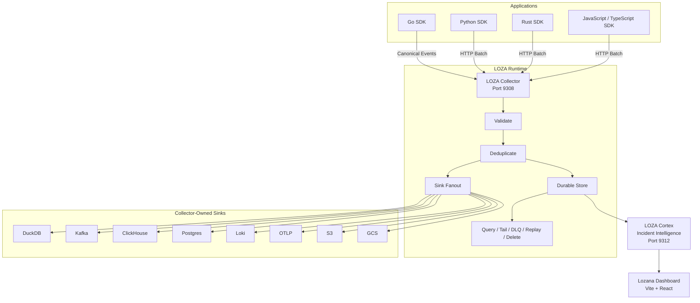
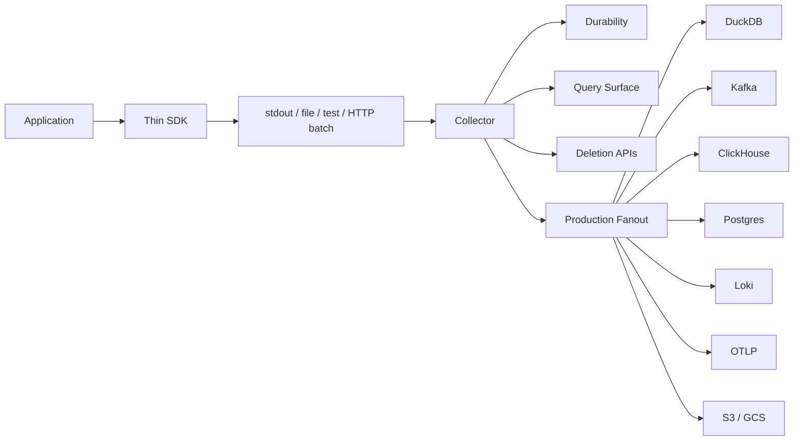
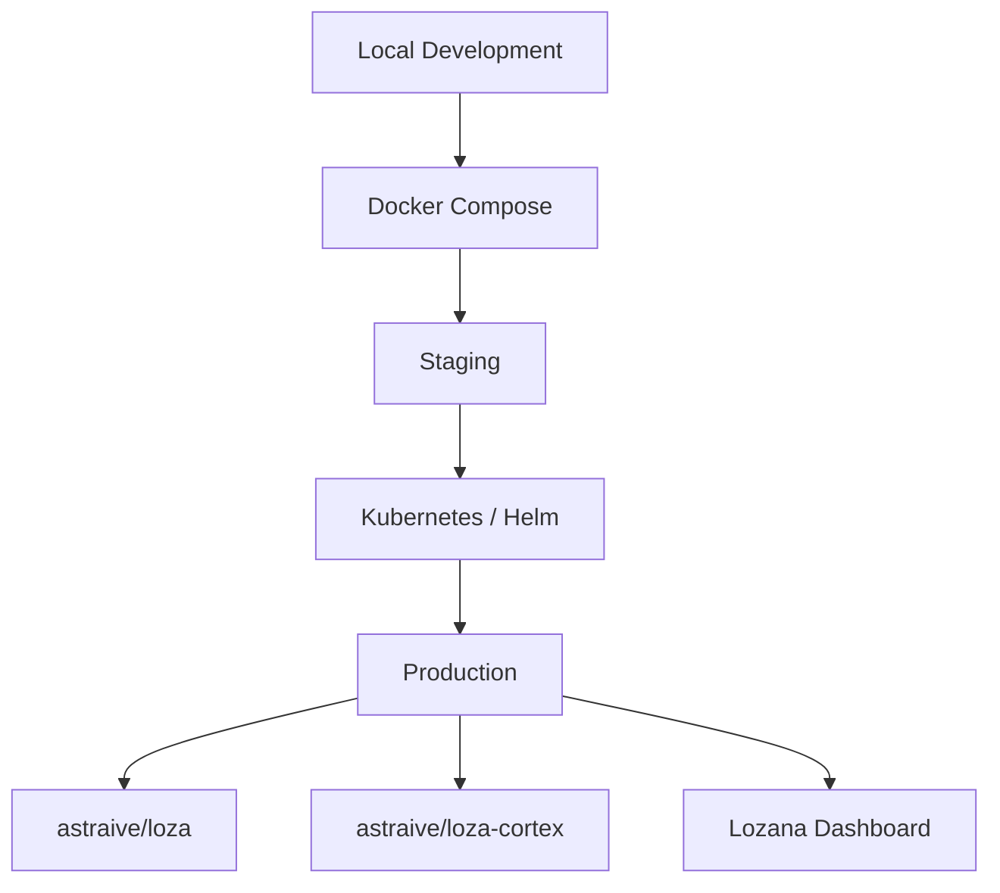

# LOZA

<p align="center">
  
</p>

<h3 align="center">
  Collector-first wide-event observability stack
</h3>

<p align="center">
  <a href="https://github.com/astraive/loza/blob/main/LICENSE">
    
  </a>
  <a href="https://github.com/astraive/loza/releases">
    
  </a>
  <br>
  <a href="https://github.com/astraive/loza/actions/workflows/collector-ci.yml">
    
  </a>
  <a href="https://github.com/astraive/loza/actions/workflows/sdks-go.yml">
    
  </a>
  <a href="https://github.com/astraive/loza/actions/workflows/sdks-py.yml">
    
  </a>
  <a href="https://github.com/astraive/loza/actions/workflows/sdks-rs.yml">
    
  </a>
  <a href="https://github.com/Astraive/lozana/actions/workflows/lozana-ci.yml">
    
  </a>
  <a href="https://hub.docker.com/r/astraive/loza">
  <br>
    
  </a>
  <a href="https://hub.docker.com/r/astraive/loza-cortex">
    
  </a>
</p>

---

LOZA is a collector-first wide-event observability stack.

Applications emit canonical structured events through lightweight SDKs to the LOZA Collector. The collector owns the heavy production pipeline: validation, deduplication, durable storage, querying, replay, deletion, and fanout to downstream sinks.

Cortex adds incident intelligence and graph analysis on top of the event stream. Lozana provides a dashboard for querying, visualization, alerting, and operator workflows.

The design principle is simple:

> **SDKs stay thin. The collector owns the pipeline.**

## Install Loza CLI

### macOS / Linux

```bash
curl -fsSL https://raw.githubusercontent.com/astraive/loza/main/cli/install/install.sh | bash
```

### Windows PowerShell

```powershell
irm https://raw.githubusercontent.com/astraive/loza/main/cli/install/install.ps1 | iex
```

## Install SDKs

```bash
npm install @astraive/loza
pip install loza
cargo add loza
go get github.com/astraive/loza/sdks/go
```

## Repository Layout

```txt
.
├── collector/   # Ingest runtime, query surface, durability layer, and sink fanout
├── cortex/      # Incident intelligence, graph reconstruction, and analysis
├── sdks/
│   ├── go/      # Reference SDK for emitting canonical events
│   ├── py/      # Lightweight Python SDK using HTTPBatchSink
│   ├── rs/      # Lightweight Rust SDK using HttpBatch
│   └── js/      # Lightweight JavaScript/TypeScript SDK using HTTPBatchSink
├── cli/         # Local operator CLI
│   └── install/ # CLI-only install scripts
├── spec/        # Shared wire and schema contract
├── docs/        # Architecture, configuration, deployment, and security docs
└── deploy/      # Docker, Kubernetes, and Helm deployment assets
```

For the current release contract, treat [`spec/docs/MVP_CUT.md`](spec/docs/MVP_CUT.md) plus the package READMEs as authoritative.

The `.kiro` specs and roadmap files are backlog material unless a feature is also claimed in a package README or runnable example.

## Architecture



## Collector-First Contract

Applications emit canonical events to the collector. Heavy production sinks stay collector-owned.



### SDK-Owned Delivery

SDKs own only lightweight local delivery:

* stdout sink
* file sink
* test sink
* collector HTTP batch transport

### Collector-Owned Delivery

The collector owns production sinks and durable routing:

* DuckDB
* Kafka
* ClickHouse
* Postgres
* Loki
* OTLP
* S3
* GCS

### Stable Operator Path

The stable operator surface is:

* `query`
* `tail`
* `dlq`
* `replay`
* collector-side deletion endpoints

## Components

| Component                  | Description                                                               |           Language | Docs                                           |
| -------------------------- | ------------------------------------------------------------------------- | -----------------: | ---------------------------------------------- |
| [`collector/`](collector/) | Event ingestion, validation, storage, query, replay, deletion, and fanout |                 Go | [`collector/README.md`](collector/README.md)   |
| [`cortex/`](cortex/)       | Incident intelligence, graph reconstruction, and event analysis           |                 Go | [`cortex/README.md`](cortex/README.md)         |
| [`sdks/go/`](sdks/go/)     | Reference SDK and strongest implementation                                |                 Go | [`sdks/go/README.md`](sdks/go/README.md)       |
| [`sdks/py/`](sdks/py/)     | Lightweight Python SDK                                                    |             Python | [`sdks/py/README.md`](sdks/py/README.md)       |
| [`sdks/rs/`](sdks/rs/)     | Lightweight Rust SDK                                                      |               Rust | [`sdks/rs/README.md`](sdks/rs/README.md)       |
| [`sdks/js/`](sdks/js/)     | JavaScript / TypeScript SDK                                               |         TypeScript | [`sdks/js/README.md`](sdks/js/README.md)       |
| [`cli/`](cli/)             | Local operator CLI                                                        |                 Go | [`cli/README.md`](cli/README.md)               |
| [`spec/`](spec/)           | Shared wire, schema, and conformance contract                             | Markdown / schemas | [`spec/docs/MVP_CUT.md`](spec/docs/MVP_CUT.md) |

## Quick Start

### 1. Start the Collector

The tracked Collector configuration is secure by default. Generate distinct runtime secrets; do not put them in YAML or source control.

```bash
cd collector
export COLLECTOR_AUTH_SERVER_SECRET="$(openssl rand -hex 32)"
export COLLECTOR_INGEST_KEY_SECRET="$(openssl rand -hex 24)"
export COLLECTOR_ADMIN_KEY_SECRET="$(openssl rand -hex 24)"
export LOZA_STORAGE_ENCRYPTION_KEY="$(openssl rand -hex 32)"
export LOZA_API_KEY="lx_sec_live_kingest_${COLLECTOR_INGEST_KEY_SECRET}"
go run ./cmd/loza-collector run -c configs/loza.yaml
```

Verify the public health endpoint, then send an authenticated event to the actual ingest route:

```bash
curl http://127.0.0.1:9308/health
curl -X POST http://127.0.0.1:9308/events \
  -H "Authorization: Bearer ${LOZA_API_KEY}" \
  -H 'Content-Type: application/json' \
  -d '[{"event":"checkout.request","service":"checkout"}]'
```

The admin token uses `lx_sec_live_kadmin_${COLLECTOR_ADMIN_KEY_SECRET}` and is intended for query and administrative routes.

### 2. Emit an Event from an SDK

#### Go

```go
package main

import (
	"context"

	"github.com/astraive/loza/sdks/go"
)

func main() {
	loza.Configure(loza.Production("checkout").
		WithCollectorEndpoint("http://127.0.0.1:9308"))
	defer loza.Shutdown(context.Background())

	ctx := loza.StartEvent(context.Background(), loza.Params{
		Event:  "checkout.request",
		Method: "POST",
		Path:   "/checkout",
	})

	loza.Enrich(ctx, loza.UserID("u-1"))
	loza.Finish(ctx, "success", loza.Int("status_code", 200))
	_ = loza.Emit(ctx)
}
```

#### Python

```python
import loza

loza.configure(
    loza.production("checkout")
    .with_collector_endpoint("http://127.0.0.1:9308")
)

ctx = loza.start_event(event="checkout.request", kind="http")
loza.enrich(ctx, loza.UserID("u-1"))
loza.finish(ctx, "success", loza.Int("status_code", 200))
loza.emit(ctx)
loza.shutdown()
```

#### Rust

```rust
fn main() -> Result<(), Box<dyn std::error::Error>> {
    loza::configure(
        loza::Config::production("checkout")
            .with_collector_endpoint("http://127.0.0.1:9308"),
    )?;

    let mut ctx = loza::start_event(
        loza::Params::new("checkout.request").with_kind("http"),
    );

    loza::enrich(&mut ctx, loza::UserID("u-1"));
    loza::finish(&mut ctx, "success");
    loza::emit(&mut ctx)?;
    loza::shutdown();

    Ok(())
}
```

#### JavaScript / TypeScript

```ts
import { loza } from '@astraive/loza';

loza.configure(
  loza.production('checkout')
    .withCollectorEndpoint('http://127.0.0.1:9308')
);

const ctx = loza.startEvent({
  event: 'checkout.request',
  kind: 'http',
});

loza.enrich(ctx, { 'user.id': 'u-1' });
loza.finish(ctx, 'success');

await loza.emit(ctx);
await loza.shutdown();
```

### 3. Query Stored Events

```bash
cd cli
go run ./cmd/loza query --sql "SELECT * FROM events LIMIT 10"
```

## Docker

### Collector

The collector image is:

```txt
astraive/loza
```

Run it locally:

```bash
docker run --rm \
  -p 9308:9308 \
  -v "$PWD/collector/configs:/configs:ro" \
  astraive/loza:latest \
  run -c /configs/loza.local.yaml
```

### Cortex

The Cortex image is:

```txt
astraive/loza-cortex
```

Run it locally:

```bash
docker run --rm \
  -p 9312:9312 \
  astraive/loza-cortex:latest
```

### Docker Compose

```bash
cd collector/deploy
docker compose up -d
```

Typical local services:

| Service    |   Port | Purpose                                    |
| ---------- | -----: | ------------------------------------------ |
| Collector  | `9308` | Ingest, query, tail, DLQ, replay, deletion |
| Cortex     | `9312` | Incident intelligence and graph analysis   |
| Prometheus | `9090` | Metrics                                    |
| Loki       | `3100` | Logs                                       |
| Grafana    | `3000` | Dashboards                                 |

## Deployment Flow



## SDK Installation

| Language                | Command                                          |
| ----------------------- | ------------------------------------------------ |
| Go                      | `go get github.com/astraive/loza/sdks/go@v0.3.2` |
| Python                  | `pip install loza`                               |
| Rust                    | `cargo add loza`                                 |
| JavaScript / TypeScript | `npm install @astraive/loza`               |

## Current Status

| Component      | Status         | Notes                                                                     |
| -------------- | -------------- | ------------------------------------------------------------------------- |
| Go SDK         | 🟢 Stable      | Strongest implementation, full conformance, production-ready              |
| Python SDK     | 🟢 Stable      | Collector-capable, full conformance, production-ready                     |
| Rust SDK       | 🟢 Stable      | Collector-capable, full conformance, production-ready                     |
| JavaScript SDK | 🟢 Stable      | TypeScript-capable, full conformance, production-ready                    |
| Collector      | 🟢 Stable      | Direct/spool/queue modes, gzip ingestion, query/tail/DLQ/delete endpoints |
| CLI            | Mixed maturity | Use `loza maturity` to see per-command status                             |
| Cortex         | Beta           | Incident intelligence and graph analysis are active surfaces              |
| Lozana         | Experimental   | Dashboard UI under active development                                     |

For conformance guarantees and required SDK behaviors, see [`spec/docs/SDK_CONFORMANCE_CONTRACT.md`](spec/docs/SDK_CONFORMANCE_CONTRACT.md).

## Not Current Release Guarantees

The following are not guaranteed by the current release contract unless claimed in a package README or runnable example:

* SIGHUP hot reload
* zstd or response compression
* hybrid reliability mode
* Redis-backed distributed dedupe
* enforced JWT or mTLS auth for HTTP ingest

## CLI Command Maturity

Use `loza maturity` to view current command stability levels.

| Command     | Maturity     | Notes                                            |
| ----------- | ------------ | ------------------------------------------------ |
| `init`      | stable       | Core initialization working reliably             |
| `dev`       | stable       | Development server fully tested                  |
| `config`    | stable       | Configuration management solid                   |
| `schema`    | stable       | Schema validation complete                       |
| `collector` | stable       | Collector CLI fully functional                   |
| `emit`      | stable       | Event emission tested                            |
| `query`     | stable       | SQL query support production-ready               |
| `tail`      | stable       | Log tail functionality complete                  |
| `bench`     | stable       | Load generation validated                        |
| `worker`    | beta         | Worker mode working, distribution may be refined |
| `dlq`       | beta         | DLQ replay available, refinements planned        |
| `replay`    | beta         | DLQ/spool replay working                         |
| `delete`    | beta         | GDPR deletion available, SLOs TBD                |
| `audit`     | beta         | Audit/PII discovery available                    |
| `deploy`    | beta         | Docker/Helm/K8s support, multi-cloud TBD         |
| `export`    | experimental | Format support may change                        |
| `doctor`    | experimental | Environment checks in progress                   |
| `dashboard` | experimental | Web UI under active development                  |

### Stability Definitions

| Level        | Meaning                                                                    |
| ------------ | -------------------------------------------------------------------------- |
| stable       | Production-ready, covered by release tests, API stable until major version |
| beta         | Working implementation, being refined, minor API changes possible in v1.x  |
| experimental | Under active development, subject to significant change, may be removed    |

## Verification

Current verification baseline after this closure pass:

```bash
cd sdks/go && go test ./...
cd sdks/py && python -m pytest -q
cd sdks/rs && cargo test -q
cd sdks/js && bun run test && bun run build
cd collector && go test ./...
```

## Documentation

| Topic                       | Link                                                                             |
| --------------------------- | -------------------------------------------------------------------------------- |
| Architecture                | [`docs/architecture.md`](docs/architecture.md)                                   |
| Configuration               | [`docs/configuration.md`](docs/configuration.md)                                 |
| Deployment                  | [`docs/deployment.md`](docs/deployment.md)                                       |
| Collector                   | [`collector/README.md`](collector/README.md)                                     |
| Go SDK                      | [`sdks/go/README.md`](sdks/go/README.md)                                         |
| Python SDK                  | [`sdks/py/README.md`](sdks/py/README.md)                                         |
| Rust SDK                    | [`sdks/rs/README.md`](sdks/rs/README.md)                                         |
| JavaScript / TypeScript SDK | [`sdks/js/README.md`](sdks/js/README.md)                                         |
| CLI                         | [`cli/README.md`](cli/README.md)                                                 |
| MVP Cut / Release Contract  | [`spec/docs/MVP_CUT.md`](spec/docs/MVP_CUT.md)                                   |
| SDK Conformance             | [`spec/docs/SDK_CONFORMANCE_CONTRACT.md`](spec/docs/SDK_CONFORMANCE_CONTRACT.md) |
| Duplicate Fields Policy     | [`spec/docs/DUPLICATE_FIELDS.md`](spec/docs/DUPLICATE_FIELDS.md)                 |

## Supported Sinks

| Sink       | Ownership       | Status    |
| ---------- | --------------- | --------- |
| DuckDB     | Collector-owned | Supported |
| Kafka      | Collector-owned | Supported |
| ClickHouse | Collector-owned | Supported |
| Postgres   | Collector-owned | Supported |
| Loki       | Collector-owned | Supported |
| OTLP       | Collector-owned | Supported |
| S3         | Collector-owned | Supported |
| GCS        | Collector-owned | Supported |

## Development

```bash
git clone https://github.com/astraive/loza.git
cd loza

# Collector tests
cd collector
go test ./...

# Go SDK tests
cd ../sdks/go
go test ./...

# Python SDK tests
cd ../py
python -m pytest -q

# Rust SDK tests
cd ../rs
cargo test -q

# JavaScript SDK tests
cd ../js
bun run test
bun run build
```

## Contributing

Contributions are welcome.

1. Fork the repository.
2. Create a feature branch.

```bash
git checkout -b feat/my-feature
```

3. Commit your changes.

```bash
git commit -m "feat: add my feature"
```

4. Push the branch.

```bash
git push origin feat/my-feature
```

5. Open a pull request.

See [`CONTRIBUTING.md`](CONTRIBUTING.md) for development setup, coding standards, and PR guidelines.

## Security

For security vulnerabilities, see [`SECURITY.md`](SECURITY.md).

Do not open a public issue for security reports.

## License

LOZA is licensed under the [`MIT License`](LICENSE).

```txt
MIT License - Copyright (c) 2026 Astraive
```

---

<p align="center">
  Built by <a href="https://astraive.com"><strong>Astraive</strong></a>
  &nbsp;&middot;&nbsp;
  <br>
  <a href="https://github.com/astraive/loza">GitHub</a>
  &nbsp;&middot;&nbsp;
  <a href="https://github.com/astraive/loza/releases">Releases</a>
  &nbsp;&middot;&nbsp;
  <a href="https://github.com/astraive/loza/issues">Issues</a>
</p>
