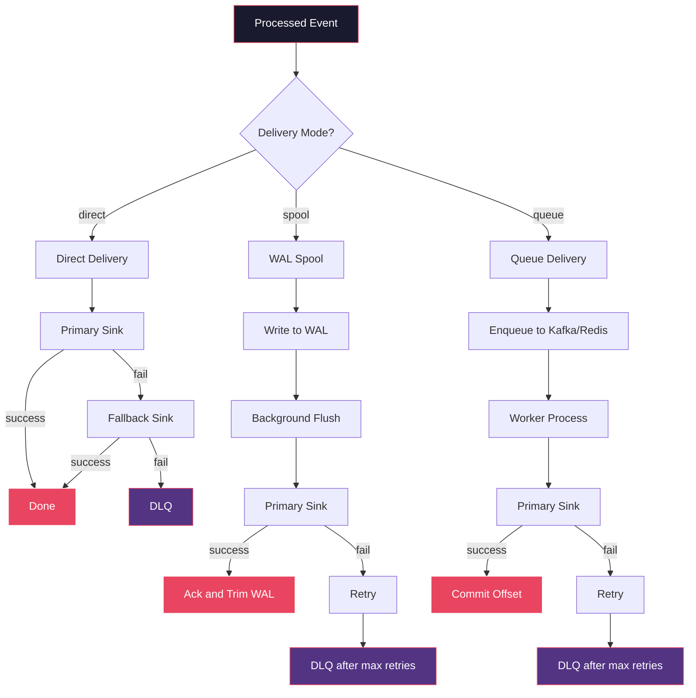
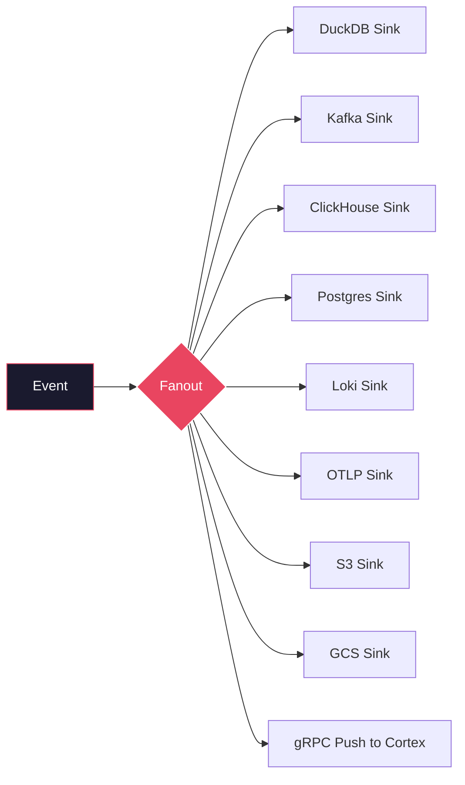

# Architecture

## Ingest Pipeline

The collector accepts events over HTTP and processes them through a multi-stage pipeline before fanning out to sinks.

### HTTP Ingest

The ingest server listens on a configurable port (default: 9308) and accepts:

- Single JSON objects
- JSON arrays
- Wrapped envelopes (`{"events": [...]}`)
- NDJSON (newline-delimited JSON)
- Gzip-compressed payloads (`Content-Encoding: gzip`)
- Zstd-compressed payloads (`Content-Encoding: zstd`)

### Parse

The parser detects the payload format automatically. It reads the full body (up to `max_body_bytes`), decompresses if needed, and splits the payload into individual event byte slices.

### Validate

Validation checks that each event is a valid JSON object. If schema governance is enabled (`schema_governance.mode`), events are validated against registered schemas:

- `off` -- no schema validation
- `warn` -- log violations but accept the event
- `enforce` / `reject` -- reject events that fail validation
- `quarantine` -- write invalid events to a quarantine file instead of rejecting

### Process

The processing pipeline applies a series of transformations and checks:

**Identity Resolution** -- tenant routing and service extraction from event fields.

**Privacy Redaction** -- applies PII redaction based on configured blocklist/allowlist patterns. Modes: `off`, `warn`, `enforce`. Optional secret scanning.

**Deduplication** -- detects duplicate events by a configurable key (default: `event_id`). Backends: in-memory or Redis. Configurable time window.

**Rate Limits** -- enforces per-tenant and global rate limits. Excess events are dropped or queued depending on the delivery policy.

## Delivery Modes

The collector supports three delivery modes configured via `reliability.mode`:

| Mode | Behavior | Use Case |
|---|---|---|
| `direct` | Synchronous delivery to primary sink. Fallback to secondary on failure. | Low-latency, single-node deployments |
| `spool` | Write-ahead log (WAL). Background goroutine flushes to sinks with retry. | Single-node with durability |
| `queue` | Enqueue to Kafka/Redis. Worker processes consume and deliver. | Distributed, multi-worker deployments |

All modes support a Dead Letter Queue (DLQ) for events that exhaust retry attempts.

## Fanout

The fanout stage delivers events to all configured sinks simultaneously. Each sink runs in its own goroutine. Failures in one sink do not affect others.

The primary sink is the first configured sink. Secondary sinks receive events after the primary succeeds. A fallback sink can be configured to receive events when the primary fails.

## Storage

### DuckDB Schema

The DuckDB sink stores events in a columnar table. The schema is derived from the event's attribute types:

| Column | Type | Description |
|---|---|---|
| id | VARCHAR | Event ID |
| event_type | VARCHAR | Event type |
| service | VARCHAR | Source service |
| timestamp | TIMESTAMP | Event timestamp |
| trace_id | VARCHAR | Distributed trace ID |
| tenant_id | VARCHAR | Tenant identifier |
| attributes | JSON | Full attribute payload |
| ingested_at | TIMESTAMP | Collector ingestion time |

Column types are configurable via `duckdb.column_types` for custom schemas.

### Retention

DuckDB retention is managed by the `storage.duckdb.retention_days` config. Events older than the retention period are purged on a configurable schedule.

### Collector-Owned Storage

The collector owns all sink implementations. SDKs do not connect to databases directly. The collector imports `internal/event` for sink interfaces and `internal/storage` for DuckDB operations. There is no dependency on any LOZA SDK module.
