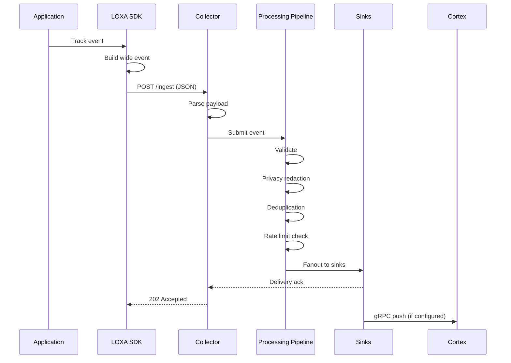

# Getting Started

This guide walks you through building, running, and sending your first event to the LOXA collector in under 5 minutes.

## Prerequisites

- Go 1.22 or later
- Git

## Build

```bash
cd collector
go build -o loxa-collector.exe ./cmd/loxa-collector
```

## Run

```bash
./loxa-collector.exe run -c configs/loxa.local.yaml
```

The collector starts an HTTP server on `localhost:9308` by default.

## Send Your First Event

```bash
curl -X POST http://localhost:9308/ingest \
  -H "Content-Type: application/json" \
  -d '{
    "id": "evt-001",
    "event_type": "http_request",
    "service": "my-service",
    "timestamp": "2026-05-20T10:00:00Z",
    "attributes": {
      "status_code": 200,
      "path": "/api/hello",
      "latency_ms": 42
    }
  }'
```

The collector responds with an acknowledgment:

```json
{"status": "accepted", "count": 1}
```

## Sequence Diagram



## What Happens Next

1. The collector parses the incoming JSON (single object, array, wrapped envelope, NDJSON, or gzip/zstd compressed).
2. The processing pipeline validates the event against the schema (if enabled), applies privacy redaction, checks for duplicates, and enforces rate limits.
3. The event is fanned out to all configured sinks (DuckDB, Kafka, ClickHouse, Postgres, Loki, OTLP, S3, GCS).
4. If the gRPC push sink is configured, the event is also forwarded to Cortex for incident intelligence.

## Next Steps

- [Architecture](architecture.md) -- understand the ingest pipeline and processing stages
- [Config](config.md) -- configure sinks, reliability modes, and privacy policies
- [Sink Reference](sink-reference.md) -- configure individual sink destinations
- [Running Locally](running-locally.md) -- run with different configs and the load generator
