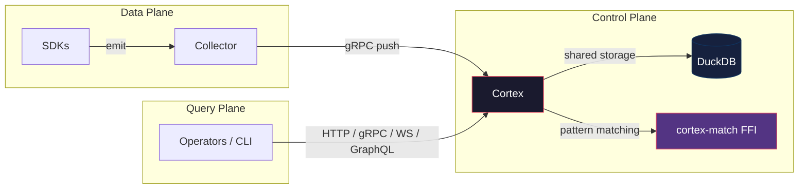

# Cortex

**Status: v1.0.0 STABLE**

Cortex is the control plane for the LOXA observability platform. It provides the Persistent Context Engine (PCE), incident intelligence, causal chain reconstruction, similar incident matching, and remediation learning. Cortex consumes events from the collector, builds service topology graphs, and surfaces actionable incident context to operators.

## What is Cortex

Cortex sits between the collector (data plane) and the SDKs (client plane). It receives events pushed by the collector over gRPC and exposes query APIs for incident reconstruction, service graph traversal, signature matching, and remediation feedback. The core engine is the Persistent Context Engine, which maintains a living model of your system's incident history and uses that model to accelerate future incident response.

Key capabilities:

- **Persistent Context Engine (PCE)** -- reconstructs incident timelines from stored events using causal chain analysis
- **Incident Intelligence** -- matches incoming incidents against historical signatures and suggests proven remediations
- **Service Graph** -- builds and maintains a topology graph from collector sync data and event relationships
- **Signature Morphing** -- tracks how incident patterns evolve over time and adjusts similarity scoring
- **Remediation Learning** -- records operator feedback on suggested actions and improves future suggestions

## Architecture



## PCE Pipeline


1. **Ingest** -- receives events from the collector via gRPC push or HTTP batch
2. **Store** -- persists events, topology aliases, and graph edges in DuckDB
3. **Reconstruct** -- builds causal chains from events linked by trace ID, service, and time window
4. **Correlate** -- matches incident signatures against historical patterns using symptom vectors and behavioral hashes
5. **Suggest** -- ranks remediations by historical effectiveness and presents them with confidence scores

## Quick Start

### Build

```bash
cd cortex
go build -o cortex.exe ./cmd/server
```

### Run

```bash
./cortex.exe -c configs/loxa-cortex.defaults.yaml
```

Or with Docker:

```bash
cd cortex/configs
docker compose up
```

### Query

Reconstruct an incident:

```bash
curl -X POST http://localhost:9091/v1/reconstruct \
  -H "Content-Type: application/json" \
  -d '{"incident_id": "inc-001", "mode": "fast"}'
```

Get the service graph:

```bash
curl http://localhost:9091/v1/graph/service/payment-service
```

Find similar incidents:

```bash
curl -X POST http://localhost:9091/v1/signatures/search \
  -H "Content-Type: application/json" \
  -d '{"symptoms": ["timeout", "5xx_spike"], "services": ["payment-service"]}'
```

Submit feedback:

```bash
curl -X POST http://localhost:9091/v1/feedback/remediation \
  -H "Content-Type: application/json" \
  -d '{"incident_id": "inc-001", "action": "restart_pod", "outcome": "resolved", "confidence": 0.9}'
```

## API Endpoints

| Endpoint | Method | Description |
|---|---|---|
| `/healthz` | GET | Liveness probe |
| `/readyz` | GET | Readiness probe |
| `/metrics` | GET | Prometheus metrics |
| `/v1/events` | POST | Ingest a single event |
| `/v1/events/batch` | POST | Ingest a batch of events |
| `/v1/events/jsonl` | POST | Ingest NDJSON stream |
| `/v1/reconstruct` | POST | Reconstruct an incident context |
| `/v1/incidents/{id}/reconstruct` | POST | Reconstruct by incident ID |
| `/v1/graph/service/{service}` | GET | Get service graph neighborhood |
| `/v1/graph/incident/{id}` | GET | Get incident graph |
| `/v1/feedback/remediation` | POST | Record remediation feedback |
| `/v1/feedback/incident` | POST | Record incident feedback |
| `/graphql` | POST | GraphQL query endpoint |
| `/v1/ws` | GET | WebSocket live event stream |

## Documentation

- [Architecture](docs/architecture.md) -- component overview and data flow
- [PCE Overview](docs/pce-overview.md) -- Persistent Context Engine concepts
- [API Reference](docs/api-reference.md) -- full endpoint specification
- [Conformance](conformance/README.md) -- conformance test suite

## License

Part of the LOXA monorepo. See [LICENSE](../LICENSE) for details.
