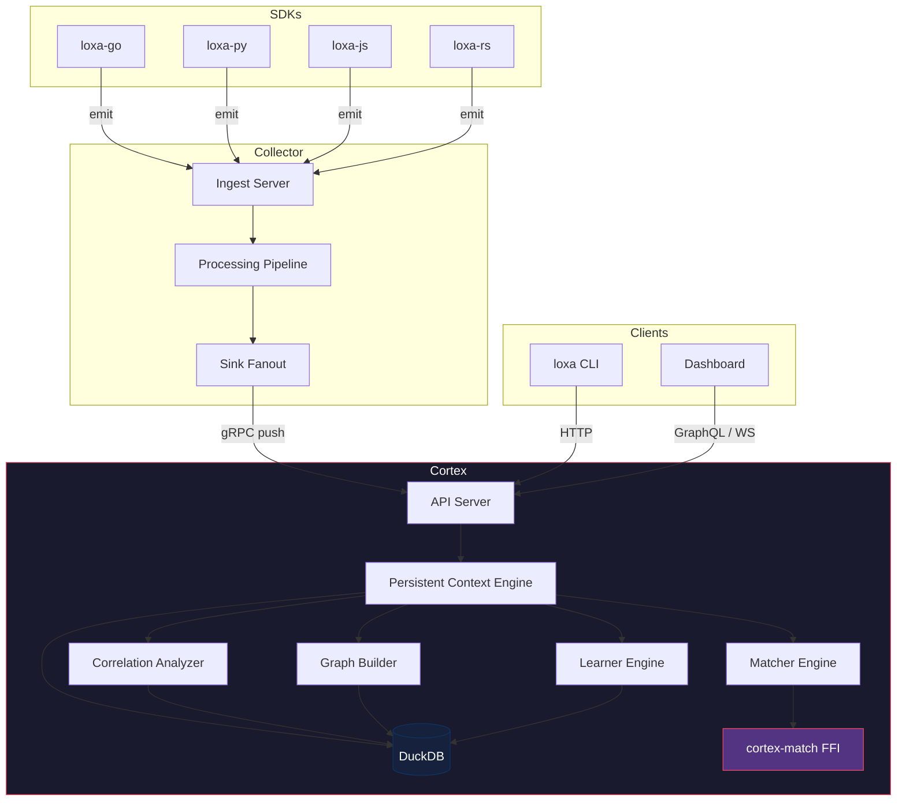
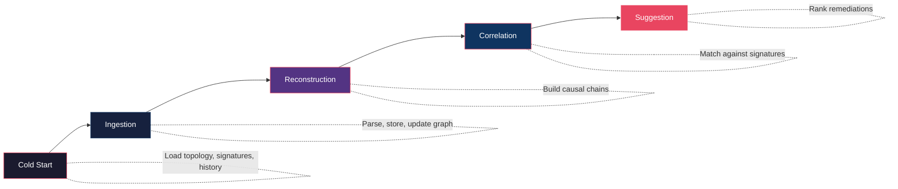

# Architecture

## Component Overview

Cortex is the control plane of the LOXA platform. It sits between the collector (data plane) and the SDKs (client plane), consuming events and serving incident intelligence queries.

## PCE Pipeline

The Persistent Context Engine processes events through a five-stage pipeline:

### Stage 1: Cold Start

On startup, Cortex loads existing topology aliases, incident signatures, and remediation history from DuckDB. The correlation analyzer begins its background loop. The graph builder initializes from stored edges and nodes.

### Stage 2: Ingestion

Events arrive via the API server (HTTP, gRPC, or WebSocket). The event processor validates each event, applies PII redaction, extracts topology aliases, and persists the event to DuckDB. It also updates the service graph with new edges derived from event relationships (caller/callee, trace linkage).

### Stage 3: Reconstruction

When a reconstruction request arrives, the IncidentReconstructor builds a causal chain from events. It supports two modes:

- **Fast mode** -- 3 levels of depth, 20 events max, 30-minute time window
- **Deep mode** -- 10 levels of depth, 200 events max, 2-hour time window

The reconstructor walks the event graph following trace IDs, service dependencies, and temporal proximity to build a timeline of what happened.

### Stage 4: Correlation

The correlation analyzer runs periodically (default: every 60 seconds) and synthesizes dynamic relationship edges by analyzing:

- **Co-occurrence** -- events that fire together within a 5-minute window
- **Deployment adjacency** -- events that follow deployments within a 30-minute window

The matcher engine compares incident signatures against stored signatures using symptom vectors, service overlap, and behavioral hashes. It supports both a Go-native matcher and a Rust FFI matcher (cortex-match) for high-throughput pattern matching.

### Stage 5: Suggestion

The learner engine ranks remediations by historical effectiveness. It tracks feedback on each remediation action and adjusts feature weights using a configurable learning rate (default: 0.1). Remediations are presented with confidence scores that combine:

- Causal chain bonus (0.1)
- Symptom match bonus (0.1)
- Signature similarity weight (0.1)
- Remediation effectiveness weight (0.1)

Confidence is clamped to [0.0, 1.0].

## Storage Layer

Cortex shares a DuckDB instance with the collector. The storage layer exposes seven sub-stores:

| Store | Purpose |
|---|---|
| EventStore | Raw event persistence and lookup by trace ID, incident ID, or service |
| TopologyStore | Service alias tracking with temporal resolution |
| GraphStore | Node and edge persistence with graph traversal |
| IncidentStore | Incident records linked to signatures |
| SignatureStore | Incident signatures with similarity search, decay, and archival |
| RemediationStore | Remediation records with effectiveness stats |
| FeedbackStore | Operator feedback on remediation suggestions |

The DuckDB database is co-located with the collector's database file. Both services open the same file with appropriate locking.

## Collector Bridge

Cortex receives events from the collector through two mechanisms:

1. **gRPC Push** -- the collector's sink fanout includes a gRPC sink that pushes events to Cortex as they are processed
2. **HTTP/WS Pull** -- the CLI and dashboard query Cortex over HTTP REST, GraphQL, or WebSocket for live event streams

The gRPC push path is the primary ingestion mechanism. Events arrive already validated and processed by the collector, so Cortex focuses on persistence, graph building, and intelligence extraction.

## Matcher Engine

The matcher engine compares incident signatures using multiple signals:

- **Symptom vectors** -- weighted set of symptom strings (e.g., "timeout", "5xx_spike")
- **Service overlap** -- Jaccard similarity of affected service sets
- **Behavioral hash** -- hash of normalized event patterns for fast lookup
- **Temporal proximity** -- incidents occurring within similar time patterns

The engine supports two implementations:

1. **Go matcher** -- pure Go implementation, always available
2. **Rust FFI (cortex-match)** -- Rust crate via CGo for high-throughput matching, optional

The matcher is configured via `config.yaml` with the `matcher.mode` field (`go` or `rust`).

## API Server

The API server exposes four transport protocols:

| Protocol | Endpoint | Use Case |
|---|---|---|
| HTTP REST | `/v1/*` | CRUD operations, reconstruction, graph queries |
| gRPC | `:9092` | Collector push, high-throughput ingestion |
| WebSocket | `/v1/ws` | Live event streaming, real-time incident feed |
| GraphQL | `/graphql` | Flexible queries, dashboard integration |

All protocols share the same backend services (processor, reconstructor, matcher, learner). Authentication and rate limiting are applied at the HTTP middleware layer.
