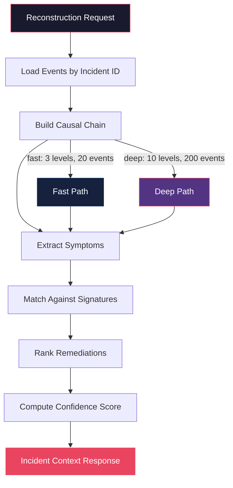

# PCE Overview

The Persistent Context Engine (PCE) is the core intelligence engine of Cortex. It maintains a living model of your system's incident history and uses that model to accelerate incident response.

## What is the Persistent Context Engine

The PCE is not a traditional event store. It is a reasoning engine that sits on top of stored events and builds higher-order abstractions: causal chains, incident signatures, service graphs, and remediation models. When a new incident occurs, the PCE reconstructs what happened, finds similar past incidents, and suggests actions that resolved them.

The PCE operates continuously. It ingests events, updates its models, and refines its understanding of your system's failure modes over time.

## Causal Chain Reconstruction

Causal chain reconstruction is the process of linking events into a timeline that explains how an incident unfolded. The reconstructor walks the event graph following:

- **Trace IDs** -- events sharing a trace ID are linked causally
- **Service dependencies** -- events from services with known caller/callee relationships
- **Temporal proximity** -- events occurring within a configurable time window

The output is a directed acyclic graph (DAG) of events with edges representing causal influence. Each edge has a confidence score based on the strength of the linkage signal.

### Reconstruction Modes

| Mode | Depth | Max Events | Time Window | Use Case |
|---|---|---|---|---|
| Fast | 3 levels | 20 events | 30 minutes | Quick triage, real-time alerts |
| Deep | 10 levels | 200 events | 2 hours | Post-incident review, root cause analysis |

Fast mode returns results in under 100ms. Deep mode may take several seconds depending on event volume.

## Similar Incident Matching

When an incident is reconstructed, the matcher engine compares its signature against all stored signatures to find similar past incidents. A signature is a normalized representation of an incident's characteristics:

- **Symptom set** -- the set of observed symptoms (e.g., "timeout", "oom_kill", "5xx_spike")
- **Service set** -- the set of affected services
- **Behavioral hash** -- a hash of the normalized event pattern for fast lookup
- **Temporal pattern** -- the shape of the event timeline (burst, gradual, periodic)

Similarity is computed as a weighted combination of:

1. **Symptom Jaccard similarity** -- overlap of symptom sets
2. **Service Jaccard similarity** -- overlap of affected service sets
3. **Behavioral hash match** -- exact or fuzzy match of behavioral hashes
4. **Temporal correlation** -- similarity of event timing patterns

The matcher returns a ranked list of similar incidents with similarity scores and matched signals.

### Signature Morphing

Signatures are not static. As new incidents match an existing signature, the signature is updated to incorporate new signals. This allows the system to track how a failure mode evolves over time -- for example, a timeout pattern that gradually includes new services or different symptom combinations.

Signature decay is applied periodically. Signatures that have not matched recently have their similarity weights reduced, and stale signatures are archived below a configurable threshold.

## Remediation Suggestion

The learner engine maintains a model of remediation effectiveness. For each incident signature, it tracks:

- **Remediation actions** -- what was tried (e.g., "restart_pod", "rollback_deploy", "scale_up")
- **Outcomes** -- whether the action resolved the incident
- **Operator feedback** -- explicit ratings from operators

When a new incident matches a signature, the learner ranks remediations by:

1. **Historical success rate** -- how often this action resolved similar incidents
2. **Recency bias** -- recent outcomes are weighted more heavily
3. **Feature weight adjustment** -- the learning rate controls how quickly the model adapts

### Feedback Loop

Operators submit feedback through the `/feedback/remediation` endpoint. Each feedback record includes:

- Incident ID
- Remediation action taken
- Outcome (resolved, partially_resolved, not_resolved, worsened)
- Optional confidence score

The learner processes feedback and adjusts feature weights accordingly. The learning rate (default: 0.1) controls the magnitude of weight updates.

## Confidence Scoring

Confidence scores quantify how much trust to place in a reconstruction or suggestion. The score is a weighted combination of:

| Signal | Weight | Description |
|---|---|---|
| Causal chain bonus | 0.1 | Bonus for events linked by explicit causal signals |
| Symptom match bonus | 0.1 | Bonus for matching known symptom patterns |
| Similarity weight | 0.1 | Contribution from signature similarity score |
| Remediation weight | 0.1 | Contribution from remediation effectiveness history |

The final confidence is clamped to [0.0, 1.0]. A confidence of 0.0 means no relevant signals were found. A confidence of 1.0 means the reconstruction is supported by all available signals.

### Interpretation

| Range | Meaning |
|---|---|
| 0.8 -- 1.0 | High confidence. Strong match against known patterns. |
| 0.5 -- 0.8 | Moderate confidence. Partial match or limited history. |
| 0.2 -- 0.5 | Low confidence. Weak signals or novel failure mode. |
| 0.0 -- 0.2 | Very low confidence. No matching history. |

## Reconstruction Flow

The response includes:

- The full causal chain DAG
- Extracted symptoms
- Ranked similar incidents with similarity scores
- Suggested remediations with confidence scores
- The reconstruction mode used and elapsed time
