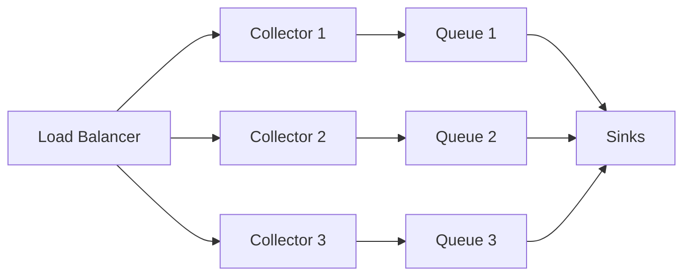

# Collector Operations

## Health Endpoints

| Endpoint | Method | Description | Response |
|----------|--------|-------------|----------|
| `/healthz` | GET | Liveness probe. Returns 200 if the process is running. | `{"status":"ok"}` |
| `/readyz` | GET | Readiness probe. Returns 200 only when all sinks are connected and the collector can accept traffic. | `{"status":"ready"}` or `{"status":"not_ready","reason":"..."}` |
| `/metrics` | GET | Prometheus-compatible metrics endpoint. | Text exposition format |
| `/core/status` | GET | Detailed operational status including queue depth, sink health, and uptime. | JSON object |

### Kubernetes Probes

```yaml
livenessProbe:
  httpGet:
    path: /healthz
    port: 9308
  initialDelaySeconds: 5
  periodSeconds: 10
readinessProbe:
  httpGet:
    path: /readyz
    port: 9308
  initialDelaySeconds: 10
  periodSeconds: 5
```

## Prometheus Metrics

The collector exposes the following Prometheus metrics at `/metrics`:

### Request Metrics

| Metric | Type | Description |
|--------|------|-------------|
| `loza_collector_requests_total` | Counter | Total ingest requests received |
| `loza_collector_requests_auth_errors_total` | Counter | Requests rejected due to auth failure |
| `loza_collector_requests_limited_total` | Counter | Requests rejected due to rate limiting |
| `loza_collector_requests_throttled_total` | Counter | Requests throttled by backpressure |
| `loza_collector_inflight_requests` | Gauge | Currently processing requests |

### Event Metrics

| Metric | Type | Description |
|--------|------|-------------|
| `loza_collector_events_accepted_total` | Counter | Events successfully accepted |
| `loza_collector_events_invalid_total` | Counter | Events rejected due to validation failure |
| `loza_collector_events_rejected_total` | Counter | Events rejected (all reasons) |
| `loza_collector_events_deduped_total` | Counter | Events dropped by deduplication |
| `loza_collector_inflight_events` | Gauge | Events currently in the processing pipeline |
| `loza_collector_parse_errors_total` | Counter | Events that failed JSON/NDJSON parsing |

### Schema Metrics

| Metric | Type | Description |
|--------|------|-------------|
| `loza_collector_schema_validations_total` | Counter | Events that passed schema validation |
| `loza_collector_schema_warnings_total` | Counter | Events with schema warnings (non-fatal) |
| `loza_collector_schema_rejections_total` | Counter | Events rejected by schema validation |

### Sink Metrics

| Metric | Type | Description |
|--------|------|-------------|
| `loza_collector_sink_write_errors_total` | Counter | Errors writing to any sink |
| `loza_collector_sink_health` | Gauge | Per-sink health status (1=healthy, 0=unhealthy) |
| `loza_collector_retry_attempts_total` | Counter | Total retry attempts across all sinks |
| `loza_collector_retry_successes_total` | Counter | Successful retries |
| `loza_collector_retry_failures_total` | Counter | Failed retries (exhausted attempts) |

### DLQ Metrics

| Metric | Type | Description |
|--------|------|-------------|
| `loza_collector_dlq_writes_total` | Counter | Events written to the dead letter queue |
| `loza_collector_dlq_write_failures_total` | Counter | Failed DLQ write attempts |
| `loza_collector_quarantine_writes_total` | Counter | Events moved to quarantine |

### Storage Metrics

| Metric | Type | Description |
|--------|------|-------------|
| `loza_collector_spool_bytes` | Gauge | Current spool directory size in bytes |
| `loza_collector_queue_bytes` | Gauge | Current queue size in bytes |
| `loza_collector_disk_full_errors_total` | Counter | Errors caused by disk full condition |
| `loza_collector_disk_health` | Gauge | Disk health status (1=healthy, 0=unhealthy) |
| `loza_collector_spool_health` | Gauge | Spool health status (1=healthy, 0=unhealthy) |
| `loza_collector_ready` | Gauge | Overall readiness (1=ready, 0=not ready) |

### Cortex Bridge Metrics

| Metric | Type | Description |
|--------|------|-------------|
| `loza_collector_cortex_bridge_flushes_total` | Counter | Flush cycles to cortex |
| `loza_collector_cortex_bridge_events_total` | Counter | Events forwarded to cortex |
| `loza_collector_cortex_bridge_errors_total` | Counter | Errors forwarding to cortex |
| `loza_collector_cortex_bridge_queue_depth` | Gauge | Events queued for cortex delivery |

## Grafana Dashboard Setup

### Prometheus Scrape Config

Add the collector to your Prometheus scrape targets:

```yaml
# prometheus.yml
scrape_configs:
  - job_name: loza-collector
    scrape_interval: 15s
    static_configs:
      - targets: ["collector:9308"]
    metrics_path: /metrics
```

A ready-to-use Prometheus config is provided at `collector/deploy/observability/prometheus.yml`.

### Recommended Dashboard Panels

Create a Grafana dashboard with these panels:

**Request Rate**

```promql
rate(loza_collector_requests_total[5m])
```

**Event Acceptance Rate**

```promql
rate(loza_collector_events_accepted_total[5m])
```

**Event Rejection Rate**

```promql
rate(loza_collector_events_rejected_total[5m])
```

**Sink Error Rate**

```promql
rate(loza_collector_sink_write_errors_total[5m])
```

**DLQ Depth**

```promql
loza_collector_dlq_writes_total - loza_collector_retry_successes_total
```

**Queue Backpressure**

```promql
loza_collector_queue_bytes
```

**Request Latency (p99)**

```promql
histogram_quantile(0.99, rate(loza_collector_request_duration_seconds_bucket[5m]))
```

### Dashboard JSON

A provisioned Grafana dashboard JSON is available at `collector/deploy/observability/grafana-dashboard.json`. Import it via Grafana UI or provision it in your Grafana instance.

## DLQ Management

### List DLQ Entries

```bash
loza dlq list --limit 50
```

### Inspect a DLQ Entry

```bash
loza dlq inspect <entry-id>
```

### Replay DLQ Entries

Replay all failed events back through the collector pipeline:

```bash
loza dlq replay --all
```

Replay a specific entry:

```bash
loza dlq replay <entry-id>
```

### Purge DLQ

```bash
loza dlq purge --older-than 7d
```

### DLQ Retention

The DLQ retention period is configured in the collector config:

```yaml
dlq:
  enabled: true
  max_entries: 10000
  retention: 168h  # 7 days
```

## Retention Tuning

### DuckDB Sink Retention

```yaml
sinks:
  duckdb:
    enabled: true
    path: ./loza.db
    retention:
      enabled: true
      max_age: 720h    # 30 days
      max_rows: 50000000
      cleanup_interval: 1h
```

### Kafka Sink Retention

Kafka retention is managed via topic configuration:

```yaml
sinks:
  kafka:
    enabled: true
    brokers: ["kafka:9092"]
    topic: loza-events
    retention_ms: 604800000  # 7 days
```

### ClickHouse Sink Retention

ClickHouse TTL is set at the table level:

```yaml
sinks:
  clickhouse:
    enabled: true
    dsn: "clickhouse://localhost:9000/loza"
    ttl_days: 90
```

### Spool Retention

```yaml
delivery:
  mode: spool
  spool:
    dir: ./spool
    max_bytes: 1073741824  # 1 GB
    max_age: 24h
```

## Scaling Guidance

### Horizontal Scaling via Queue Mode

Queue mode decouples ingest from sink writes, allowing independent scaling:

```yaml
delivery:
  mode: queue
  queue:
    dir: ./queue
    workers: 4
    max_bytes: 1073741824  # 1 GB
    retry:
      max_attempts: 5
      initial_backoff: 1s
      max_backoff: 60s
```

Deploy multiple collector instances behind a load balancer. Each instance processes its own queue independently.



### Vertical Scaling via Batch Size

Increase batch sizes to improve throughput on a single instance:

```yaml
sinks:
  duckdb:
    batch_size: 5000
    flush_interval: 2s
  kafka:
    batch_size: 10000
    flush_interval: 1s
```

### Resource Recommendations

| Deployment | Events/sec | vCPUs | Memory | Disk |
|------------|-----------|-------|--------|------|
| Development | < 100 | 1 | 512 MB | 1 GB |
| Staging | 100-1,000 | 2 | 2 GB | 10 GB |
| Production (single) | 1,000-10,000 | 4 | 4 GB | 50 GB |
| Production (cluster) | 10,000+ | 4 per node | 4 GB per node | 100 GB per node |

### Queue Mode vs Direct Mode

| Criterion | Direct Mode | Queue Mode |
|-----------|------------|------------|
| Latency | Lowest (sync write) | Higher (async buffer) |
| Durability | None (events lost on crash) | Crash-safe (disk-backed) |
| Throughput | Limited by slowest sink | Decoupled from sink speed |
| Complexity | Minimal | Queue management, DLQ |
| Use case | Development, low-volume | Production, high-volume |
