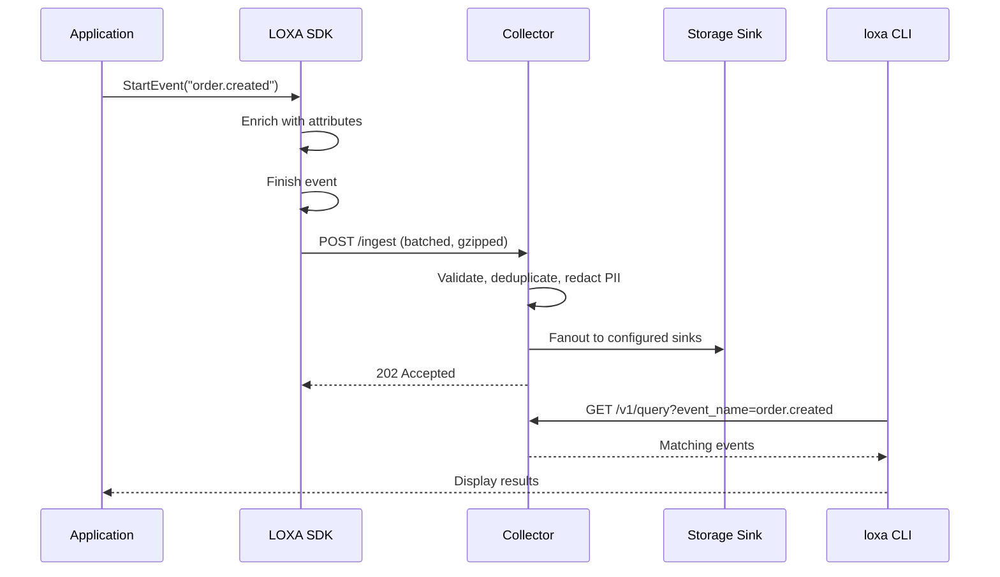

# Getting Started with LOXA


## Table of Contents

1. [Prerequisites](#prerequisites)
2. [Start the Collector](#1-start-the-collector)
3. [Emit Your First Event](#2-emit-your-first-event)
4. [Query Events](#3-query-events)
5. [Next Steps](#4-next-steps)

## Prerequisites

| Component | Minimum Version | Check Command |
|-----------|----------------|---------------|
| Go        | 1.22+          | `go version`  |
| Python    | 3.10+          | `python3 --version` |
| Rust      | 1.75+          | `rustc --version`   |
| Node.js   | 20+            | `node --version`    |

## Happy Path



## 1. Start the Collector

### Build from Source

```bash
cd collector
go build -o loxa-collector ./cmd/loxa-collector
./loxa-collector --config configs/loxa.local.yaml
```

### Run with Default Config

```bash
cd collector
go run ./cmd/loxa-collector --config loxa-collector.defaults.yaml
```

The collector starts on port 9090 by default. Verify it is running:

```bash
curl http://localhost:9090/healthz
# Expected: {"status":"ok"}
```

### Docker Compose Alternative

```bash
cd collector/deploy
docker compose up -d
```

This starts the collector with a DuckDB sink and local configuration.

## 2. Emit Your First Event

### Go

```go
package main

import (
    "context"
    loxa "github.com/astraive/loxa-go/src"
    "github.com/astraive/loxa-go/src/sinks/httpbatch"
)

func main() {
    sink, _ := httpbatch.New(httpbatch.Config{
        Endpoint: "http://localhost:9090/ingest",
    })
    client, _ := loxa.New(loxa.Config{
        Service: "my-service",
        Sink:    sink,
    })
    defer client.Close(context.Background())

    evt := client.StartEvent("order.created")
    evt.SetAttr("order_id", "ORD-12345")
    evt.SetAttr("customer_id", "CUST-789")
    evt.SetAttr("total_cents", 5999)
    evt.Finish()
    client.Emit(context.Background(), evt)
}
```

### Python

```python
from loxa import CollectorClient, HTTPBatchSink

sink = HTTPBatchSink(endpoint="http://localhost:9090/ingest")
client = CollectorClient(service="my-service", sink=sink)

evt = client.start_event("order.created")
evt.set_attr("order_id", "ORD-12345")
evt.set_attr("customer_id", "CUST-789")
evt.set_attr("total_cents", 5999)
evt.finish()
client.emit(evt)

client.close()
```

### Rust

```rust
use loxa::{Config, Event, HTTPBatchSink};

#[tokio::main]
async fn main() -> Result<(), Box<dyn std::error::Error>> {
    let sink = HTTPBatchSink::new("http://localhost:9090/ingest")?;
    let client = Config::new("my-service")
        .with_sink(sink)
        .build()?;

    let mut evt = client.start_event("order.created");
    evt.set_attr("order_id", "ORD-12345");
    evt.set_attr("customer_id", "CUST-789");
    evt.set_attr("total_cents", 5999);
    evt.finish();
    client.emit(&evt).await?;

    client.close().await;
    Ok(())
}
```

### JavaScript

```javascript
import { CollectorClient, HTTPBatchSink } from "loxa-js";

const sink = new HTTPBatchSink({ endpoint: "http://localhost:9090/ingest" });
const client = new CollectorClient({ service: "my-service", sink });

const evt = client.startEvent("order.created");
evt.setAttr("order_id", "ORD-12345");
evt.setAttr("customer_id", "CUST-789");
evt.setAttr("total_cents", 5999);
evt.finish();
await client.emit(evt);

await client.close();
```

## 3. Query Events

Use the CLI to query events stored by the collector:

```bash
loxa query --event order.created --last 10
```

Example output:

```
EVENT            SERVICE       DURATION   ATTRS
order.created    my-service    12ms       order_id=ORD-12345 customer_id=CUST-789 total_cents=5999
order.created    my-service    8ms        order_id=ORD-12346 customer_id=CUST-790 total_cents=2499
```

Query with filters:

```bash
loxa query --event order.created --attr "total_cents>5000" --last 5 --format json
```

Tail live events as they arrive:

```bash
loxa tail --event order.created
```

## 4. Next Steps

- **SDK Documentation**: See `sdks/go/docs`, `sdks/py/docs`, `sdks/rs/docs`, `sdks/js/docs` for framework-specific guides
- **Collector Configuration**: Review `collector/configs/` for production, queue, and fanout configurations
- **CLI Reference**: Run `loxa --help` or see `cli/docs/` for all available commands
- **Cortex**: Enable the Persistent Context Engine for incident reconstruction and service graph analysis
- **Conformance**: Run `cd spec && python conformance/runner.py` to verify SDK behavior
