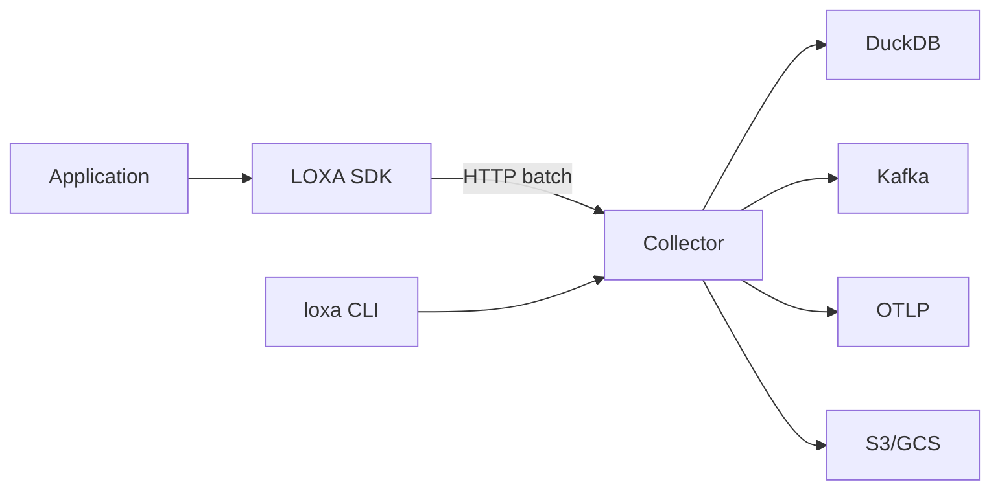
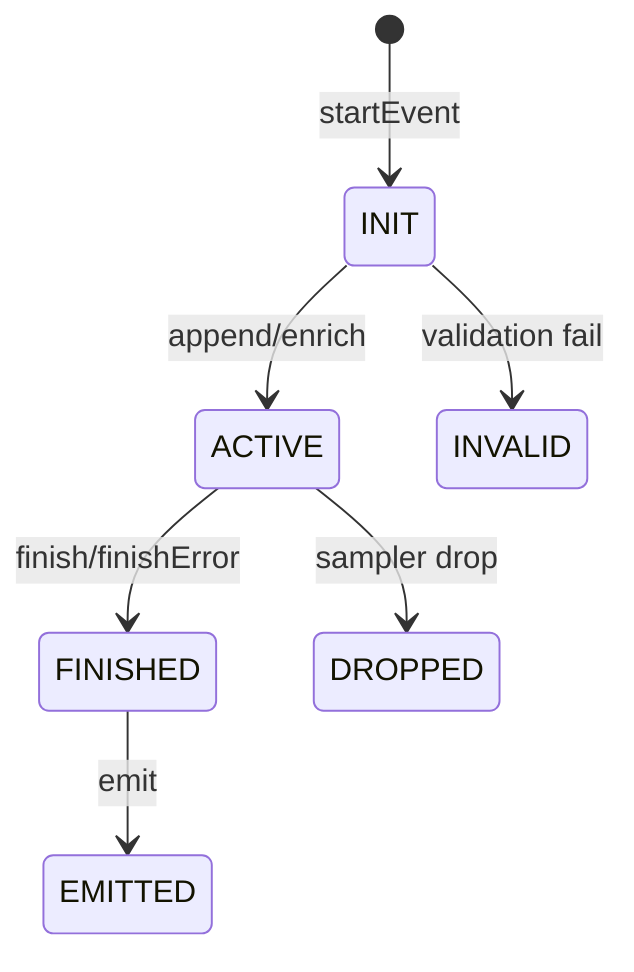

# Instrumentation Guide

> **Audience**: Application developers instrumenting checkout, payments, auth, jobs, queues, and cron flows with LOXA.

LOXA is a collector-first wide-event observability stack. The SDKs stay lightweight and application-friendly. The collector owns validation, durability, fanout, deletion, DLQ, and production sinks.

This guide explains how to instrument real business flows using LOXA's event lifecycle:

```
startEvent → append/enrich → checkpoint → finish/finishError → emit
```

---

## Mental Model

### What LOXA Answers

- What business event happened?
- Which user, tenant, cart, order, plan, or feature context mattered?
- What outcome did the event finish with?
- How long did the flow take?
- Which checkpoints happened before failure?
- Was the event accepted, dropped, quarantined, or sent to DLQ?
- Can we query events later with SQL?

### Architecture



SDKs emit canonical wide events. The collector validates, redacts, deduplicates, and fans out to production sinks.

---

## Event Lifecycle

Every LOXA event follows a strict state machine:



### Canonical Flow

```text
StartEvent(ctx, Params)     → creates the event
  Append/Enrich(ctx, ...)   → adds attributes
  Checkpoint(ctx, "name")   → marks progress
  Finish(ctx, "success")    → sets outcome
  Emit(ctx)                 → sends to sink
```

### Canonical Outcomes

| Outcome | Meaning |
|---------|---------|
| `success` | Operation completed normally |
| `error` | Operation failed |
| `partial` | Some steps succeeded, some failed |
| `abandoned` | Operation was abandoned (e.g., timeout) |
| `retried` | Operation will be retried |

---

## Timing Primitives

LOXA provides five timing primitives for measuring and structuring event timelines:

| Primitive | Has Duration | Has Order | Best Use |
|-----------|:---:|:---:|----------|
| **Checkpoint** | no | timeline | Breadcrumb / milestone |
| **Process** | yes | numbered | Main ordered steps |
| **Group** | yes | phase | Larger named phase/block |
| **Timer** | yes | no | Latency measurement |
| **Stopwatch** | yes | no | Local elapsed time |

### Checkpoint

A checkpoint is a breadcrumb — it records that a milestone happened at a specific time.

```text
Checkpoint(ctx, "cart_loaded")
Checkpoint(ctx, "risk_checked")
Checkpoint(ctx, "payment_started")
```

Emitted shape:

```json
{
  "checkpoints": [
    { "name": "cart_loaded", "offset_ms": 14 },
    { "name": "risk_checked", "offset_ms": 41 },
    { "name": "payment_started", "offset_ms": 58 }
  ]
}
```

### Process

A process is an ordered, numbered step with its own duration and outcome.

```text
process = Process(ctx, "authorize_payment")
  ... do work ...
process.Finish("success")
```

Emitted shape:

```json
{
  "processes": [
    {
      "step": 1,
      "name": "authorize_payment",
      "started_at_ms": 12,
      "ended_at_ms": 418,
      "duration_ms": 406,
      "status_code": 200
    }
  ]
}
```

### Group

A group is a named phase that may contain multiple processes, checkpoints, and timers.

```text
group = StartGroup(ctx, "payment_flow")
  ... multiple steps ...
group.Finish(...)
```

### Timer

A timer measures how long a specific operation took — useful for database queries, API calls, or cache lookups.

```text
timer = StartTimer(ctx, "db.cart_lookup")
  ... query ...
timer.Stop(...)
```

### Stopwatch

A standalone elapsed-time measurer with no event reference.

```text
sw = Stopwatch()
  ... work ...
elapsed = sw.Elapsed()
```

---

## Field Naming

Use **dot-separated** names for business attributes:

```text
cart.item_count
cart.total_cents
checkout.payment_method
payment.provider
payment.failure_code
order.status
feature.checkout_v2
risk.score_bucket
```

**Avoid** unstable names:

```text
foo, metadata, stuff, data, payload, raw, extra, context
```

**Avoid** JSON blobs unless explicitly intended as opaque payloads. Prefer typed, named fields.

---

## Cardinality Policy

**High-cardinality** fields are dangerous for indexing, metrics, billing, and query speed.

### Safe Fields

```text
service, event, kind, level, outcome
http.method, http.route, http.status_code
user.subscription, checkout.payment_method, payment.provider
error.code, feature.checkout_v2
```

### High-Cardinality Fields (handle carefully)

```text
user.id, order.id, cart.id, payment.id
request_id, trace_id, span_id, session.id
email, ip_address
```

Store these for lookup and correlation, but do not aggregate or index them blindly.

### Prefer Buckets for Analytics

Instead of storing raw numeric values like `user.lifetime_value`, prefer bucketed strings:

```text
user.ltv_bucket → "lt_100" | "100_500" | "500_1000" | "1000_5000" | "gt_5000"
```

---

## Redaction and Privacy

LOXA uses layered protection.

### SDK Safety Net

SDKs block obvious secrets before they leave the process:

```text
password, passwd, secret, token, api_key, apikey,
authorization, cookie, set_cookie, private_key,
client_secret, access_token, refresh_token
```

### Collector Policy

The collector enforces the real privacy policy:

- PII detection
- Allowlist / blocklist
- Tenant-specific policy
- Schema validation
- Quarantine mode
- Audit logs
- Deletion support

### Recommended Default

```text
SDK:     minimal key-based redaction safety net
Collector: full PII/security policy enforcement
```

### Marking Sensitive Fields

Use `SensitiveString` for fields that should always be redacted:

```text
SensitiveString("user.email", email)
HashString("user.ssn", ssn)
MarkSensitive("credit_card", cardNo)
```

---

## Error Handling

Use `FinishError` when the event outcome is an error:

```text
try:
    result = do_work()
    Finish(ctx, "success")
except err:
    FinishError(ctx, err)
finally:
    Emit(ctx)
```

### Recommended Error Fields

| Field | Purpose |
|-------|---------|
| `error.type` | Exception class name |
| `error.code` | Application error code |
| `error.message_template` | Safe error template |
| `error.retriable` | Whether the operation can be retried |
| `error.retry_after_ms` | Suggested retry delay |
| `error.source` | Component that originated the error |
| `error.provider` | External provider (e.g., "stripe", "sendgrid") |

Avoid raw error messages when they may contain secrets or customer data.

---

## Event Taxonomy

Use consistent event names across your application.

### HTTP Request Events

```text
checkout.request
auth.login.request
billing.portal.request
webhook.stripe.request
```

### Business State Events

```text
checkout.started
checkout.completed
checkout.failed
payment.authorize.started
payment.authorize.completed
payment.authorize.failed
order.created
order.cancelled
subscription.upgraded
subscription.cancelled
```

### Background Job Events

```text
job.email_send
job.invoice_generate
job.reindex_search
job.sync_customer
```

### Queue Events

```text
queue.process
queue.retry
queue.dlq
```

### Cron Events

```text
cron.daily_billing
cron.weekly_report
cron.cleanup_temp
```

**Rule**: Use request-level events for request lifecycle. Use business state events for explicit domain transitions.

---

## Collector Ingest Contract

SDKs emit canonical events to the collector using the ingest endpoint.

### Endpoint

```text
POST /v1/events
```

### Request Shape

```json
{
  "events": [
    {
      "schema_version": "v1",
      "event_version": "v1",
      "event_id": "018f7f...",
      "timestamp": "2026-05-22T06:10:42.120Z",
      "service": "checkout",
      "event": "checkout.request",
      "kind": "http",
      "level": "info",
      "outcome": "success",
      "duration_ms": 842,
      "attrs": {}
    }
  ]
}
```

### Response Shape

```json
{
  "accepted": 1,
  "rejected": 0,
  "quarantined": 0,
  "errors": []
}
```

### Validation Modes

| Mode | Behavior |
|------|----------|
| `enforce` | Reject invalid events |
| `warn` | Accept but report schema issues |
| `quarantine` | Store invalid events separately |

---

## Collector Enrichment

The collector enriches events centrally — application code does not need to provide all context.

### Collector-Added Fields

```text
environment
region
service.version
deployment.id
commit.sha
runtime.language
sdk.name
sdk.version
tenant.id (from API key)
collector.received_at
collector.node_id
sampling.decision
redaction.applied
```

**Principle**: Application code provides business meaning. The collector provides infrastructure and policy context.

---

## Query Examples

Because LOXA stores wide events, operators can query them directly with SQL.

### Recent Checkout Errors

```sql
SELECT
  timestamp,
  service,
  event,
  outcome,
  attrs->>'error.code' AS error_code,
  attrs->>'payment.provider' AS provider
FROM events
WHERE event = 'checkout.request'
  AND outcome = 'error'
ORDER BY timestamp DESC
LIMIT 50;
```

### Payment Failures by Provider

```sql
SELECT
  attrs->>'payment.provider' AS provider,
  attrs->>'error.code' AS error_code,
  count(*) AS failures
FROM events
WHERE event = 'checkout.request'
  AND outcome = 'error'
GROUP BY provider, error_code
ORDER BY failures DESC;
```

### Checkout Latency by Payment Method

```sql
SELECT
  attrs->>'checkout.payment_method' AS payment_method,
  avg(duration_ms) AS avg_duration_ms,
  approx_quantile(duration_ms, 0.95) AS p95_duration_ms
FROM events
WHERE event = 'checkout.request'
  AND outcome = 'success'
GROUP BY payment_method;
```

### Feature Flag Impact

```sql
SELECT
  attrs->>'feature.checkout_v2' AS checkout_v2,
  outcome,
  count(*) AS events
FROM events
WHERE event = 'checkout.request'
GROUP BY checkout_v2, outcome
ORDER BY events DESC;
```

### Job Failure Rate

```sql
SELECT
  event,
  outcome,
  count(*) AS total,
  avg(duration_ms) AS avg_ms
FROM events
WHERE kind = 'job'
GROUP BY event, outcome
ORDER BY total DESC;
```

---

## Production Recommendations

### SDK

- Use **HTTP batch sink** for collector delivery
- Keep SDK redaction as a minimal safety net
- Set **service name** explicitly
- Use **route patterns**, not raw paths with IDs
- Emit **once** per event
- Always **finish before emit**
- Use `FinishError` for exceptions
- Avoid raw request/response bodies
- Avoid unbounded attributes

### Collector

- Run with validation in `warn` first, then move to `enforce`
- Enable **durable spool** or **DLQ** for production
- Configure **retention**
- Configure **API-key auth** for public ingest
- Use collector-side tenant resolution
- Export metrics
- Fan out to production sinks from the collector, not from SDKs

### Schema

- Keep canonical fields stable
- Add business attrs gradually
- Promote common attrs to helpers only after repeated usage
- Use conformance tests across SDKs

---

## SDK Documentation

For language-specific instrumentation guides with complete code examples:

- **Go**: [sdks/go/docs/business-instrumentation.md](../sdks/go/docs/business-instrumentation.md)
- **Python**: [sdks/py/docs/business-instrumentation.md](../sdks/py/docs/business-instrumentation.md)
- **JavaScript**: [sdks/js/docs/business-instrumentation.md](../sdks/js/docs/business-instrumentation.md)
- **Rust**: [sdks/rs/docs/business-instrumentation.md](../sdks/rs/docs/business-instrumentation.md)
