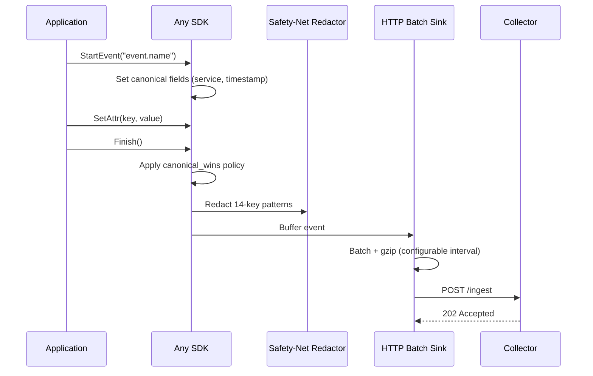

# SDK Comparison

v0.2.0 standardizes the same product shape in every SDK: default `loxa` client, cross-language factory, immutable same-config aliases, and first-class lifecycle primitives (`checkpoint`, `process`, `group`, `timer`, `stopwatch`). See [instrumentation-and-sdk-idea.md](./instrumentation-and-sdk-idea.md) for the canonical catalog.

## Feature Matrix

| Feature | Go | Python | Rust | JavaScript |
|---------|-----|--------|------|------------|
| Lifecycle API (StartEvent, Enrich, Finish, Emit) | Yes | Yes | Yes | Yes |
| HTTP Middleware | gin, echo, chi, fiber, net/http | Flask, Django, FastAPI | axum, actix, warp | Express |
| gRPC Middleware | Yes | -- | -- | -- |
| Integrations | stdlib, popular frameworks | stdlib, popular frameworks | tokio ecosystem | Node.js ecosystem |
| Sinks | HTTPBatchSink | HTTPBatchSink | HTTPBatchSink | HTTPBatchSink |
| Sampling | Full suite | Full suite | Full suite | Full suite |
| Redaction | 14-key safety net + custom rules | 14-key safety net + custom rules | 14-key safety net + custom rules | 14-key safety net + custom rules |
| Schema Encoders | 8 (Default, Flat, Nested, EC, OTel, OTelLog, Datadog, Custom) | 8 | 8 | 8 |
| Metrics | Internal counters | -- | Internal counters | -- |
| Async Emit | Goroutine-based | Thread-based | Tokio async | Promise-based |
| CortexClient | Yes (11 methods) | Yes (13 methods) | Yes | Yes |
| Default API (`loxa.*` facade) | Yes | Yes | Yes | Yes |
| `CreateLoxa()` factory | `CreateLoxa` and `New` | `create_loxa` | `create_loxa` | `createLoxa` |
| `Alias("name")` sugar | Yes | Yes | Yes | Yes |

## SDK Documentation

- **Go SDK**: `sdks/go/docs/` -- package reference, middleware guide, examples
- **Python SDK**: `sdks/py/docs/` -- API reference, framework integration, examples
- **Rust SDK**: `sdks/rs/docs/` -- crate docs, async patterns, examples
- **JavaScript SDK**: `sdks/js/docs/` -- TypeScript types, middleware guide, examples

## Parity Manifests

Each SDK maintains a parity manifest tracking feature implementation status:

- Go: `sdks/go/docs/parity.md`
- Python: `sdks/py/docs/parity.md`
- Rust: `sdks/rs/docs/parity.md`
- JavaScript: `sdks/js/docs/parity.md`

v0.2.0 updates the parity target from stable-v1 parity to the full product-parity method family.

## Common Patterns

All SDKs share the same event lifecycle:

## Configuration

All SDKs accept configuration via a `Config` struct (or equivalent):

| Field | Type | Description |
|-------|------|-------------|
| `service` | string | Service name attached to every event |
| `sink` | Sink | Output sink (typically HTTPBatchSink) |
| `sampling` | Sampler | Sampling strategy |
| `redaction` | Redactor | Custom redaction rules |
| `schema` | SchemaEncoder | Event serialization format |
