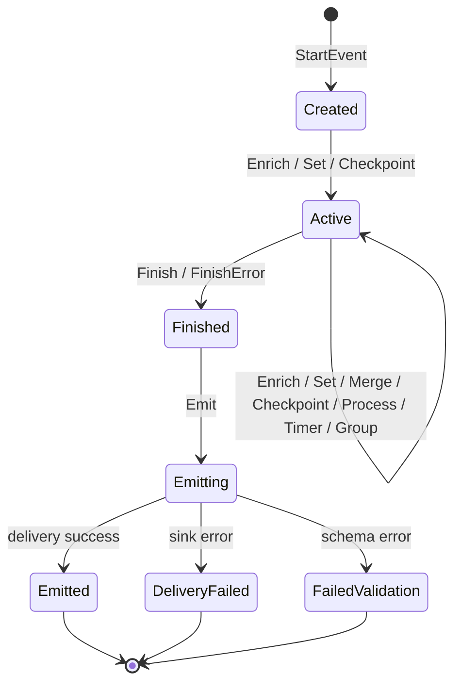

# Instrumentation Guide

> A comprehensive guide to instrumenting real-world business flows with the LOZA Go SDK.

---

## 1. Introduction

Instrumentation goes beyond basic request logging. It captures the **domain narrative** of what your system is doing -- which user placed which order, which payment provider was used, which feature flags were active, and where in a multi-step pipeline things went wrong.

LOZA's Go SDK provides a **wide-event** model: a single canonical event per request, job, or queue message accumulates context as it flows through your code. Instead of scattered log lines that are hard to correlate, you emit one structured event at the end that tells the complete story.

### Why Wide Events?

| Traditional Logging | LOZA Wide Events |
|---|---|
| Many log lines per request | One event per lifecycle |
| String interpolation | Typed key-value attrs |
| Cross-service correlation is manual | Built-in trace/request IDs |
| Business context lost in log noise | Business attrs are first-class |
| PII scattered across log files | Redaction at the SDK layer |

### What You Will Learn

- How to start, enrich, checkpoint, and finish events for every business flow
- How to use timing primitives (Process, Group, Timer, Stopwatch) for latency attribution
- How to attach canonical user, tenant, and business identifiers
- How to handle errors with the `FinishError` pattern
- How to wire net/http middleware for automatic HTTP instrumentation
- How to configure production sinks, sampling, and redaction
- How to test your instrumentation with `TestLogger`, `Capture`, and `AssertEvent`

---

## 2. Quick Start -- Full Checkout Example

This example shows a complete checkout flow instrumented end-to-end:

```go
package main

import (
    "context"
    "fmt"
    "time"

    loza "github.com/astraive/loza/sdks/go"
)

func main() {
    // Configure the logger for production.
    logger, err := loza.New(loza.ApplyConfig(
        loza.Production(),
        loza.WithService("checkout-service"),
        loza.WithVersion("1.4.2"),
        loza.WithEnvironment("production"),
        loza.WithSink(loza.StdoutSink()),
    ))
    if err != nil {
        panic(err)
    }
    loza.SetDefault(logger)
    defer loza.MustShutdown(5 * time.Second)

    // Simulate a checkout request.
    ctx := context.Background()
    err = processCheckout(ctx, "user-42", "cart-789", "tok_abc123")
    if err != nil {
        loza.Error("checkout failed", loza.Err(err))
    }
}

func processCheckout(ctx context.Context, userID, cartID, paymentToken string) error {
    // Start a canonical event for this checkout.
    ctx = loza.StartHTTPEvent(ctx, loza.Params{
        Event: "checkout.request",
        Kind:  "http",
    })

    // Attach the actor and business identifiers.
    loza.Enrich(ctx,
        loza.UserID(userID),
        loza.CartID(cartID),
        loza.String("payment.token", paymentToken),
        loza.String("checkout.source", "web"),
    )

    // Step 1: Validate the cart.
    p1, _ := loza.Process(ctx, "validate_cart")
    if err := validateCart(ctx, cartID); err != nil {
        p1.FinishError(err, 400)
        return loza.FinishError(ctx, err, loza.ErrorCode("INVALID_CART"))
    }
    p1.Finish()

    // Step 2: Charge the payment.
    p2, _ := loza.Process(ctx, "charge_payment")
    loza.Checkpoint(ctx, "payment.initiated")
    paymentResult, err := chargePayment(ctx, userID, paymentToken)
    if err != nil {
        p2.FinishError(err, 502)
        return loza.FinishError(ctx, err,
            loza.ErrorCode("PAYMENT_FAILED"),
            loza.Retryable(true),
        )
    }
    p2.Finish(loza.String("payment.provider", paymentResult.Provider))

    // Step 3: Create the order.
    p3, _ := loza.Process(ctx, "create_order")
    order, err := createOrder(ctx, userID, cartID, paymentResult)
    if err != nil {
        p3.FinishError(err, 500)
        return loza.FinishError(ctx, err)
    }
    p3.Finish(loza.OrderID(order.ID))

    // Attach final business context and finish successfully.
    loza.Set(ctx,
        loza.OrderID(order.ID),
        loza.Amount(order.TotalCents),
        loza.Currency("USD"),
        loza.Plan("premium"),
    )

    return loza.Finish(ctx, "success",
        loza.StatusCode(200),
        loza.OrderID(order.ID),
    )
}

// Stub types and functions for the example.
type PaymentResult struct { Provider string }
type Order struct { ID string; TotalCents int64 }

func validateCart(ctx context.Context, cartID string) error { return nil }
func chargePayment(ctx context.Context, userID, token string) (*PaymentResult, error) {
    return &PaymentResult{Provider: "stripe"}, nil
}
func createOrder(ctx context.Context, userID, cartID string, pr *PaymentResult) (*Order, error) {
    return &Order{ID: "ord-1001", TotalCents: 4999}, nil
}
```

The emitted event JSON contains the complete story:

```json
{
  "timestamp": "2026-05-22T10:30:00.123Z",
  "event_id": "019X...",
  "event": "checkout.request",
  "kind": "http",
  "outcome": "success",
  "service": "checkout-service",
  "version": "1.4.2",
  "environment": "production",
  "duration_ms": 342,
  "status_code": 200,
  "user_id": "user-42",
  "cart_id": "cart-789",
  "order_id": "ord-1001",
  "payment_amount": 4999,
  "payment_currency": "USD",
  "customer_plan": "premium",
  "checkpoints": [
    { "name": "payment.initiated", "at_ms": 120 }
  ],
  "processes": [
    { "step": 1, "name": "validate_cart", "started_at_ms": 0, "ended_at_ms": 15, "duration_ms": 15 },
    { "step": 2, "name": "charge_payment", "started_at_ms": 15, "ended_at_ms": 280, "duration_ms": 265 },
    { "step": 3, "name": "create_order", "started_at_ms": 280, "ended_at_ms": 340, "duration_ms": 60 }
  ]
}
```

---

## 3. Core Lifecycle

Every LOZA event follows a strict state machine. Understanding the lifecycle is essential for correct instrumentation.

### Event State Machine



### Starting Events

Use the appropriate starter for your event kind. Each sets sensible defaults for `kind` and `event`:

| Starter | Default Kind | Default Event | Use Case |
|---|---|---|---|
| `StartEvent` | (none) | (none) | Generic -- you supply everything |
| `StartHTTPEvent` | `"http"` | `"http.request"` | HTTP request handlers |
| `StartJobEvent` | `"job"` | `"job.run"` | Background jobs |
| `StartQueueEvent` | `"queue"` | `"queue.process"` | Queue consumers |
| `StartCLIEvent` | `"cli"` | `"cli.run"` | CLI command execution |
| `StartCronEvent` | `"cron"` | `"cron.run"` | Scheduled/cron tasks |

```go
// Generic event -- supply all fields yourself.
ctx = loza.StartEvent(ctx, loza.Params{
    Event: "data.export",
    Kind:  "job",
    Custom: []loza.Attr{
        loza.String("export.format", "csv"),
    },
})

// HTTP event -- kind and event name are defaulted.
ctx = loza.StartHTTPEvent(ctx, loza.Params{
    Event: "user.profile.update",
})

// Queue event with convenience wrapper.
ctx = loza.StartQueueJob(ctx, "email-notifications", "msg-abc123")

// Cron event with convenience wrapper.
ctx = loza.StartCron(ctx, "daily-report")
```

The `Params` struct also accepts subject identifiers directly:

```go
ctx = loza.StartHTTPEvent(ctx, loza.Params{
    Event:        "order.create",
    UserID:       "user-42",
    TenantID:     "tenant-acme",
    WorkspaceID:  "ws-main",
    OrganizationID: "org-corp",
    SessionID:    "sess-xyz",
    RequestID:    "req-abc",
    TraceID:      "trace-123",
    Method:       "POST",
    Path:         "/api/orders",
    Route:        "/api/orders",
})
```

### Enriching Events

Enrichment adds context to the active event in the current `context.Context`. There are several enrichment methods with different semantics:

| Method | Behavior | Use When |
|---|---|---|
| `Enrich` | Appends attrs (error if key exists) | Adding new context |
| `Append` | Alias for `Enrich` | Same as Enrich |
| `Set` | Upserts attrs by key | Updating or overwriting values |
| `Merge` | Upserts into a named group | Building nested objects incrementally |
| `Delete` | Removes attrs by key (dot-path supported) | Stripping sensitive data |
| `Add` | Appends a value to an array field | Building lists |
| `Get` | Reads a value by key (dot-path supported) | Conditional logic based on event state |
| `GetGroup` | Reads a group as `map[string]any` | Inspecting nested groups |

```go
// Enrich with new context.
loza.Enrich(ctx,
    loza.String("checkout.source", "mobile"),
    loza.Bool("checkout.gift_wrapped", true),
)

// Set overwrites existing keys (useful for late-binding values).
loza.Set(ctx, loza.String("user.tier", "premium"))

// Merge into a named group -- creates the group if it doesn't exist.
loza.Merge(ctx, "payment",
    loza.String("provider", "stripe"),
    loza.String("method", "card"),
    loza.Amount(4999),
)

// Delete sensitive data before emission.
loza.Delete(ctx, "payment.token", "raw_body")

// Add to an array field.
loza.Add(ctx, "promo_codes_applied", "SUMMER25")
loza.Add(ctx, "promo_codes_applied", "WELCOME10")

// Get for conditional logic.
if v, ok := loza.Get(ctx, "user.tier"); ok && v == "enterprise" {
    loza.Enrich(ctx, loza.Bool("sla.priority", true))
}
```

### Checkpoints

Checkpoints are lightweight breadcrumbs that record a name and elapsed time without blocking the event flow:

```go
loza.Checkpoint(ctx, "validation.started")
// ... validation logic ...
loza.Checkpoint(ctx, "validation.completed")

loza.Checkpoint(ctx, "db.query.begin")
// ... database query ...
loza.Checkpoint(ctx, "db.query.end", loza.String("query", "SELECT * FROM orders"))
```

Checkpoints appear in the emitted JSON under the `"checkpoints"` array, ordered by their `at_ms` timestamp. Use them for latency attribution within a step that doesn't warrant a full Process.

### Finishing Events

An event must be finished exactly once before emission:

```go
// Successful outcome.
loza.Finish(ctx, "success", loza.StatusCode(200))

// Custom outcome strings.
loza.Finish(ctx, "cached_hit")
loza.Finish(ctx, "rate_limited", loza.StatusCode(429))

// Error outcome -- automatically sets outcome="error" and level=error.
loza.FinishError(ctx, err,
    loza.ErrorCode("PAYMENT_DECLINED"),
    loza.Retryable(false),
)
```

### Emitting Events

After finishing, emit the event to deliver it to configured sinks:

```go
loza.Finish(ctx, "success")
if err := loza.Emit(ctx); err != nil {
    // Delivery failure -- event was not sent.
    log.Printf("emit failed: %v", err)
}
```

### Flushing and Shutdown

Always flush pending events before your process exits:

```go
// Flush drains the async queue.
loza.Flush(ctx)

// Shutdown drains and closes all sinks.
loza.ShutdownTimeout(5 * time.Second)

// Or panic on shutdown failure.
loza.MustShutdown(5 * time.Second)
```

### The RunEvent Pattern

For simple cases, `RunEvent` and its variants wrap the entire lifecycle automatically:

```go
err := loza.RunHTTP(ctx, loza.Params{
    Event: "health.check",
}, func(ctx context.Context) error {
    // Your business logic here.
    // Returning nil => Finish("success")
    // Returning err => FinishError(err)
    return checkDatabase(ctx)
})
```

Available wrappers: `RunEvent`, `RunHTTP`, `RunJob`, `RunQueue`, `RunCLI`, `RunCron`.

---

## 4. Timing Primitives

LOZA provides four timing primitives for latency attribution. Each records structured timing data in the emitted event.

### Process

A **Process** represents a discrete step in a multi-step workflow. Processes are auto-numbered and appear in the `"processes"` array:

```go
p, _ := loza.Process(ctx, "fetch_user_profile")
// ... do work ...
p.Finish(loza.Int("records_returned", 1))
```

Processes support error completion:

```go
p, _ := loza.Process(ctx, "charge_payment")
result, err := paymentProvider.Charge(ctx, amount)
if err != nil {
    p.FinishError(err, 502, loza.String("provider", "stripe"))
    return loza.FinishError(ctx, err)
}
p.Finish(loza.String("provider", result.Provider))
```

### Group

A **Group** is a parent phase that logically contains processes. Groups appear in the `"groups"` array:

```go
g, _ := loza.StartGroup(ctx, "payment_phase")
// ... payment processes ...
g.Finish(loza.String("payment.method", "card"))
```

Groups support error completion with a status code:

```go
g, _ := loza.StartGroup(ctx, "import_phase")
if err := runImport(ctx); err != nil {
    g.FinishError(500, loza.ErrorMessage(err.Error()))
    return loza.FinishError(ctx, err)
}
g.Finish()
```

### Timer

A **Timer** measures the duration of an arbitrary operation. Timers appear in the `"timers"` array:

```go
t, _ := loza.StartTimer(ctx, "external_api_call")
resp, err := httpClient.Do(req)
t.Stop(loza.Int("status_code", resp.StatusCode))
```

### Stopwatch

A **Stopwatch** is a standalone elapsed-time measurer that does not require an active event. Use it for pre-event timing or benchmarking:

```go
sw := loza.Stopwatch()
// ... setup work ...
ctx = loza.StartHTTPEvent(ctx, loza.Params{Event: "request"})
loza.Enrich(ctx, loza.Duration("setup_duration", sw.Elapsed()))
```

### Comparison Table

| Primitive | Requires Event | Output Key | Has Steps | Supports Error | Records To |
|---|---|---|---|---|---|
| **Process** | Yes | `processes[]` | Yes (auto-incremented) | Yes | `processes` array |
| **Group** | Yes | `groups[]` | No | Yes | `groups` array |
| **Timer** | Yes | `timers[]` | No | No | `timers` array |
| **Stopwatch** | No | (manual) | No | No | You decide |

### Nested Example

```go
ctx = loza.StartHTTPEvent(ctx, loza.Params{Event: "order.fulfill"})

g, _ := loza.StartGroup(ctx, "fulfillment")

p1, _ := loza.Process(ctx, "reserve_inventory")
// ...
p1.Finish()

p2, _ := loza.Process(ctx, "generate_label")
t, _ := loza.StartTimer(ctx, "carrier_api_call")
// ... call carrier API ...
t.Stop(loza.String("carrier", "fedex"))
p2.Finish()

g.Finish(loza.String("fulfillment.center", "warehouse-east"))

loza.Finish(ctx, "success")
loza.Emit(ctx)
```

---

## 5. Attribute Constructors

LOZA provides typed attribute constructors that avoid reflection on the hot encoding path.

### Primitive Types

| Constructor | Signature | JSON Output |
|---|---|---|
| `String` | `String(key, val string) Attr` | `"key": "val"` |
| `Int` | `Int(key string, val int) Attr` | `"key": 42` |
| `Int64` | `Int64(key string, val int64) Attr` | `"key": 42` |
| `Uint64` | `Uint64(key string, val uint64) Attr` | `"key": 42` |
| `Float64` | `Float64(key string, val float64) Attr` | `"key": 3.14` |
| `Bool` | `Bool(key string, val bool) Attr` | `"key": true` |
| `Time` | `Time(key string, val time.Time) Attr` | `"key": "2026-05-22T10:00:00Z"` |
| `Duration` | `Duration(key string, val time.Duration) Attr` | `"key": 1500.0` (milliseconds) |
| `Any` | `Any(key string, val any) Attr` | `"key": <json-encoded>` (slow path) |
| `Null` | `Null(key string) Attr` | `"key": null` |
| `Err` | `Err(err error) Attr` | `"error": "message"` |
| `Stringer` | `Stringer(key string, val fmt.Stringer) Attr` | `"key": "String()"` |

### Group (Nested Objects)

`Group` creates a nested JSON object:

```go
loza.Group("user",
    loza.String("id", "user-42"),
    loza.String("plan", "premium"),
    loza.Bool("verified", true),
)
// Produces: {"user":{"id":"user-42","plan":"premium","verified":true}}
```

### Dot-Key Expansion

Helper constructors like `UserID`, `TenantID`, etc. use dot-keys that expand into nested objects automatically:

```go
loza.UserID("user-42")       // {"user":{"id":"user-42"}}
loza.TenantID("tenant-acme") // {"tenant":{"id":"tenant-acme"}}
```

---

## 6. Canonical Helpers

Canonical helpers map to well-known fields in the LOZA event schema. Using them ensures your events are queryable across all services.

### Identity and Correlation

| Helper | Key | Description |
|---|---|---|
| `RequestID(id)` | `request_id` | Unique request identifier |
| `TraceID(id)` | `trace_id` | Distributed trace identifier |
| `SpanID(id)` | `span_id` | OpenTelemetry span identifier |

### Service Metadata

| Helper | Key | Description |
|---|---|---|
| `Service(name)` | `service` | Service name |
| `Version(v)` | `version` | Service version |
| `DeploymentID(id)` | `deployment_id` | Deployment identifier |
| `Region(r)` | `region` | Deployment region |

### HTTP Metadata

| Helper | Key | Description |
|---|---|---|
| `Method(m)` | `method` | HTTP method |
| `Path(p)` | `path` | Request path |
| `Route(r)` | `route` | Route template |
| `StatusCode(c)` | `status_code` | HTTP status code |

### Timing and Outcome

| Helper | Key | Description |
|---|---|---|
| `DurationMS(ms)` | `duration_ms` | Duration in milliseconds |
| `Outcome(o)` | `outcome` | Event outcome string |

---

## 7. Business Helpers

Business helpers represent domain-specific identifiers and values. They use dot-key expansion to produce structured JSON.

### Subject Identifiers

| Helper | Dot-Key | Expanded JSON |
|---|---|---|
| `UserID(id)` | `user.id` | `{"user":{"id":"..."}}` |
| `TenantID(id)` | `tenant.id` | `{"tenant":{"id":"..."}}` |
| `WorkspaceID(id)` | `workspace.id` | `{"workspace":{"id":"..."}}` |
| `OrganizationID(id)` | `organization.id` | `{"organization":{"id":"..."}}` |
| `SessionID(id)` | `session.id` | `{"session":{"id":"..."}}` |

### E-Commerce

| Helper | Dot-Key | Expanded JSON |
|---|---|---|
| `OrderID(id)` | `order.id` | `{"order":{"id":"..."}}` |
| `CartID(id)` | `cart.id` | `{"cart":{"id":"..."}}` |
| `ProductID(id)` | `product.id` | `{"product":{"id":"..."}}` |
| `CustomerID(id)` | `customer.id` | `{"customer":{"id":"..."}}` |
| `Plan(name)` | `customer.plan` | `{"customer":{"plan":"..."}}` |
| `Currency(code)` | `payment.currency` | `{"payment":{"currency":"..."}}` |
| `Amount(value)` | `payment.amount` | `{"payment":{"amount":...}}` |

### Geography and Device

| Helper | Dot-Key | Expanded JSON |
|---|---|---|
| `Country(code)` | `geo.country` | `{"geo":{"country":"..."}}` |
| `Device(name)` | `device.name` | `{"device":{"name":"..."}}` |
| `Platform(p)` | `device.platform` | `{"device":{"platform":"..."}}` |
| `AppVersion(v)` | `app.version` | `{"app":{"version":"..."}}` |

### Jobs and Queues

| Helper | Dot-Key | Expanded JSON |
|---|---|---|
| `JobName(name)` | `job.name` | `{"job":{"name":"..."}}` |
| `QueueName(name)` | `queue.name` | `{"queue":{"name":"..."}}` |
| `MessageID(id)` | `message.id` | `{"message":{"id":"..."}}` |
| `Attempt(n)` | `retry.attempt` | `{"retry":{"attempt":N}}` |

### Feature Flags and Experiments

```go
// Feature flag -- creates a nested "feature" group.
loza.FeatureFlag("new_checkout", true)
// {"feature":{"new_checkout":true}}

loza.FeatureFlagBool("dark_mode", false)
// {"feature":{"dark_mode":false}}

// Experiment variant -- creates a nested "experiment" group.
loza.Experiment("checkout_flow_v2", "variant_b")
// {"experiment":{"checkout_flow_v2":"variant_b"}}
```

### Sensitive Data

```go
// Mark a field as sensitive -- prefix with "sensitive."
loza.SensitiveString("email", "user@example.com")
// {"sensitive.email":"user@example.com"}

// Hash a value before storing.
loza.HashString("ssn", "123-45-6789")
// {"hash.ssn":"123-45-6789"}

// Mark any attr as sensitive.
loza.MarkSensitive(loza.String("phone", "+1-555-0123"))
// {"sensitive.phone":"+1-555-0123"}
```

---

## 8. Error Handling

LOZA provides structured error recording through the `FinishError` pattern and the error attribute helpers.

### The FinishError Pattern

`FinishError` automatically:
- Sets `outcome` to `"error"`
- Sets `level` to `LevelError`
- Extracts error type, message, and stack from the `error` value
- Computes `duration_ms` from event start to now

```go
func processPayment(ctx context.Context, amount int64) error {
    result, err := paymentProvider.Charge(ctx, amount)
    if err != nil {
        // FinishError records the error and emits the event.
        return loza.FinishError(ctx, err,
            loza.ErrorCode("CHARGE_FAILED"),
            loza.ErrorMessage(fmt.Sprintf("amount=%d", amount)),
            loza.Retryable(true),
        )
    }
    loza.Enrich(ctx, loza.String("payment.id", result.ID))
    return loza.Finish(ctx, "success")
}
```

### Error Attribute Helpers

| Helper | Key | Description |
|---|---|---|
| `ErrorType(name)` | `error.type` | Error classification |
| `ErrorCode(code)` | `error.code` | Application error code |
| `ErrorMessage(msg)` | `error.message` | Human-readable message |
| `ErrorStack(stack)` | `error.stack` | Stack trace string |
| `Retryable(v)` | `error.retryable` | Whether the operation can be retried |

### Combining Error Helpers

```go
loza.FinishError(ctx, err,
    loza.ErrorType("PaymentDeclined"),
    loza.ErrorCode("PAY_4001"),
    loza.ErrorMessage("card was declined by issuer"),
    loza.ErrorStack(string(debug.Stack())),
    loza.Retryable(false),
    loza.String("payment.provider", "stripe"),
    loza.String("payment.decline_code", "insufficient_funds"),
)
```

### Error in Process Steps

Process steps can independently track errors:

```go
p, _ := loza.Process(ctx, "validate_address")
if err := validateAddress(addr); err != nil {
    p.FinishError(err, 422,
        loza.String("validation.field", "zip_code"),
    )
    // Continue processing -- the process error is recorded,
    // but the event may still succeed overall.
    loza.Enrich(ctx, loza.Bool("address.validated", false))
} else {
    p.Finish(loza.Bool("address.validated", true))
}
```

### Error Recovery with RunEvent

`RunEvent` and its variants automatically handle the finish/emit lifecycle:

```go
err := loza.RunJob(ctx, loza.Params{
    Event: "email.send",
}, func(ctx context.Context) error {
    if err := sendEmail(ctx); err != nil {
        return err // Automatically calls FinishError + Emit
    }
    return nil // Automatically calls Finish("success") + Emit
},
    loza.String("email.template", "welcome"), // Finish attrs
)
```

---

## 9. Middleware Integration

The `net/http` middleware automatically instruments HTTP request handlers.

### Basic Usage

```go
import lozamw "github.com/astraive/loza/sdks/go/src/middleware/nethttp"

func main() {
    mux := http.NewServeMux()
    mux.HandleFunc("/api/orders", handleOrders)

    // Wrap with LOZA middleware.
    handler := lozamw.Middleware()(mux)

    http.ListenAndServe(":8080", handler)
}
```

The middleware automatically:
- Starts an HTTP event at request entry
- Extracts `X-Request-ID` and `X-Trace-ID` headers
- Records method, path, host, scheme, user agent, remote IP
- Records `status_code` and `response_bytes` on completion
- Recovers from panics and records them as errors
- Emits the event when the handler returns

### Custom Configuration

```go
handler := lozamw.MiddlewareWithConfig(lozamw.Config{
    Event: "api.request",
    RouteExtractor: func(r *http.Request) string {
        // Return a route template for grouping.
        return mux.RouteFor(r)
    },
    TrustForwardedFor:  true,
    ForwardedForHeader: "X-Real-IP",
    HeaderAttrs:        []string{"X-Tenant-ID", "X-Feature-Flag"},
})
```

### Enriching Inside Handlers

The middleware injects the event into the request context, so you can enrich it from your handler:

```go
func handleOrders(w http.ResponseWriter, r *http.Request) {
    ctx := r.Context()

    // Enrich the event started by middleware.
    loza.Enrich(ctx,
        loza.UserID(getUserID(r)),
        loza.TenantID(getTenantID(r)),
        loza.String("request.version", "v2"),
    )

    // Your business logic...
    orders, err := fetchOrders(ctx)
    if err != nil {
        // Middleware will record the error if you don't finish manually.
        http.Error(w, "internal error", 500)
        return
    }

    json.NewEncoder(w).Encode(orders)
    // Middleware calls Finish + Emit automatically.
}
```

---

## 10. Config and Sinks

### Preset Configurations

LOZA provides three preset configurations:

| Preset | Async | Level | Redactor | Use Case |
|---|---|---|---|---|
| `Production()` | Yes | Info | DefaultRedactor | Production services |
| `Dev()` | No | Debug | None | Local development |
| `Test()` | No | Debug | None | Unit tests |

### Production Configuration

```go
logger, err := loza.New(loza.ApplyConfig(
    loza.Production(),
    loza.WithService("order-service"),
    loza.WithVersion("2.1.0"),
    loza.WithEnvironment("production"),
    loza.WithRegion("us-east-1"),
    loza.WithSink(loza.HTTPBatchSink(loza.HTTPBatchSinkConfig{
        Endpoint: "https://collector.internal:9309/ingest",
        BatchSize: 100,
        FlushInterval: 5 * time.Second,
    })),
    loza.WithAsync(true),
    loza.WithAsyncQueue(16384),
    loza.WithWorkers(8),
    loza.WithSampler(loza.AnySampler(
        loza.SampleErrors(),
        loza.SampleSlowRequests(500 * time.Millisecond),
        loza.SampleRandom(0.1),
    )),
    loza.WithRedactor(loza.ComposeRedactors(
        loza.DefaultRedactor(),
        loza.HashKeys("ssn", "credit_card"),
        loza.DropKeys("raw_body", "debug_payload"),
    )),
    loza.WithDuplicatePolicy(loza.CanonicalWins),
    loza.WithPanicRecovery(true),
))
```

### Sink Options

| Sink | Constructor | Use Case |
|---|---|---|
| Stdout | `StdoutSink()` | Development, container logs |
| Stderr | `StderrSink()` | Development, sidecar log collection |
| File | `FileSink(path)` | Local file logging |
| Rotating File | `RotatingFileSink(cfg)` | Production file logging with rotation |
| Memory | `MemorySink()` | Testing |
| Noop | `NoopSink()` | Disabling output |
| HTTP Batch | `HTTPBatchSink(cfg)` | Production -- batches NDJSON to collector |
| Collector | `CollectorSink(cfg)` | Legacy collector sink |

### Environment Variable Configuration

`LoadFromEnv` reads configuration from environment variables:

```go
cfg := loza.LoadFromEnv(loza.Production())
logger, err := loza.New(cfg)
```

Supported variables: `LOZA_SERVICE`, `LOZA_VERSION`, `LOZA_ENVIRONMENT`, `LOZA_COLLECTOR_URL`, `LOZA_LEVEL`, `LOZA_ASYNC`, etc.

### File-Based Configuration

```go
fileCfg, err := loza.LoadFromFile("loza.yaml")
// Then merge with code-level overrides.
```

---

## 11. Sampling and Redaction

### Sampling Strategies

Sampling controls which events are emitted. Combine samplers with logical operators:

```go
// Keep all errors, all slow requests, and 10% of everything else.
sampler := loza.AnySampler(
    loza.SampleErrors(),
    loza.SampleSlowRequests(500 * time.Millisecond),
    loza.SampleRandom(0.1),
)

// Keep events only for specific tenants.
sampler := loza.SampleTenants("tenant-acme", "tenant-beta")

// Keep events for users in an experiment.
sampler := loza.SampleFeatureFlag("new_checkout", true)

// Rate-limit to 1000 events per second.
sampler := loza.SampleRateLimited(1000, time.Second)

// Keep only 5xx status codes.
sampler := loza.SampleStatusCodes(500, 502, 503, 504)

// Keep only specific routes.
sampler := loza.SampleRoutes("/api/orders", "/api/payments")

// Combine with AND logic.
sampler := loza.AllSampler(
    loza.SampleTenants("tenant-acme"),
    loza.SampleSlowRequests(200*time.Millisecond),
)

// Invert a sampler.
sampler := loza.NotSampler(loza.SampleRoutes("/health"))
```

### Full Sampler Reference

| Sampler | Description |
|---|---|
| `SampleAll()` | Keep every event |
| `SampleNone()` | Drop every event |
| `SampleRandom(rate)` | Keep approximately `rate` fraction (0.0-1.0) |
| `SampleErrors()` | Keep error events only |
| `SampleSlowRequests(d)` | Keep events with duration >= d |
| `SampleStatusCodes(codes...)` | Keep events matching status codes |
| `SampleRoutes(routes...)` | Keep events matching routes |
| `SampleUsers(ids...)` | Keep events for specific users |
| `SampleTenants(ids...)` | Keep events for specific tenants |
| `SampleFeatureFlag(name, value)` | Keep events with matching flag |
| `SampleRateLimited(rate, window)` | Token-bucket rate limiter |
| `SampleByHeader(header, value)` | Keep events with matching header |
| `AnySampler(samplers...)` | OR combinator |
| `AllSampler(samplers...)` | AND combinator |
| `NotSampler(sampler)` | Inverter |

### Redaction Policies

Redaction transforms sensitive data before emission:

```go
// Hash PII fields -- irreversible.
redactor := loza.HashKeys("ssn", "credit_card", "passport_number")

// Mask fields -- partial visibility for debugging.
redactor := loza.MaskKeys("email", "phone")

// Drop fields entirely.
redactor := loza.DropKeys("raw_request_body", "debug_stack")

// Redact fields by regex pattern.
redactor := loza.RedactPatterns(`\b\d{4}-\d{4}-\d{4}-\d{4}\b`)

// Compose multiple redactors.
redactor := loza.ComposeRedactors(
    loza.DefaultRedactor(),          // Redact keys with "password", "secret", etc.
    loza.HashKeys("ssn"),
    loza.MaskKeys("email"),
    loza.DropKeys("raw_body"),
)
```

### Redactor Reference

| Redactor | Behavior |
|---|---|
| `DefaultRedactor()` | Redacts keys matching common PII patterns (password, secret, token, etc.) |
| `RedactKeys(keys...)` | Replaces values with `[REDACTED]` |
| `HashKeys(keys...)` | Replaces values with a SHA-256 hash |
| `MaskKeys(keys...)` | Replaces values with `****` |
| `DropKeys(keys...)` | Removes the attr entirely |
| `RedactPatterns(patterns...)` | Redacts values matching regex patterns |
| `ComposeRedactors(redactors...)` | Chains multiple redactors in order |

---

## 12. Testing

LOZA provides testing utilities that let you capture and assert on emitted events without a real sink.

### TestLogger

`TestLogger` creates a logger backed by an in-memory store:

```go
func TestCheckoutInstrumentation(t *testing.T) {
    logger, store, err := loza.TestLogger()
    if err != nil {
        t.Fatal(err)
    }
    loza.SetDefault(logger)

    // Run your business logic.
    ctx := context.Background()
    processCheckout(ctx, "user-1", "cart-1", "tok_test")

    // Inspect captured events.
    events := store.Events()
    if len(events) != 1 {
        t.Fatalf("expected 1 event, got %d", len(events))
    }

    ev := events[0]
    loza.AssertEvent(t, ev, "event", "checkout.request")
    loza.AssertEvent(t, ev, "outcome", "success")
    loza.AssertEvent(t, ev, "user_id", "user-1")
    loza.AssertEvent(t, ev, "cart_id", "cart-1")
}
```

### Capture

`Capture` runs a function with a temporary memory sink and returns all events emitted during execution:

```go
func TestPaymentFlow(t *testing.T) {
    events, err := loza.Capture(func() {
        ctx := context.Background()
        ctx = loza.StartHTTPEvent(ctx, loza.Params{Event: "payment.charge"})
        loza.Enrich(ctx, loza.Amount(4999))
        loza.Finish(ctx, "success")
        loza.Emit(ctx)
    })
    if err != nil {
        t.Fatal(err)
    }

    if len(events) != 1 {
        t.Fatalf("expected 1 event, got %d", len(events))
    }
    loza.AssertEvent(t, events[0], "payment_amount", int64(4999))
}
```

### AssertEvent

`AssertEvent` checks that an event contains an expected key-value pair:

```go
func TestEventHasUserID(t *testing.T) {
    ev := loza.NewEvent(loza.Params{
        Event: "test.event",
        Custom: []loza.Attr{
            loza.UserID("user-42"),
        },
    })
    loza.AssertEvent(t, ev, "user.id", "user-42")
}
```

### Testing Processes and Checkpoints

```go
func TestProcessesRecorded(t *testing.T) {
    events, _ := loza.Capture(func() {
        ctx := loza.StartHTTPEvent(context.Background(), loza.Params{
            Event: "order.process",
        })

        p1, _ := loza.Process(ctx, "validate")
        p1.Finish()

        p2, _ := loza.Process(ctx, "charge")
        p2.Finish()

        loza.Finish(ctx, "success")
        loza.Emit(ctx)
    })

    ev := events[0]
    // The processes are recorded in the event's Processes slice.
    loza.AssertEvent(t, ev, "outcome", "success")
}
```

---

## 13. Real-World Examples

### Checkout Flow

A complete e-commerce checkout with payment, inventory, and order creation:

```go
func handleCheckout(ctx context.Context, req CheckoutRequest) error {
    ctx = loza.StartHTTPEvent(ctx, loza.Params{
        Event: "checkout.complete",
        Kind:  "http",
    })

    loza.Enrich(ctx,
        loza.UserID(req.UserID),
        loza.CartID(req.CartID),
        loza.String("checkout.source", req.Source),
        loza.Country(req.Country),
        loza.Device(req.Device),
        loza.Platform(req.Platform),
    )

    // Validate cart.
    p1, _ := loza.Process(ctx, "validate_cart")
    cart, err := cartService.Validate(ctx, req.CartID)
    if err != nil {
        p1.FinishError(err, 400)
        return loza.FinishError(ctx, err, loza.ErrorCode("INVALID_CART"))
    }
    p1.Finish(loza.Int("items", len(cart.Items)))

    // Apply promotions.
    loza.Checkpoint(ctx, "promotions.start")
    discount, _ := promoService.Apply(ctx, req.PromoCodes...)
    loza.Checkpoint(ctx, "promotions.applied",
        loza.Int64("discount_cents", discount),
    )

    // Charge payment.
    p2, _ := loza.Process(ctx, "charge_payment")
    loza.Merge(ctx, "payment",
        loza.String("provider", req.PaymentProvider),
        loza.Currency(req.Currency),
        loza.Amount(cart.TotalCents - discount),
    )
    payResult, err := paymentService.Charge(ctx, PaymentCharge{
        Amount:   cart.TotalCents - discount,
        Currency: req.Currency,
        Token:    req.PaymentToken,
    })
    if err != nil {
        p2.FinishError(err, 402)
        return loza.FinishError(ctx, err,
            loza.ErrorCode("PAYMENT_DECLINED"),
            loza.Retryable(false),
        )
    }
    p2.Finish(loza.String("payment.id", payResult.ID))

    // Create order.
    p3, _ := loza.Process(ctx, "create_order")
    order, err := orderService.Create(ctx, OrderInput{
        UserID:       req.UserID,
        CartID:       req.CartID,
        PaymentID:    payResult.ID,
        TotalCents:   cart.TotalCents - discount,
        Currency:     req.Currency,
    })
    if err != nil {
        p3.FinishError(err, 500)
        return loza.FinishError(ctx, err)
    }
    p3.Finish(loza.OrderID(order.ID))

    // Send confirmation.
    loza.Checkpoint(ctx, "email.queue")
    emailService.Queue(ctx, EmailJob{
        To:       req.Email,
        Template: "order_confirmation",
        Data:     map[string]any{"order_id": order.ID},
    })

    loza.Set(ctx, loza.OrderID(order.ID))
    return loza.Finish(ctx, "success", loza.StatusCode(201))
}
```

### Payment Processing with Retry

```go
func processPaymentWithRetry(ctx context.Context, charge PaymentCharge) error {
    ctx = loza.StartJobEvent(ctx, loza.Params{
        Event: "payment.process",
    })

    loza.Enrich(ctx,
        loza.UserID(charge.UserID),
        loza.Currency(charge.Currency),
        loza.Amount(charge.Amount),
    )

    maxRetries := 3
    for attempt := 1; attempt <= maxRetries; attempt++ {
        loza.Enrich(ctx, loza.Attempt(attempt))
        loza.Checkpoint(ctx, fmt.Sprintf("attempt.%d.start", attempt))

        t, _ := loza.StartTimer(ctx, "provider_call")
        result, err := paymentProvider.Charge(ctx, charge)
        t.Stop()

        if err == nil {
            loza.Set(ctx, loza.String("payment.id", result.ID))
            loza.Checkpoint(ctx, fmt.Sprintf("attempt.%d.success", attempt))
            return loza.Finish(ctx, "success",
                loza.Int("total_attempts", attempt),
            )
        }

        loza.Checkpoint(ctx, fmt.Sprintf("attempt.%d.failed", attempt),
            loza.ErrorMessage(err.Error()),
        )

        if !isRetryable(err) || attempt == maxRetries {
            return loza.FinishError(ctx, err,
                loza.ErrorCode("PAYMENT_FAILED"),
                loza.Int("total_attempts", attempt),
                loza.Retryable(attempt < maxRetries),
            )
        }

        time.Sleep(time.Duration(attempt*100) * time.Millisecond)
    }

    return loza.FinishError(ctx, fmt.Errorf("exhausted retries"))
}

func isRetryable(err error) bool {
    // Check if the error is transient.
    return true
}
```

### Authentication Flow

```go
func handleLogin(ctx context.Context, req LoginRequest) error {
    ctx = loza.StartHTTPEvent(ctx, loza.Params{
        Event: "auth.login",
        Kind:  "http",
    })

    loza.Enrich(ctx,
        loza.String("auth.method", req.Method),
        loza.String("auth.provider", req.Provider),
        loza.Device(req.Device),
        loza.Platform(req.Platform),
        loza.Country(req.Country),
    )

    // Rate limit check.
    p1, _ := loza.Process(ctx, "rate_limit_check")
    allowed, err := rateLimiter.Allow(ctx, req.Email)
    if err != nil || !allowed {
        p1.Finish(loza.Bool("allowed", false))
        return loza.FinishError(ctx, fmt.Errorf("rate limited"),
            loza.ErrorCode("RATE_LIMITED"),
            loza.StatusCode(429),
        )
    }
    p1.Finish(loza.Bool("allowed", true))

    // Credential verification.
    p2, _ := loza.Process(ctx, "verify_credentials")
    t, _ := loza.StartTimer(ctx, "password_hash_verify")
    user, err := authService.Verify(ctx, req.Email, req.Password)
    t.Stop()
    if err != nil {
        p2.FinishError(err, 401)
        return loza.FinishError(ctx, err,
            loza.ErrorCode("INVALID_CREDENTIALS"),
            loza.StatusCode(401),
        )
    }
    p2.Finish(loza.UserID(user.ID))

    // Generate token.
    p3, _ := loza.Process(ctx, "generate_token")
    token, err := tokenService.Generate(ctx, user)
    if err != nil {
        p3.FinishError(err, 500)
        return loza.FinishError(ctx, err)
    }
    p3.Finish()

    loza.Enrich(ctx,
        loza.UserID(user.ID),
        loza.TenantID(user.TenantID),
        loza.String("auth.token_type", "bearer"),
    )

    return loza.Finish(ctx, "success", loza.StatusCode(200))
}
```

### Background Job

```go
func runImageResizeJob(ctx context.Context, job ImageResizeJob) error {
    ctx = loza.StartJobEvent(ctx, loza.Params{
        Event: "image.resize",
    })

    loza.Enrich(ctx,
        loza.JobName("image_resize"),
        loza.UserID(job.UserID),
        loza.String("image.source_url", job.SourceURL),
        loza.String("image.target_format", job.Format),
        loza.Int("image.target_width", job.Width),
        loza.Int("image.target_height", job.Height),
    )

    // Download.
    p1, _ := loza.Process(ctx, "download")
    t1, _ := loza.StartTimer(ctx, "download_time")
    data, err := storage.Download(ctx, job.SourceURL)
    t1.Stop()
    if err != nil {
        p1.FinishError(err, 502)
        return loza.FinishError(ctx, err, loza.Retryable(true))
    }
    p1.Finish(loza.Int64("bytes", int64(len(data))))

    // Resize.
    p2, _ := loza.Process(ctx, "resize")
    t2, _ := loza.StartTimer(ctx, "resize_time")
    resized, err := imageProcessor.Resize(ctx, data, job.Width, job.Height)
    t2.Stop()
    if err != nil {
        p2.FinishError(err, 500)
        return loza.FinishError(ctx, err)
    }
    p2.Finish(loza.Int64("output_bytes", int64(len(resized))))

    // Upload.
    p3, _ := loza.Process(ctx, "upload")
    t3, _ := loza.StartTimer(ctx, "upload_time")
    url, err := storage.Upload(ctx, resized, job.Format)
    t3.Stop()
    if err != nil {
        p3.FinishError(err, 502)
        return loza.FinishError(ctx, err, loza.Retryable(true))
    }
    p3.Finish(loza.String("output_url", url))

    return loza.Finish(ctx, "success")
}
```

### Queue Consumer

```go
func processEmailQueue(ctx context.Context, msg QueueMessage) error {
    ctx = loza.StartQueueEvent(ctx, loza.Params{
        Event: "email.send",
    })

    loza.Enrich(ctx,
        loza.QueueName("email-notifications"),
        loza.MessageID(msg.ID),
        loza.Attempt(msg.Attempt),
        loza.String("email.to", msg.To),
        loza.String("email.template", msg.Template),
    )

    g, _ := loza.StartGroup(ctx, "email_delivery")

    // Render template.
    p1, _ := loza.Process(ctx, "render_template")
    body, err := templateService.Render(ctx, msg.Template, msg.Data)
    if err != nil {
        p1.FinishError(err, 500)
        g.FinishError(500)
        return loza.FinishError(ctx, err)
    }
    p1.Finish(loza.Int("body_bytes", len(body)))

    // Send via provider.
    p2, _ := loza.Process(ctx, "send")
    t, _ := loza.StartTimer(ctx, "provider_latency")
    err = emailProvider.Send(ctx, EmailMessage{
        To:      msg.To,
        Subject: msg.Subject,
        Body:    body,
    })
    t.Stop(loza.String("provider", "sendgrid"))
    if err != nil {
        p2.FinishError(err, 502)
        g.FinishError(502)
        return loza.FinishError(ctx, err,
            loza.ErrorCode("EMAIL_SEND_FAILED"),
            loza.Retryable(true),
        )
    }
    p2.Finish()

    g.Finish()
    return loza.Finish(ctx, "success")
}
```

### Cron Job

```go
func runDailyReport(ctx context.Context) error {
    ctx = loza.StartCronEvent(ctx, loza.Params{
        Event: "report.daily",
    })

    loza.Enrich(ctx,
        loza.JobName("daily_report"),
        loza.String("report.type", "revenue"),
        loza.String("report.date", time.Now().Format("2006-01-02")),
    )

    sw := loza.Stopwatch()

    // Query data.
    p1, _ := loza.Process(ctx, "query_data")
    data, err := reportingService.QueryDailyRevenue(ctx, time.Now())
    if err != nil {
        p1.FinishError(err, 500)
        return loza.FinishError(ctx, err)
    }
    p1.Finish(loza.Int("rows", len(data)))

    // Generate PDF.
    p2, _ := loza.Process(ctx, "generate_pdf")
    pdf, err := pdfService.Generate(ctx, data)
    if err != nil {
        p2.FinishError(err, 500)
        return loza.FinishError(ctx, err)
    }
    p2.Finish(loza.Int64("pdf_bytes", int64(len(pdf))))

    // Send email.
    p3, _ := loza.Process(ctx, "send_report")
    err = emailService.Send(ctx, EmailMessage{
        To:      "team@company.com",
        Subject: "Daily Revenue Report",
        Attach:  pdf,
    })
    if err != nil {
        p3.FinishError(err, 502)
        return loza.FinishError(ctx, err, loza.Retryable(true))
    }
    p3.Finish()

    loza.Enrich(ctx, loza.Duration("total_elapsed", sw.Elapsed()))
    return loza.Finish(ctx, "success")
}
```

### Multi-Tenant SaaS with Feature Flags

```go
func handleFeatureRequest(ctx context.Context, req FeatureRequest) error {
    ctx = loza.StartHTTPEvent(ctx, loza.Params{
        Event:     "feature.request",
        UserID:    req.UserID,
        TenantID:  req.TenantID,
        Method:    "POST",
        Path:      "/api/v2/features",
        Route:     "/api/v2/features",
    })

    loza.Enrich(ctx,
        loza.WorkspaceID(req.WorkspaceID),
        loza.OrganizationID(req.OrgID),
        loza.SessionID(req.SessionID),
        loza.String("feature.name", req.FeatureName),
    )

    // Check feature flags.
    flags := featureFlagService.Evaluate(ctx, req.TenantID, req.UserID)
    loza.Enrich(ctx,
        loza.FeatureFlag("new_dashboard", flags.NewDashboard),
        loza.FeatureFlag("beta_api", flags.BetaAPI),
        loza.FeatureFlagBool("dark_mode", flags.DarkMode),
        loza.Experiment("onboarding_v2", flags.OnboardingVariant),
    )

    // Route based on feature flag.
    if flags.BetaAPI {
        return handleBetaRequest(ctx, req)
    }
    return handleStableRequest(ctx, req)
}
```

---

## Appendix: Attr Key Reference

### Canonical Fields (auto-mapped to Event struct)

These keys are automatically applied to the Event struct fields and are not stored in the Attrs array:

`timestamp`, `event_id`, `schema_version`, `event_version`, `request_id`, `trace_id`, `span_id`, `parent_id`, `level`, `event`, `kind`, `message`, `outcome`, `duration_ms`, `service`, `version`, `environment`, `deployment_id`, `region`, `host`, `runtime`, `method`, `path`, `route`, `status_code`, `error`, `checkpoints`

### Dot-Key Expansion

Dot-keys automatically expand into nested JSON objects:

```
user.id        -> {"user":{"id":"..."}}
tenant.id      -> {"tenant":{"id":"..."}}
payment.amount -> {"payment":{"amount":...}}
cart.id        -> {"cart":{"id":"..."}}
```

### Sensitive Prefix

Fields prefixed with `sensitive.` are subject to redaction when `SecurityConfig.RedactByDefault` is enabled and `AllowPII` is false.
