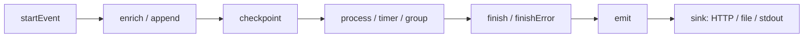
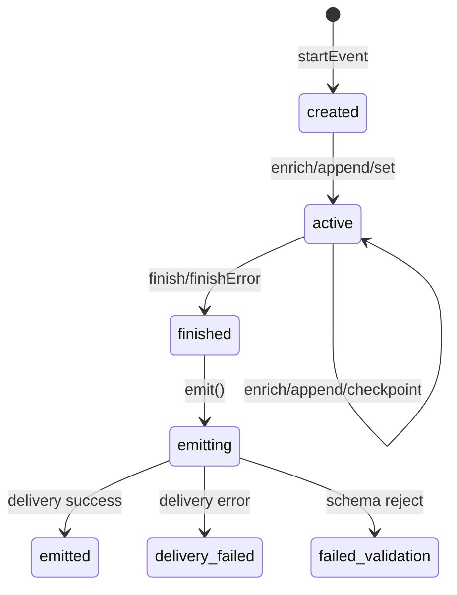

# Instrumentation Guide - loza

> A comprehensive, production-ready guide to instrumenting business workflows with the LOZA JS/TS SDK.

---

## Table of Contents

1. [Introduction](#1-introduction)
2. [Quick Start — Full Checkout Example](#2-quick-start--full-checkout-example)
3. [Core Lifecycle](#3-core-lifecycle)
4. [Timing Primitives](#4-timing-primitives)
5. [Attribute Constructors](#5-attribute-constructors)
6. [Canonical Helpers](#6-canonical-helpers)
7. [Business Helpers](#7-business-helpers)
8. [Error Handling](#8-error-handling)
9. [Middleware Integration](#9-middleware-integration)
10. [Configuration & Sinks](#10-configuration--sinks)
11. [Sampling & Redaction](#11-sampling--redaction)
12. [Testing](#12-testing)
13. [Real-World Examples](#13-real-world-examples)

---

## 1. Introduction

**loza** is the JavaScript/TypeScript SDK for the LOZA observability platform. It provides structured event lifecycle management, timing primitives, rich attribute typing, automatic redaction, and production-grade delivery — all designed for business-critical instrumentation.

### Why Structured Events?

Traditional logging emits flat text. LOZA emits **structured events** with:

- **Lifecycle tracking** — every event has a start, enrichment phase, checkpoint trail, and finish
- **Typed attributes** — not just strings; integers, floats, booleans, durations, groups
- **Timing primitives** — processes, timers, groups, and stopwatches with automatic duration tracking
- **Semantic helpers** — `userId`, `orderId`, `currency`, `amount` instead of raw key-value pairs
- **Production safety** — redaction, sampling, schema control, and async delivery out of the box

### Naming Convention

loza exports **camelCase** as the primary API and **PascalCase** aliases for every function:

```typescript
// These are identical — use whichever style you prefer
import { startEvent, userId, string } from "loza";
import { StartEvent, UserID, String } from "loza";
```

### Event Anatomy



Every event flows through this pipeline. You can add attributes at any point before `finish`, record checkpoints as breadcrumbs, and track timing with process handles.

---

## 2. Quick Start — Full Checkout Example

This example instruments a complete e-commerce checkout flow:

```typescript
import { loza } from "loza";

// --- One-time setup ---
loza.configure(
  loza.production("checkout-service")
    .withVersion("1.2.0")
    .withSink(loza.httpBatchSink({
      endpoint: "https://collector.example.com/ingest",
      apiKey: process.env.LOZA_API_KEY,
    }))
    .withRedactor(loza.defaultRedactor())
);

// --- Instrument a checkout ---
async function handleCheckout(req: CheckoutRequest): Promise<CheckoutResult> {
  const ctx = loza.startEvent({
    event: "checkout.request",
    kind: "http",
    method: "POST",
    path: "/api/checkout",
    route: "/api/checkout",
  });

  // Attach identity
  loza.append(ctx,
    loza.userId(req.userId),
    loza.tenantId(req.tenantId),
    loza.sessionId(req.sessionId),
  );

  // Attach business context
  loza.append(ctx,
    loza.orderId(req.orderId),
    loza.cartId(req.cartId),
    loza.currency(req.currency),
    loza.amount(req.totalAmount),
    loza.country(req.country),
    loza.platform(req.platform),
  );

  // Step 1: Validate cart
  loza.checkpoint(ctx, "cart.validated");
  const cart = await validateCart(req.cartId);
  loza.append(ctx, loza.int("cart.item_count", cart.items.length));

  // Step 2: Process payment (timed)
  const payment = loza.process(ctx, "payment.charge");
  try {
    const result = await chargePayment(cart, req.paymentMethod);
    payment.finish(loza.int("payment.status_code", 200));
    loza.append(ctx, loza.string("payment.provider", result.provider));
  } catch (err) {
    payment.finishError(err);
    throw err;
  }

  // Step 3: Fulfill order
  loza.checkpoint(ctx, "order.fulfilling");
  await fulfillOrder(cart, req.shippingAddress);

  // Done
  loza.finish(ctx, "success",
    loza.int("order.item_count", cart.items.length),
    loza.float64("order.total", req.totalAmount),
  );
  await loza.emit(ctx);

  return { orderId: req.orderId, status: "confirmed" };
}
```

**What the collector receives:**

```json
{
  "schema_version": "v1",
  "event_id": "01923a...",
  "event": "checkout.request",
  "kind": "http",
  "level": "info",
  "outcome": "success",
  "service": "checkout-service",
  "duration_ms": 847,
  "user": { "id": "u_abc123" },
  "tenant": { "id": "t_xyz" },
  "attrs": {
    "order.id": "ord_789",
    "cart.id": "cart_456",
    "payment.currency": "USD",
    "payment.amount": 149.99,
    "geo.country": "US",
    "device.platform": "ios",
    "cart.item_count": 3,
    "payment.provider": "stripe",
    "payment.status_code": 200,
    "order.total": 149.99
  },
  "checkpoints": [
    { "name": "cart.validated", "at_ms": 12 },
    { "name": "order.fulfilling", "at_ms": 534 }
  ],
  "processes": [
    { "step": 1, "name": "payment.charge", "started_at_ms": 13, "ended_at_ms": 533, "duration_ms": 520 }
  ]
}
```

---

## 3. Core Lifecycle

### 3.1 Starting Events

Every event begins with a `start*` call. Each returns an `Event` context you pass to every subsequent API.

| Function | Kind | Use Case |
|---|---|---|
| `startEvent(params)` | `"event"` | Generic business events |
| `startHttpEvent(params)` | `"http"` | HTTP request/response cycles |
| `startJobEvent(params)` | `"job"` | Background jobs (BullMQ, Agenda) |
| `startQueueEvent(params)` | `"queue"` | Queue consumer processing |
| `startCliEvent(params)` | `"cli"` | CLI command execution |
| `startCronEvent(params)` | `"cron"` | Scheduled/cron tasks |

```typescript
// Generic event
const ctx = loza.startEvent({ event: "user.signup" });

// HTTP event — automatically sets kind="http"
const ctx = loza.startHttpEvent({
  event: "GET /api/users",
  method: "GET",
  path: "/api/users",
  route: "/api/users",
  statusCode: 200,
});

// Job event
const ctx = loza.startJobEvent({ event: "email.send_welcome", name: "send-welcome-email" });

// Queue event
const ctx = loza.startQueueEvent({ event: "order.process", name: "order-queue" });

// CLI event
const ctx = loza.startCliEvent({ event: "db.migrate", name: "migrate" });

// Cron event
const ctx = loza.startCronEvent({ event: "report.daily", name: "daily-report" });
```

**Params object fields:**

| Field | Type | Description |
|---|---|---|
| `event` | `string` | Event name (dot-separated, e.g. `checkout.request`) |
| `name` | `string` | Alias for `event` |
| `kind` | `string` | Event kind: `event`, `http`, `job`, `queue`, `cli`, `cron` |
| `message` | `string` | Human-readable message |
| `level` | `string` | `debug`, `info`, `warn`, `error`, `fatal` |
| `method` | `string` | HTTP method |
| `path` | `string` | HTTP path |
| `route` | `string` | HTTP route pattern |
| `statusCode` | `number` | HTTP status code |
| `userId` | `string` | Shorthand for `user.id` attr |
| `tenantId` | `string` | Shorthand for `tenant.id` attr |
| `sessionId` | `string` | Shorthand for `session.id` attr |
| `custom` | `Attr[]` | Additional attributes |

### 3.2 Enriching Events

Add attributes to an event at any point before `finish`:

```typescript
// append / enrich — add typed attributes (identical behavior)
loza.append(ctx, loza.string("payment.method", "card"));
loza.enrich(ctx, loza.int("cart.item_count", 5));

// set — set a single key (raw value, no type wrapper)
loza.set(ctx, "custom.note", "rush delivery");

// merge — bulk-set from a plain object
loza.merge(ctx, {
  "shipping.carrier": "fedex",
  "shipping.tracking": "1Z999...",
});

// del — remove a key
loza.del(ctx, "temp.scratch");

// get — read a value back
const amount = loza.get(ctx, "payment.amount");

// getGroup — read all attrs with a prefix, prefix stripped
const userInfo = loza.getGroup(ctx, "user");
// { id: "u_123", plan: "pro", ... }
```

> **Note:** `append` and `enrich` are aliases. Use `append` as the v1-preferred name.

### 3.3 Checkpoints

Checkpoints are lightweight breadcrumbs that record "this point was reached" with a timestamp offset:

```typescript
loza.checkpoint(ctx, "validation.passed");
loza.checkpoint(ctx, "payment.charged", { provider: "stripe" });
loza.checkpoint(ctx, "email.sent", { template: "order_confirmation" });
```

Checkpoints appear in the emitted event as:

```json
"checkpoints": [
  { "name": "validation.passed", "at_ms": 5 },
  { "name": "payment.charged", "at_ms": 312, "attrs": { "provider": "stripe" } },
  { "name": "email.sent", "at_ms": 890, "attrs": { "template": "order_confirmation" } }
]
```

### 3.4 Finishing Events

```typescript
// Success
loza.finish(ctx, "success");

// Custom outcome
loza.finish(ctx, "partial", loza.int("items.shipped", 3));

// Error (see Section 8 for details)
loza.finishError(ctx, new Error("payment declined"));
```

### 3.5 Emitting & Flushing

```typescript
// Emit — encodes, applies redactor, delivers to sink
const json = await loza.emit(ctx);

// Flush — force-deliver any buffered events in the sink
await loza.flush();

// Shutdown — flush + close sink
await loza.shutdown();
```

### 3.6 runEvent — One-Shot Pattern

For simple events that don't need fine-grained control:

```typescript
await loza.runEvent(
  { event: "cache.warm" },
  async (ctx) => {
    loza.append(ctx, loza.string("cache.region", "us-east-1"));
    await warmCache();
    // finish is called automatically with "success"
  },
  [loza.string("cache.strategy", "lru")], // optional finish attrs
);
```

### 3.7 Immediate Log Helpers

For fire-and-forget log lines (no lifecycle, auto-finished):

```typescript
await loza.info("Server started", loza.int("port", 3000));
await loza.warn("High memory usage", loza.float64("memory.mb", 1024));
await loza.error("Database connection failed", loza.string("db.host", "primary"));
await loza.fatal("Out of memory");
await loza.debug("Cache miss", loza.string("key", "user:123"));
```

### 3.8 Event State Machine



---

## 4. Timing Primitives

loza provides four timing primitives, each suited to a different pattern.

### 4.1 Comparison Table

| Primitive | Returns | Tracks | Use Case |
|---|---|---|---|
| `process(ctx, name)` | `ProcessHandle` | Sequential steps with ordering | Multi-step pipelines |
| `startTimer(ctx, name)` | `TimerHandle` | Single elapsed duration | One-off measurements |
| `startGroup(ctx, name)` | `GroupHandle` | Named phase with start/end | Logical groupings |
| `stopwatch()` | `StopwatchHandle` | Standalone elapsed time | No event reference needed |

### 4.2 ProcessHandle

Processes are **ordered steps** in a pipeline. Each gets an auto-incremented step number.

```typescript
const step1 = loza.process(ctx, "validate_input");
await validateInput(data);
step1.finish();

const step2 = loza.process(ctx, "transform_data");
const transformed = await transform(data);
step2.finish(loza.int("records.processed", transformed.length));

const step3 = loza.process(ctx, "persist_to_db");
try {
  await db.insert(transformed);
  step3.finish();
} catch (err) {
  step3.finishError(err);
  throw err;
}
```

**ProcessHandle API:**

| Method | Description |
|---|---|
| `finish(...attrs)` | Mark step complete with optional attributes |
| `finishError(err, ...attrs)` | Mark step failed with error |
| `duration()` | Return elapsed ms since start |

**Emitted output:**

```json
"processes": [
  { "step": 1, "name": "validate_input", "started_at_ms": 0, "ended_at_ms": 12, "duration_ms": 12 },
  { "step": 2, "name": "transform_data", "started_at_ms": 13, "ended_at_ms": 89, "duration_ms": 76 },
  { "step": 3, "name": "persist_to_db", "started_at_ms": 90, "ended_at_ms": 245, "duration_ms": 155 }
]
```

### 4.3 TimerHandle

Timers measure a **single duration** without step ordering.

```typescript
const timer = loza.startTimer(ctx, "db.query");
const result = await db.query("SELECT * FROM orders WHERE ...");
timer.stop(loza.int("db.rows_returned", result.length));
```

**TimerHandle API:**

| Method | Description |
|---|---|
| `stop(...attrs)` | Stop the timer and record it |
| `duration()` | Return elapsed ms since start |

### 4.4 GroupHandle

Groups are **logical phases** that contain a start and end timestamp.

```typescript
const auth = loza.startGroup(ctx, "authentication");
const user = await verifyToken(token);
auth.finish(loza.string("auth.method", "jwt"));

const authz = loza.startGroup(ctx, "authorization");
await checkPermissions(user, resource);
authz.finish();
```

**GroupHandle API:**

| Method | Description |
|---|---|
| `finish(...attrs)` | Close the group and record it |
| `duration()` | Return elapsed ms since start |

### 4.5 StopwatchHandle

Stopwatches are **standalone** — they have no event reference and emit nothing. Use them for ad-hoc timing.

```typescript
const sw = loza.stopwatch();

await doSomething();
console.log(`Step 1 took ${sw.elapsed()}ms`);

await doSomethingElse();
console.log(`Total: ${sw.elapsed()}ms`);
```

**StopwatchHandle API:**

| Method | Description |
|---|---|
| `elapsed()` | Return ms since creation |

---

## 5. Attribute Constructors

Attributes are typed key-value pairs attached to events. Each constructor returns an `Attr` object.

### 5.1 Primitive Types

| Constructor | Alias | Type | Example |
|---|---|---|---|
| `String(k, v)` | `string(k, v)` | `string` | `string("env", "prod")` |
| `Int(k, v)` | `int(k, v)` | `number` | `int("retries", 3)` |
| `Int64(k, v)` | `int64(k, v)` | `number` | `int64("seq", 9007199254740993)` |
| `Uint64(k, v)` | `uint64(k, v)` | `number` | `uint64("bytes", 1024)` |
| `Float64(k, v)` | `float64(k, v)` | `number` | `float64("latency_ms", 12.5)` |
| `Bool(k, v)` | `bool(k, v)` | `boolean` | `bool("cached", true)` |
| `Null(k)` | `null_(k)` | `null` | `null_("deprecated_field")` |
| `Any(k, v)` | `any(k, v)` | `any` | `any("metadata", { nested: true })` |
| `Time(k, v)` | `time(k, v)` | ISO string | `time("deadline", new Date())` |
| `Duration(k, v)` | `duration(k, v)` | `number` (ms) | `duration("timeout", 5000)` |

### 5.2 Group Constructor

Groups create nested attribute structures:

```typescript
loza.append(ctx,
  loza.group("request", [
    loza.string("method", "POST"),
    loza.string("path", "/api/orders"),
    loza.int("status_code", 201),
  ])
);
```

### 5.3 Sensitive & Hashed Attributes

```typescript
// Mark a value as sensitive (redacted by redactor)
loza.append(ctx, loza.sensitiveString("ssn", "123-45-6789"));
// Output: { "ssn": "[REDACTED]" }

// Hash a value (SHA-256, reversible for correlation only)
loza.append(ctx, loza.hashString("email", "user@example.com"));
// Output: { "email": "sha256:a1b2c3..." }

// Mark any attr as sensitive after creation
loza.append(ctx, loza.markSensitive(loza.string("secret", "top-secret")));
```

---

## 6. Canonical Helpers

Canonical helpers map to **well-known attribute keys** used across the LOZA platform. They enable cross-service correlation, tenant isolation, and distributed tracing.

| Helper | Alias | Key | Description |
|---|---|---|---|
| `UserID(id)` | `userId(id)` | `user.id` | End-user identifier |
| `TenantID(id)` | `tenantId(id)` | `tenant.id` | Multi-tenant identifier |
| `WorkspaceID(id)` | `workspaceId(id)` | `workspace.id` | Workspace/team identifier |
| `OrganizationID(id)` | `organizationId(id)` | `organization.id` | Organization identifier |
| `SessionID(id)` | `sessionId(id)` | `session.id` | Session identifier |
| `RequestID(id)` | `requestId(id)` | `request_id` | HTTP request correlation |
| `TraceID(id)` | `traceId(id)` | `trace_id` | Distributed trace ID |
| `SpanID(id)` | `spanId(id)` | `span_id` | Trace span ID |
| `FeatureFlag(name, val)` | `featureFlag(name, val)` | `feature.{name}` | Feature flag value |
| `FeatureFlagBool(name, val)` | `featureFlagBool(name, val)` | `feature.{name}` | Boolean feature flag |
| `Experiment(name, variant)` | `experiment(name, variant)` | `experiment.{name}` | A/B test variant |

```typescript
loza.append(ctx,
  loza.userId("u_abc123"),
  loza.tenantId("t_enterprise"),
  loza.workspaceId("ws_main"),
  loza.organizationId("org_acme"),
  loza.sessionId("sess_xyz789"),
  loza.requestId("req_001"),
  loza.traceId("trace_abc"),
  loza.spanId("span_def"),
  loza.featureFlag("new_checkout", true),
  loza.experiment("pricing_v2", "variant_b"),
);
```

> **Tip:** You can also pass canonical IDs directly in `startEvent` params: `loza.startEvent({ event: "x", userId: "u_123", tenantId: "t_456" })`.

---

## 7. Business Helpers

Business helpers provide **domain-specific attribute constructors** for e-commerce, SaaS, and application contexts.

### 7.1 Commerce

| Helper | Alias | Key | Type |
|---|---|---|---|
| `OrderID(id)` | `orderId(id)` | `order.id` | `string` |
| `CartID(id)` | `cartId(id)` | `cart.id` | `string` |
| `ProductID(id)` | `productId(id)` | `product.id` | `string` |
| `CustomerID(id)` | `customerId(id)` | `customer.id` | `string` |
| `Plan(name)` | `plan(name)` | `customer.plan` | `string` |
| `Currency(code)` | `currency(code)` | `payment.currency` | `string` |
| `Amount(val)` | `amount(val)` | `payment.amount` | `float64` |

```typescript
loza.append(ctx,
  loza.orderId("ord_2024_001"),
  loza.cartId("cart_abc"),
  loza.productId("prod_widget_v2"),
  lozaCustomerId("cust_xyz"),
  loza.plan("enterprise"),
  loza.currency("USD"),
  loza.amount(299.99),
);
```

### 7.2 Application

| Helper | Alias | Key | Type |
|---|---|---|---|
| `Country(code)` | `country(code)` | `geo.country` | `string` |
| `Device(name)` | `device(name)` | `device.name` | `string` |
| `Platform(name)` | `platform(name)` | `device.platform` | `string` |
| `AppVersion(ver)` | `appVersion(ver)` | `app.version` | `string` |

```typescript
loza.append(ctx,
  loza.country("US"),
  loza.device("iPhone 15"),
  loza.platform("ios"),
  loza.appVersion("3.1.0"),
);
```

---

## 8. Error Handling

### 8.1 The finishError Pattern

`finishError` extracts structured error information and sets `outcome: "error"`:

```typescript
try {
  await processPayment(order);
  loza.finish(ctx, "success");
} catch (err) {
  loza.finishError(ctx, err);
  // Automatically sets:
  //   outcome = "error"
  //   error.type = "Error" (constructor name)
  //   error.message = "Card declined"
  //   error.stack = "Error: Card declined\n    at ..."
}
await loza.emit(ctx);
```

### 8.2 Error Attribute Helpers

For fine-grained error context, use the error attribute helpers:

```typescript
loza.finishError(ctx, err,
  loza.errorType("PaymentDeclined"),
  loza.errorCode("CARD_DECLINED"),
  loza.errorMessage("Your card was declined"),
  loza.errorStack(stackTrace),
  loza.retryable(true),
);
```

| Helper | Alias | Key | Description |
|---|---|---|---|
| `ErrorType(t)` | `errorType(t)` | `error.type` | Error classification |
| `ErrorCode(c)` | `errorCode(c)` | `error.code` | Machine-readable code |
| `ErrorMessage(m)` | `errorMessage(m)` | `error.message` | Human-readable message |
| `ErrorStack(s)` | `errorStack(s)` | `error.stack` | Stack trace |
| `Retryable(v)` | `retryable(v)` | `error.retryable` | Whether the operation can be retried |

### 8.3 Error with Process Steps

```typescript
const step = loza.process(ctx, "external_api_call");
try {
  const res = await fetch("https://api.example.com/data");
  step.finish(loza.int("http.status", res.status));
} catch (err) {
  step.finishError(err,
    loza.string("api.endpoint", "/data"),
    loza.retryable(true),
  );
  loza.finishError(ctx, err, loza.errorCode("API_UNAVAILABLE"));
}
await loza.emit(ctx);
```

### 8.4 Try-Catch with runEvent

The `runEvent` helper auto-catches and finishes with error:

```typescript
await loza.runEvent(
  { event: "report.generate" },
  async (ctx) => {
    loza.append(ctx, loza.string("report.type", "monthly"));
    const data = await fetchReportData();
    await renderReport(data);
    // Auto-finishes with "success"
  },
  // If the function throws, auto-finishes with "error"
);
```

---

## 9. Middleware Integration

### 9.1 Express Middleware

loza includes a drop-in Express middleware that instruments every request:

```typescript
import express from "express";
import { lozaMiddleware } from "loza/middleware/express";

const app = express();

app.use(lozaMiddleware({
  service: "api-gateway",
  routeExtractor: (req) => req.route?.path || req.path,
}));

app.get("/api/users/:id", async (req, res) => {
  const user = await getUser(req.params.id);
  res.json(user);
  // Middleware auto-emits: "GET /api/users/:id" with status, duration, user-agent
});
```

**What the middleware captures:**

| Field | Source |
|---|---|
| `event` | `"{METHOD} {route}"` |
| `kind` | `"http"` |
| `method` | `req.method` |
| `path` | `req.path` |
| `route` | `req.route.path` or `req.path` |
| `http.user_agent` | `req.headers['user-agent']` |
| `http.remote_ip` | `req.ip` |
| `outcome` | `"error"` if status >= 500, else `"success"` |
| `status_code` | `res.statusCode` |
| `duration_ms` | Time from request to response end |

### 9.2 Manual HTTP Instrumentation

For frameworks without middleware support (Fastify, Koa, Hono):

```typescript
async function handleRequest(req: Request): Promise<Response> {
  const ctx = loza.startHttpEvent({
    event: `${req.method} ${new URL(req.url).pathname}`,
    method: req.method,
    path: new URL(req.url).pathname,
  });

  loza.append(ctx,
    loza.string("http.user_agent", req.headers.get("user-agent") || ""),
  );

  const timer = loza.startTimer(ctx, "handler.duration");

  try {
    const response = await routeHandler(req);
    timer.stop();
    loza.finish(ctx, response.status >= 500 ? "error" : "success",
      loza.int("status_code", response.status),
    );
    return response;
  } catch (err) {
    timer.stop();
    loza.finishError(ctx, err);
    throw err;
  } finally {
    await loza.emit(ctx);
  }
}
```

---

## 10. Configuration & Sinks

### 10.1 Configuration Presets

| Preset | Async | Strict | Environment | Use Case |
|---|---|---|---|---|
| `production(service)` | Yes | Yes | `"production"` | Live traffic |
| `dev(service)` | No | No | `"development"` | Local development |
| `test(service?)` | No | No | `"test"` | Unit/integration tests |

```typescript
// Production — async delivery, strict validation
loza.configure(
  loza.production("order-service")
    .withVersion("2.1.0")
    .withSink(loza.httpBatchSink({
      endpoint: "https://collector.example.com/ingest",
      apiKey: process.env.LOZA_API_KEY,
    }))
);

// Development — stdout, no batching
loza.configure(
  loza.dev("order-service")
    .withSink(loza.stdoutSink())
);

// Test — memory capture
loza.configure(
  loza.test("order-service")
    .withSink(loza.memorySink())
);
```

### 10.2 ConfigBuilder Methods

| Method | Description | Default |
|---|---|---|
| `.withService(name)` | Service name | `""` |
| `.withVersion(ver)` | Service version | `""` |
| `.withEnvironment(env)` | Environment name | `"development"` |
| `.withSink(sink)` | Primary event sink | `null` |
| `.withSinks(...sinks)` | Multiple sinks | `[]` |
| `.withSampler(sampler)` | Sampling policy | `sampleAll()` |
| `.withRedactor(redactor)` | Redaction policy | `null` |
| `.withSchema(schema)` | Output schema | `DefaultSchema` |
| `.withAsync(enabled)` | Async delivery | `false` (prod: `true`) |
| `.withCollectorUrl(url)` | Collector HTTP endpoint | `""` |
| `.withApiKey(key)` | API key for auth | `LOZA_API_KEY` env |
| `.withBatchSize(n)` | Events per batch | `50` |
| `.withFlushInterval(ms)` | Flush interval | `5000` |
| `.withStrict(bool)` | Strict validation | `false` (prod: `true`) |
| `.withDuplicatePolicy(p)` | Canonical field policy | `"canonical_wins"` |
| `.withIncludeHost(bool)` | Include hostname | `true` |

### 10.3 Available Sinks

| Sink | Factory | Description |
|---|---|---|
| **HTTPBatchSink** | `httpBatchSink(opts)` | Batched HTTP delivery to collector |
| **StdoutSink** | `stdoutSink()` | NDJSON to stdout |
| **StderrSink** | `stderrSink()` | NDJSON to stderr |
| **FileSink** | `fileSink(path)` | Append NDJSON to file |
| **RotatingFileSink** | `rotatingFileSink(path)` | File sink with rotation |
| **MemorySink** | `memorySink()` | In-memory capture (testing) |
| **NoopSink** | `noopSink()` | Discard all events |

### 10.4 HTTPBatchSink Options

```typescript
const sink = loza.httpBatchSink({
  endpoint: "https://collector.example.com/ingest",
  apiKey: process.env.LOZA_API_KEY,
  authHeader: "Authorization",       // default: "Authorization" → "Bearer {key}"
  service: "order-service",
  timeout: 2000,                     // ms per request
  retries: 3,                        // max retry attempts
  baseDelay: 100,                    // initial backoff ms
  maxDelay: 30000,                   // max backoff ms
  enableCompression: true,           // gzip compression
  batchSize: 50,                     // events per batch
  flushIntervalMs: 5000,             // max time between flushes
  ndjson: false,                     // true = NDJSON, false = JSON envelope
  statsHandler: {
    onCollectorAck({ acks, errors, requestId }) {
      console.log(`Batch ${requestId}: ${acks.length} accepted, ${errors.length} rejected`);
    },
  },
});
```

### 10.5 Auto-Wiring with collectorUrl

If you set `collectorUrl` in config, the SDK auto-creates an `HTTPBatchSink`:

```typescript
loza.configure(
  loza.production("my-service")
    .withCollectorUrl("https://collector.example.com/ingest")
    .withApiKey(process.env.LOZA_API_KEY)
);
// No explicit .withSink() needed — HTTPBatchSink is auto-wired
```

---

## 11. Sampling & Redaction

### 11.1 Sampling Policies

Sampling controls **which events are emitted**. Dropped events are silently discarded before encoding.

| Sampler | Description |
|---|---|
| `sampleAll()` | Keep every event (default) |
| `sampleNone()` | Drop every event |
| `sampleRandom(rate)` | Keep `rate` fraction (0.0 to 1.0) |
| `sampleErrors()` | Keep only error events |
| `sampleSlowRequests(thresholdMs)` | Keep events with duration >= threshold |
| `sampleStatusCodes(...codes)` | Keep events with matching HTTP status codes |
| `sampleRoutes(...routes)` | Keep events matching route or path |
| `sampleUsers(...ids)` | Keep events for specific user IDs |
| `sampleTenants(...ids)` | Keep events for specific tenant IDs |
| `sampleFeatureFlag(name, value)` | Keep events matching a feature flag |
| `sampleRateLimited(rate, windowMs)` | Token-bucket rate limiter |
| `sampleByHeader(header, value?)` | Keep events where an HTTP header matches |

**Combinators:**

| Combinator | Description |
|---|---|
| `anySampler(...samplers)` | Logical OR — keep if any sampler matches |
| `allSampler(...samplers)` | Logical AND — keep if all samplers match |
| `notSampler(sampler)` | Logical NOT — invert a sampler |

```typescript
// Production: keep errors + slow requests + 10% of everything else
loza.configure(
  loza.production("api-service")
    .withSampler(loza.anySampler(
      loza.sampleErrors(),
      loza.sampleSlowRequests(2000),
      loza.sampleRandom(0.1),
    ))
);

// Debug specific user
loza.configure(
  loza.dev("api-service")
    .withSampler(loza.sampleUsers("u_debug_123"))
);

// Rate limit to 1000 events/sec
loza.configure(
  loza.production("high-volume-service")
    .withSampler(loza.sampleRateLimited(1000, 1000))
);
```

### 11.2 Redaction Policies

Redaction transforms **event payloads** before encoding. It runs after schema encoding and before sink delivery.

| Redactor | Description |
|---|---|
| `defaultRedactor()` | Redact 14 sensitive keys (password, token, api_key, etc.) |
| `redactKeys(...keys)` | Replace matching values with `[REDACTED]` |
| `hashKeys(...keys)` | Replace matching values with `sha256:{hash}` |
| `maskKeys(...keys)` | Mask: first 2 + last 2 chars visible (`ab****yz`) |
| `dropKeys(...keys)` | Remove matching keys entirely |
| `composeRedactors(...redactors)` | Chain multiple redactors |

```typescript
// Default redaction (passwords, tokens, secrets)
loza.configure(
  loza.production("auth-service")
    .withRedactor(loza.defaultRedactor())
);

// Custom redaction
loza.configure(
  loza.production("payment-service")
    .withRedactor(loza.composeRedactors(
      loza.defaultRedactor(),
      loza.redactKeys("card_number", "cvv", "ssn"),
      loza.hashKeys("email", "phone"),
      loza.maskKeys("account_number"),
    ))
);
```

### 11.3 Attribute-Level Redaction

Mark individual attributes as sensitive at construction time:

```typescript
// These are redacted by the redactor before emission
loza.append(ctx,
  loza.sensitiveString("password", "hunter2"),        // → [REDACTED]
  loza.hashString("email", "user@example.com"),       // → sha256:...
  loza.markSensitive(loza.string("secret", "value")), // → [REDACTED]
);
```

---

## 12. Testing

### 12.1 testLogger

Creates a logger with a `MemorySink` for capturing events in tests:

```typescript
import { testLogger, assertEvent, assertHasCheckpoint, assertRedacted } from "loza";

describe("checkout flow", () => {
  it("should emit checkout event with correct attrs", async () => {
    const { logger, sink } = testLogger({ service: "test" });

    const ctx = logger.startEvent({ event: "checkout.request" });
    logger.append(ctx,
      loza.userId("u_test"),
      loza.orderId("ord_test"),
      loza.amount(99.99),
    );
    logger.checkpoint(ctx, "validated");
    logger.finish(ctx, "success");
    await logger.emit(ctx);

    const events = sink.getEvents();
    expect(events).toHaveLength(1);

    const event = JSON.parse(events[0]);
    expect(event.event).toBe("checkout.request");
    expect(event.outcome).toBe("success");
    expect(event.user.id).toBe("u_test");
  });
});
```

### 12.2 capture

One-shot capture helper for quick assertions:

```typescript
import { capture, assertEvent, assertAttr } from "loza";

it("should track error outcome", async () => {
  const events = await capture(async (logger) => {
    const ctx = logger.startEvent({ event: "payment.charge" });
    logger.finishError(ctx, new Error("declined"));
    await logger.emit(ctx);
  });

  expect(events).toHaveLength(1);
  assertEvent(events[0], "outcome", "error");
  assertEvent(events[0], "error.type", "Error");
  assertEvent(events[0], "error.message", "declined");
});
```

### 12.3 Assertion Helpers

| Helper | Description |
|---|---|
| `assertEvent(json, key, expected)` | Assert a top-level or nested key equals expected value |
| `assertAttr(json, key, expected)` | Alias for `assertEvent` |
| `assertRedacted(json, key)` | Assert a key's value is `[REDACTED]` |
| `assertHasCheckpoint(json, name)` | Assert a checkpoint with the given name exists |

```typescript
import { capture, assertEvent, assertRedacted, assertHasCheckpoint } from "loza";

it("should redact sensitive fields", async () => {
  const events = await capture(async (logger) => {
    const ctx = logger.startEvent({ event: "auth.login" });
    logger.append(ctx, loza.sensitiveString("password", "secret123"));
    logger.finish(ctx, "success");
    await logger.emit(ctx);
  });

  assertRedacted(events[0], "attrs.password");
});

it("should record checkpoints", async () => {
  const events = await capture(async (logger) => {
    const ctx = logger.startEvent({ event: "order.process" });
    logger.checkpoint(ctx, "validated");
    logger.checkpoint(ctx, "charged");
    logger.finish(ctx, "success");
    await logger.emit(ctx);
  });

  assertHasCheckpoint(events[0], "validated");
  assertHasCheckpoint(events[0], "charged");
});
```

### 12.4 Testing Patterns

**With Jest/Vitest:**

```typescript
import { testLogger, assertEvent } from "loza";

// In beforeEach or test setup
const { logger, sink } = testLogger();

afterEach(() => {
  sink.clear();
});

it("should instrument order creation", async () => {
  const ctx = logger.startEvent({ event: "order.create" });
  // ... instrument your code ...
  logger.finish(ctx, "success");
  await logger.emit(ctx);

  const events = sink.getEvents();
  assertEvent(events[0], "event", "order.create");
});
```

**With process timing:**

```typescript
it("should track process steps", async () => {
  const events = await capture(async (logger) => {
    const ctx = logger.startEvent({ event: "pipeline.run" });

    const s1 = logger.process(ctx, "extract");
    s1.finish();
    const s2 = logger.process(ctx, "transform");
    s2.finish();
    const s3 = logger.process(ctx, "load");
    s3.finish();

    logger.finish(ctx, "success");
    await logger.emit(ctx);
  });

  const event = JSON.parse(events[0]);
  expect(event.process).toHaveLength(3);
  expect(event.process[0].name).toBe("extract");
  expect(event.process[1].name).toBe("transform");
  expect(event.process[2].name).toBe("load");
});
```

---

## 13. Real-World Examples

### 13.1 E-Commerce Checkout Flow

```typescript
import { loza } from "loza";

async function handleCheckout(req: CheckoutRequest) {
  const ctx = loza.startEvent({
    event: "checkout.complete",
    kind: "http",
    method: "POST",
    path: "/checkout",
  });

  loza.append(ctx,
    loza.userId(req.userId),
    loza.tenantId(req.tenantId),
    loza.orderId(req.orderId),
    loza.cartId(req.cartId),
    loza.currency(req.currency),
    loza.amount(req.total),
    loza.country(req.country),
    loza.platform(req.platform),
    loza.featureFlag("express_checkout", req.isExpress),
  );

  // Validate
  loza.checkpoint(ctx, "cart.validated");
  const cart = await validateCart(req.cartId);

  // Reserve inventory
  const reserve = loza.process(ctx, "inventory.reserve");
  await reserveInventory(cart.items);
  reserve.finish(loza.int("items.reserved", cart.items.length));

  // Charge payment
  const pay = loza.process(ctx, "payment.charge");
  try {
    const charge = await chargePayment(cart, req.paymentMethod);
    pay.finish(loza.string("payment.provider", charge.provider));
    loza.append(ctx, loza.string("payment.id", charge.id));
  } catch (err) {
    pay.finishError(err);
    await releaseInventory(cart.items);
    loza.finishError(ctx, err, loza.errorCode("PAYMENT_FAILED"));
    await loza.emit(ctx);
    throw err;
  }

  // Fulfill
  loza.checkpoint(ctx, "order.fulfilling");
  await createShipment(cart, req.shippingAddress);

  loza.finish(ctx, "success",
    loza.int("order.item_count", cart.items.length),
    loza.float64("order.total", req.total),
  );
  await loza.emit(ctx);
}
```

### 13.2 Payment Processing with Retry

```typescript
async function processPaymentWithRetry(order: Order, maxRetries = 3) {
  const ctx = loza.startEvent({
    event: "payment.process",
    kind: "job",
  });

  loza.append(ctx,
    loza.orderId(order.id),
    loza.customerId(order.customerId),
    loza.currency(order.currency),
    loza.amount(order.total),
    loza.int("payment.max_retries", maxRetries),
  );

  for (let attempt = 1; attempt <= maxRetries; attempt++) {
    loza.checkpoint(ctx, `attempt.${attempt}`);

    const timer = loza.startTimer(ctx, `payment.attempt_${attempt}`);
    try {
      const result = await chargeCard(order);
      timer.stop(loza.int("payment.status_code", 200));

      loza.finish(ctx, "success",
        loza.int("payment.attempts", attempt),
        loza.string("payment.provider", result.provider),
      );
      await loza.emit(ctx);
      return result;
    } catch (err) {
      timer.stop();
      loza.append(ctx,
        loza.errorType(err.constructor.name),
        loza.errorMessage(err.message),
        loza.retryable(isRetryable(err)),
      );

      if (!isRetryable(err) || attempt === maxRetries) {
        loza.finishError(ctx, err,
          loza.int("payment.attempts", attempt),
          loza.errorCode("PAYMENT_EXHAUSTED"),
        );
        await loza.emit(ctx);
        throw err;
      }

      loza.warn(`Payment attempt ${attempt} failed, retrying`, loza.int("attempt", attempt));
    }
  }
}
```

### 13.3 Authentication Flow

```typescript
async function authenticateUser(req: AuthRequest) {
  const ctx = loza.startHttpEvent({
    event: "auth.login",
    method: "POST",
    path: "/auth/login",
  });

  loza.append(ctx,
    loza.string("auth.method", req.method),
    loza.string("auth.provider", req.provider),
    loza.sessionId(req.sessionId),
    loza.string("http.remote_ip", req.ip),
    loza.string("http.user_agent", req.userAgent),
  );

  // Rate limit check
  const rateLimit = loza.process(ctx, "rate_limit.check");
  const allowed = await checkRateLimit(req.ip);
  rateLimit.finish(loza.bool("rate_limit.allowed", allowed));

  if (!allowed) {
    loza.finish(ctx, "rejected", loza.errorCode("RATE_LIMITED"));
    await loza.emit(ctx);
    return { status: 429 };
  }

  // Credential verification
  const verify = loza.process(ctx, "credentials.verify");
  try {
    const user = await verifyCredentials(req.email, req.password);
    verify.finish(loza.string("user.role", user.role));
    loza.append(ctx, loza.userId(user.id), loza.string("user.role", user.role));
  } catch (err) {
    verify.finishError(err);
    loza.finishError(ctx, err, loza.errorCode("INVALID_CREDENTIALS"));
    await loza.emit(ctx);
    return { status: 401 };
  }

  // Token generation
  const tokenTimer = loza.startTimer(ctx, "token.generate");
  const token = await generateToken(user);
  token.stop();

  loza.finish(ctx, "success");
  await loza.emit(ctx);
  return { status: 200, token };
}
```

### 13.4 Background Job Processing

```typescript
async function processEmailJob(job: EmailJob) {
  const ctx = loza.startJobEvent({
    event: "email.send",
    name: "send-email",
  });

  loza.append(ctx,
    loza.string("email.to", job.to),
    loza.string("email.template", job.template),
    loza.string("email.provider", "sendgrid"),
    loza.userId(job.userId),
    loza.tenantId(job.tenantId),
  );

  // Render template
  const render = loza.process(ctx, "template.render");
  const html = await renderTemplate(job.template, job.data);
  render.finish(loza.int("email.body_bytes", html.length));

  // Send
  const send = loza.process(ctx, "email.deliver");
  try {
    const result = await sendEmail(job.to, html);
    send.finish(loza.string("email.message_id", result.messageId));
    loza.checkpoint(ctx, "email.delivered");
  } catch (err) {
    send.finishError(err);
    throw err;
  }

  loza.finish(ctx, "success");
  await loza.emit(ctx);
}
```

### 13.5 Queue Consumer

```typescript
async function processOrderQueue(message: QueueMessage) {
  const ctx = loza.startQueueEvent({
    event: "order.process",
    name: "order-queue",
  });

  loza.append(ctx,
    loza.orderId(message.orderId),
    loza.string("queue.name", "orders"),
    loza.string("queue.message_id", message.id),
    loza.int("queue.attempt", message.attempt),
  );

  const group = loza.startGroup(ctx, "order_processing");

  // Validate
  loza.checkpoint(ctx, "order.validated");
  await validateOrder(message.payload);

  // Process items
  const items = loza.process(ctx, "items.process");
  await processItems(message.payload.items);
  items.finish(loza.int("items.count", message.payload.items.length));

  // Update status
  await updateOrderStatus(message.orderId, "completed");
  group.finish();

  loza.finish(ctx, "success");
  await loza.emit(ctx);
}
```

### 13.6 Scheduled Cron Job

```typescript
async function generateDailyReport() {
  const ctx = loza.startCronEvent({
    event: "report.daily",
    name: "daily-report",
  });

  loza.append(ctx,
    loza.string("report.type", "daily"),
    loza.string("report.date", new Date().toISOString().split("T")[0]),
  );

  // Fetch data
  const fetch = loza.process(ctx, "data.fetch");
  const data = await fetchReportData();
  fetch.finish(loza.int("report.rows", data.length));

  // Generate PDF
  const generate = loza.process(ctx, "report.generate");
  const pdf = await generatePDF(data);
  generate.finish(loza.int("report.pdf_bytes", pdf.length));

  // Distribute
  const distribute = loza.process(ctx, "report.distribute");
  await sendReport(pdf, ["admin@example.com"]);
  distribute.finish(loza.int("report.recipients", 1));

  loza.finish(ctx, "success",
    loza.int("report.rows", data.length),
    loza.int("report.pdf_bytes", pdf.length),
  );
  await loza.emit(ctx);
}
```

### 13.7 Multi-Tenant SaaS with Feature Flags

```typescript
async function handleTenantRequest(req: TenantRequest) {
  const ctx = loza.startHttpEvent({
    event: "api.request",
    method: req.method,
    path: req.path,
    route: req.route,
  });

  loza.append(ctx,
    loza.userId(req.userId),
    loza.tenantId(req.tenantId),
    loza.workspaceId(req.workspaceId),
    loza.organizationId(req.orgId),
    loza.plan(req.tenantPlan),
    loza.featureFlag("new_dashboard", req.flags.newDashboard),
    loza.featureFlagBool("dark_mode", req.flags.darkMode),
    loza.experiment("onboarding_v2", req.experiments.onboarding),
  );

  // Tenant-aware sampling
  if (req.tenantPlan === "free") {
    loza.append(ctx, loza.string("sampling.tier", "reduced"));
  }

  // ... handle request ...

  loza.finish(ctx, "success");
  await loza.emit(ctx);
}
```

---

## Appendix: Schema Options

| Schema | Output Shape | Best For |
|---|---|---|
| `DefaultSchema` / `NestedSchema` | Canonical fields + grouped attrs | General use, LOZA collector |
| `FlatSchema` | All fields flattened with dot keys | Flat log aggregators |
| `OTelLogSchema` / `OTelSchema` | OpenTelemetry log format | OTel-compatible pipelines |
| `ECSchema` | Elastic Common Schema | Elasticsearch |
| `DatadogSchema` | Datadog JSON format | Datadog intake |
| `CustomSchema(fn)` | Your projection function | Custom integrations |

```typescript
// Use ECSchema for Elasticsearch
loza.configure(
  loza.production("my-service")
    .withSink(loza.httpBatchSink({ endpoint: "..." }))
    .withSchema(new loza.ECSchema())
);

// Use DatadogSchema for Datadog
loza.configure(
  loza.production("my-service")
    .withSink(loza.httpBatchSink({ endpoint: "..." }))
    .withSchema(new loza.DatadogSchema())
);

// Custom schema
const mySchema = loza.CustomSchema((view) => ({
  ts: view.timestamp,
  msg: view.event,
  lvl: view.level,
  data: view.attrs,
}));
```

---

## Appendix: Context API

For accessing the current event from deep call stacks without passing `ctx`:

```typescript
import { getEvent, hasEvent, eventId, runWithEvent } from "loza";

// Check if an event is in context
if (hasEvent()) {
  const ev = getEvent();
  ev?.checkpoint("deep_function.reached");
}

// Get just the event ID
const id = eventId();

// Run a function with a specific event in context
runWithEvent(ctx, () => {
  // Any code here can call getEvent() to access ctx
  deepFunction();
});
```

> **Note:** Context uses Node.js `AsyncLocalStorage`. It works automatically within async chains but requires `runWithEvent` for synchronous boundaries.

---

*Generated for loza v0.0.1. See [public-api.md](./public-api.md) for the full API surface reference.*
