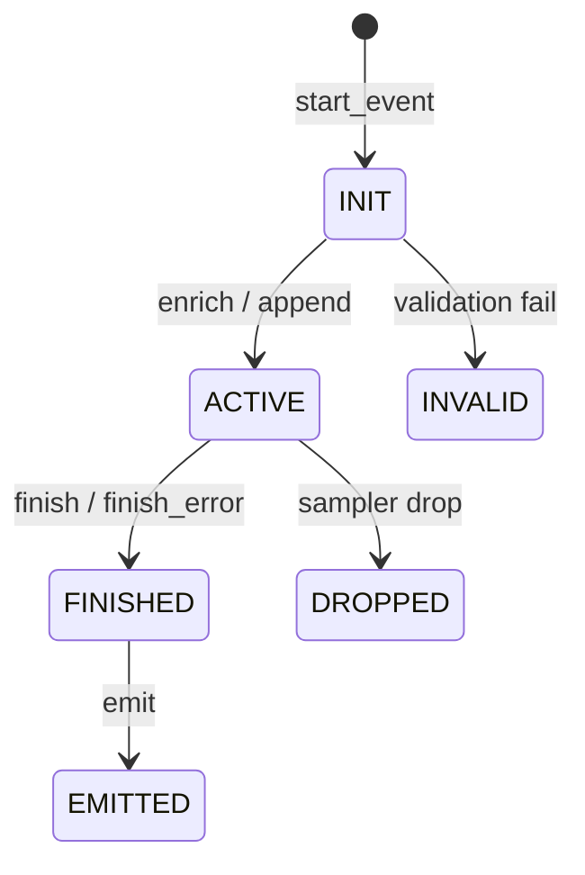

# Instrumentation Guide — Python

> **Audience**: Python developers instrumenting checkout, payments, auth, jobs, queues, and cron flows with LOXA.

This guide covers LOXA's Python SDK for real-world Instrumentation. All APIs use Python naming conventions:

- **Functions**: `snake_case` — `start_event`, `enrich`, `checkpoint`, `finish`, `emit`
- **Constructors**: `PascalCase` — `String`, `Int`, `UserID`, `OrderID`
- **Uppercase aliases** also available — `StartEvent`, `Enrich`, `Finish`

---

## Quick Start

```python
from loxa import (
    production, configure, start_http_event, enrich, checkpoint,
    finish, finish_error, emit, shutdown,
    String, Int, Bool, UserID, OrderID, CartID, Amount, Currency,
    FeatureFlag, HTTPBatchSink,
)

# Configure
configure(
    production("checkout").with_sink(
        HTTPBatchSink("http://127.0.0.1:9090/events")
    )
)

# Instrument a checkout request
ctx = start_http_event(None, event="checkout.request", method="POST", path="/checkout")

enrich(ctx,
    UserID("u_123"),
    OrderID("ord_83k2"),
    CartID("cart_456"),
    Amount(1399900),
    Currency("INR"),
    FeatureFlag("checkout_v2", "on"),
)

checkpoint(ctx, "cart_loaded")
checkpoint(ctx, "payment_started")

try:
    # ... process checkout ...
    finish(ctx, "success", Int("status_code", 200))
except Exception as e:
    finish_error(ctx, e, Int("status_code", 500))
finally:
    emit(ctx)
```

---

## Core Lifecycle

### Event Lifecycle State Machine



### Starting Events

```python
from loxa import (
    start_event, start_http_event, start_job_event,
    start_queue_event, start_cli_event, start_cron_event,
    Params,
)

# Generic event
ctx = start_event(Params(event="order.created", kind="event"))

# Typed starters
ctx = start_http_event(None, event="http.request", method="POST", path="/checkout")
ctx = start_job_event(None, event="job.send_email")
ctx = start_queue_event(None, event="queue.process")
ctx = start_cli_event(None, event="cli.run")
ctx = start_cron_event(None, event="cron.daily_billing")
```

### Enriching Events

```python
from loxa import enrich, append, set, merge, delete, get, get_group, String, Int

# Add attributes
enrich(ctx, String("user.id", "u_123"), Int("cart.items", 3))

# Append (alias for enrich)
append(ctx, String("key", "value"))

# Override a field
set(ctx, String("status", "processing"))

# Merge into a group
merge(ctx, "payment", String("provider", "stripe"), Int("attempt", 1))

# Delete a field
delete(ctx, "temp_field")

# Read fields
val = get(ctx, "user.id")
group = get_group(ctx, "payment")
```

### Checkpoints

```python
from loxa import checkpoint

checkpoint(ctx, "cart_loaded")
checkpoint(ctx, "risk_checked")
checkpoint(ctx, "payment_started")
```

### Finishing and Emitting

```python
from loxa import finish, finish_error, emit, flush, shutdown

# Success
finish(ctx, "success", Int("status_code", 200))

# Error
try:
    process_payment()
except Exception as e:
    finish_error(ctx, e, Int("status_code", 500))

# Emit (sends to sink)
emit(ctx)

# Flush buffered events
flush()

# Shutdown gracefully
shutdown()
```

---

## Timing Primitives

| Primitive | Has Duration | Has Order | Best Use |
|-----------|:---:|:---:|----------|
| **Checkpoint** | no | timeline | Breadcrumb / milestone |
| **Process** | yes | numbered | Main ordered steps |
| **Group** | yes | phase | Larger named phase |
| **Timer** | yes | no | Latency measurement |
| **Stopwatch** | yes | no | Local elapsed time |

### Process

```python
from loxa import process

# Ordered step with duration
p = process(ctx, "authorize_payment")
try:
    result = authorize_payment()
    p.finish(String("payment.status", result.status), Int("status_code", 200))
except Exception as e:
    p.finish_error(e, Int("status_code", 402))
    raise
```

### Group

```python
from loxa import start_group

# Named phase containing multiple steps
g = start_group(ctx, "payment_flow")
try:
    # ... multiple processes ...
    g.finish(String("payment.provider", "stripe"), Int("status_code", 200))
except Exception as e:
    g.finish(Int("status_code", 402))
    raise
```

### Timer

```python
from loxa import start_timer

# Measure a specific operation
t = start_timer(ctx, "db.cart_lookup")
cart = db.carts.find_by_id(cart_id)
t.stop(Int("db.rows", 1))
```

### Stopwatch

```python
from loxa import stopwatch

# Standalone elapsed time
sw = stopwatch()
await do_something()
elapsed = sw.elapsed()
```

---

## Attribute Constructors

```python
from loxa import (
    String, Int, Int64, Uint64, Float64, Bool,
    Time, Duration, Any, Null, Group,
)

enrich(ctx,
    String("user.id", "u_123"),
    Int("cart.items", 3),
    Int64("big_number", 9999999999),
    Float64("price", 49.99),
    Bool("premium", True),
    Duration("timeout", timedelta(seconds=30)),
    Any("metadata", {"key": "value"}),
    Null("optional_field"),
)

# Groups (nested objects)
enrich(ctx,
    Group("user",
        String("id", "u_123"),
        String("email", "user@example.com"),
    ),
)
```

**Dot keys** expand into nested JSON:

```python
String("user.id", "u_123")  # → {"user": {"id": "u_123"}}
```

---

## Canonical Helpers

```python
from loxa import (
    UserID, TenantID, WorkspaceID, OrganizationID, SessionID,
    RequestID, TraceID, SpanID,
    FeatureFlag, FeatureFlagBool, Experiment,
)

enrich(ctx,
    UserID("u_123"),
    TenantID("t_456"),
    WorkspaceID("w_789"),
    OrganizationID("org_abc"),
    SessionID("sess_xyz"),
    RequestID("req_123"),
    TraceID("trace_abc"),
    SpanID("span_def"),
    FeatureFlag("checkout_v2", "enabled"),
    FeatureFlagBool("new_ui", True),
    Experiment("pricing_test", "variant_b"),
)
```

---

## Business Helpers

```python
from loxa import (
    OrderID, CartID, ProductID, CustomerID,
    Plan, Currency, Amount, Country, Device, Platform, AppVersion,
)

enrich(ctx,
    OrderID("ord_123"),
    CartID("cart_456"),
    ProductID("prod_789"),
    CustomerID("cust_abc"),
    Plan("pro"),
    Currency("INR"),
    Amount(4999),
    Country("IN"),
    Device("mobile"),
    Platform("ios"),
    AppVersion("2.1.0"),
)
```

---

## Error Handling

```python
from loxa import (
    finish_error, ErrorType, ErrorCode, ErrorMessage, ErrorStack, Retryable,
)

try:
    result = process_payment()
    finish(ctx, "success")
except Exception as e:
    finish_error(ctx, e,
        ErrorType("PaymentError"),
        ErrorCode("card_declined"),
        Retryable(False),
    )
finally:
    emit(ctx)
```

### Error Output

```json
{
  "outcome": "error",
  "level": "error",
  "error": {
    "type": "PaymentError",
    "code": "card_declined",
    "retryable": false
  }
}
```

---

## Middleware Integration

### Flask

```python
from loxa.middleware.flask.middleware import LoxaMiddleware

app = Flask(__name__)
app.wsgi_app = LoxaMiddleware(app.wsgi_app, service="checkout")
```

### FastAPI / Starlette

```python
from loxa.middleware.asgi.middleware import Middleware as LoxaMiddleware

app.add_middleware(LoxaMiddleware, service="checkout")
```

### Django

```python
# settings.py
MIDDLEWARE = [
    "loxa.middleware.django.middleware.LoxaMiddleware",
    # ... other middleware
]
```

### Enriching Inside Handlers

```python
@app.post("/checkout")
async def checkout(request: Request):
    ctx = from_request(request)  # middleware-created context
    enrich(ctx,
        UserID(request.user.id),
        Int("cart.items", len(request.body.items)),
    )
    # ... process ...
```

---

## Config and Sinks

### Presets

```python
from loxa import dev, production, test

cfg = dev("checkout")        # pretty JSON, stdout, sync, debug
cfg = production("checkout") # compact JSON, stdout, async, info
cfg = test("checkout")       # sync, no sinks, debug
```

### Production Config

```python
from loxa import (
    production, StdoutSink, HTTPBatchSink, SampleErrors, DefaultRedactor,
    CanonicalWins,
)

cfg = (
    production("checkout")
    .with_version("1.2.0")
    .with_environment("prod")
    .with_region("ap-south-1")
    .with_sink(HTTPBatchSink("http://collector:9090/events"))
    .with_sampler(SampleErrors())
    .with_redactor(DefaultRedactor())
    .with_duplicate_policy(CanonicalWins)
)
```

### Sinks

```python
from loxa import StdoutSink, StderrSink, FileSink, MemorySink, NoopSink, HTTPBatchSink

StdoutSink()                                      # stdout
StderrSink()                                      # stderr
FileSink("/var/log/app.log")                      # file
MemorySink()                                      # testing
NoopSink()                                        # discard
HTTPBatchSink("http://collector:9090/events")  # HTTP batch
```

---

## Sampling and Redaction

### Sampling

```python
from loxa import (
    SampleAll, SampleNone, SampleRandom, SampleErrors,
    SampleSlowRequests, SampleStatusCodes, SampleRoutes,
    SampleUsers, SampleTenants, SampleFeatureFlag,
    SampleRateLimited, AnySampler, AllSampler, NotSampler,
)

# Keep 1% of events
cfg = production("checkout").with_sampler(SampleRandom(0.01))

# Keep all errors + slow requests + 1% sample
cfg = production("checkout").with_sampler(
    AnySampler(
        SampleErrors(),
        SampleSlowRequests(timedelta(milliseconds=500)),
        SampleRandom(0.01),
    )
)
```

### Redaction

```python
from loxa import (
    DefaultRedactor, RedactKeys, HashKeys, MaskKeys, DropKeys,
    ComposeRedactors, SensitiveString, MarkSensitive, HashString,
)

cfg = production("checkout").with_redactor(
    ComposeRedactors(
        DefaultRedactor(),
        RedactKeys("password", "token"),
        HashKeys("user.email"),
    )
)

# Mark fields as sensitive
enrich(ctx,
    SensitiveString("user.email", email),
    HashString("user.ssn", ssn),
)
```

---

## Testing

```python
from loxa.testkit.helpers import (
    test_logger, capture, assert_event, assert_redacted, assert_has_checkpoint,
)

# Create test logger with memory sink
logger, store = test_logger("test")

# Capture events from a function
events = capture(lambda: some_function())

# Assert
assert_event(events[0], "user.id", "u_123")
assert_redacted(events[0], "password")
assert_has_checkpoint(events[0], "payment_started")
```

---

## Real-World Examples

### Checkout Flow

```python
from loxa import *

configure(production("checkout").with_sink(
    HTTPBatchSink("http://127.0.0.1:9090/events")
))

def handle_checkout(user, cart, payment_method):
    ctx = start_http_event(None,
        event="checkout.request",
        method="POST",
        path="/checkout",
    )

    enrich(ctx,
        UserID(user.id),
        CartID(cart.id),
        Int("cart.items", len(cart.items)),
        Amount(cart.total_cents),
        Currency("INR"),
        String("checkout.payment_method", payment_method),
        FeatureFlag("checkout_v2", "on"),
    )

    checkpoint(ctx, "cart_validated")

    # Validate cart
    p = process(ctx, "validate_cart")
    validate_cart(cart)
    p.finish(Int("status_code", 200))

    checkpoint(ctx, "payment_started")

    # Process payment
    p = process(ctx, "process_payment")
    try:
        result = process_payment(cart, payment_method)
        p.finish(
            String("payment.provider", result.provider),
            Int("status_code", 200),
        )
    except Exception as e:
        p.finish_error(e, Int("status_code", 402))
        raise

    checkpoint(ctx, "order_created")

    # Create order
    p = process(ctx, "create_order")
    order = create_order(cart, result)
    p.finish(String("order.id", order.id))

    enrich(ctx,
        OrderID(order.id),
        String("order.status", order.status),
    )

    finish(ctx, "success", Int("status_code", 200))
    emit(ctx)
    return order
```

### Payment with Retry

```python
def process_payment_with_retry(ctx, cart, max_retries=3):
    for attempt in range(max_retries):
        enrich(ctx, Int("payment.attempt", attempt + 1))

        p = process(ctx, f"payment_attempt_{attempt + 1}")
        try:
            result = charge_card(cart)
            p.finish(String("payment.status", "success"))
            return result
        except TransientError as e:
            p.finish_error(e, Retryable(True))
            if attempt < max_retries - 1:
                checkpoint(ctx, f"retry_scheduled_{attempt + 1}")
                time.sleep(2 ** attempt)
            else:
                finish_error(ctx, e, ErrorCode("max_retries_exceeded"))
                emit(ctx)
                raise
```

### Background Job

```python
def send_email_job(user_id, template):
    ctx = start_job_event(None, event="job.send_email")

    enrich(ctx,
        UserID(user_id),
        String("email.template", template),
    )

    p = process(ctx, "load_user")
    user = load_user(user_id)
    p.finish(Int("status_code", 200))

    p = process(ctx, "render_template")
    body = render_template(template, user)
    p.finish(Int("email.length", len(body)))

    p = process(ctx, "send_email")
    try:
        send_email(user.email, body)
        p.finish(Int("status_code", 200))
        finish(ctx, "success")
    except Exception as e:
        p.finish_error(e)
        finish_error(ctx, e)

    emit(ctx)
```

### Queue Consumer

```python
def process_queue_message(message):
    ctx = start_queue_event(None, event="queue.process")

    enrich(ctx,
        String("queue.name", "emails"),
        String("message.id", message.id),
        Int("message.attempt", message.attempt),
    )

    try:
        process_message(message)
        finish(ctx, "success")
    except Exception as e:
        finish_error(ctx, e, Retryable(True))
    finally:
        emit(ctx)
```

### Cron Job

```python
def daily_billing():
    ctx = start_cron_event(None, event="cron.daily_billing")

    checkpoint(ctx, "started")

    p = process(ctx, "load_customers")
    customers = load_active_customers()
    p.finish(Int("customers.count", len(customers)))

    processed = 0
    errors = 0
    for customer in customers:
        try:
            bill_customer(customer)
            processed += 1
        except Exception:
            errors += 1

    enrich(ctx,
        Int("billing.processed", processed),
        Int("billing.errors", errors),
    )

    finish(ctx, "success" if errors == 0 else "partial")
    emit(ctx)
```

### Authentication

```python
def login_handler(username, password):
    ctx = start_http_event(None,
        event="auth.login.request",
        method="POST",
        path="/auth/login",
    )

    p = process(ctx, "validate_credentials")
    try:
        user = validate_credentials(username, password)
        p.finish(Int("status_code", 200))
    except AuthError as e:
        p.finish_error(e, Int("status_code", 401))
        finish_error(ctx, e, ErrorCode("invalid_credentials"))
        emit(ctx)
        raise

    p = process(ctx, "generate_token")
    token = generate_token(user)
    p.finish(Int("token.length", len(token)))

    enrich(ctx, UserID(user.id), String("user.role", user.role))
    finish(ctx, "success", Int("status_code", 200))
    emit(ctx)
    return token
```
