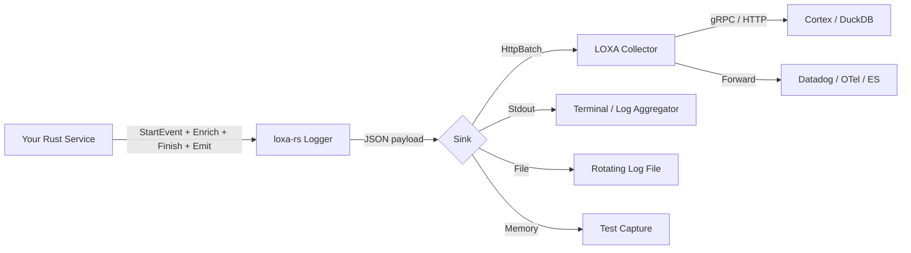
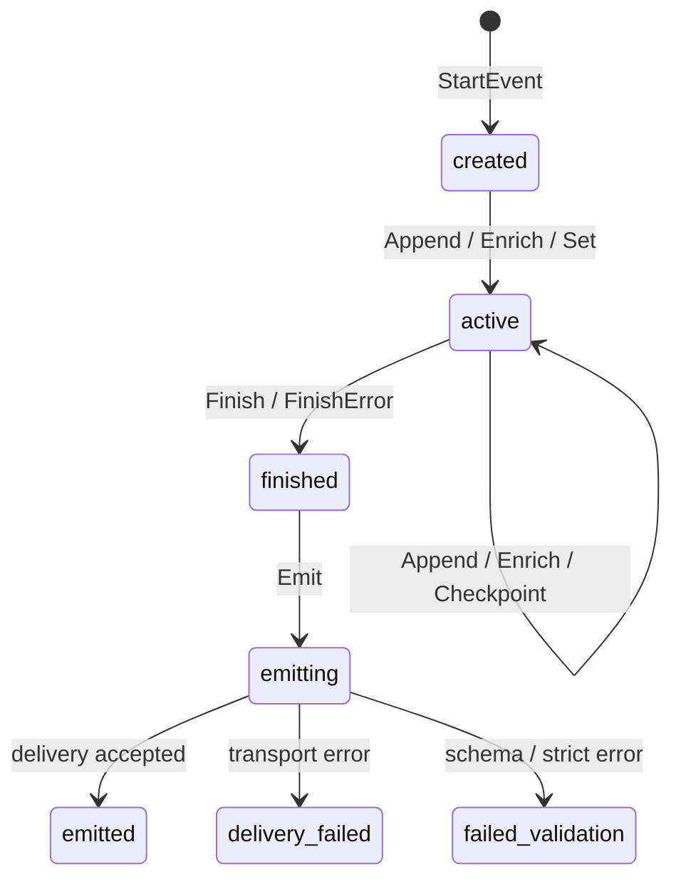

# LOXA Rust SDK -- Instrumentation Guide

> **Audience**: Rust engineers instrumenting production services with LOXA structured events.
> **SDK version**: loxa-rs v1.0.0 | **Spec version**: see `LOXA_SPEC_VERSION`

---

## Table of Contents

1. [Introduction](#1-introduction)
2. [Quick Start -- Full Checkout Example](#2-quick-start----full-checkout-example)
3. [Core Lifecycle](#3-core-lifecycle)
4. [Timing Primitives](#4-timing-primitives)
5. [Attribute Constructors](#5-attribute-constructors)
6. [Canonical Helpers](#6-canonical-helpers)
7. [Business Helpers](#7-business-helpers)
8. [Error Handling](#8-error-handling)
9. [Middleware Integration](#9-middleware-integration)
10. [Config & Sinks](#10-config--sinks)
11. [Sampling & Redaction](#11-sampling--redaction)
12. [Testing](#12-testing)
13. [Real-World Examples](#13-real-world-examples)

---

## 1. Introduction

LOXA's Rust SDK provides a **wide-event structured instrumentation** layer that turns every meaningful business operation -- checkout, payment, authentication, background job, queue consumer, cron task -- into a rich, schema-validated JSON event. These events flow through the LOXA Collector into your observability stack (DuckDB, Datadog, OTel, Elasticsearch, or any custom sink).

### Why Wide Events

Traditional logging produces narrow, fragmented log lines. A LOXA wide event captures the **entire operational context** of a business operation in a single structured document:

```
| Traditional Log                     | LOXA Wide Event                          |
|-------------------------------------|------------------------------------------|
| "Order 123 placed by user 456"      | Full event with order.id, user.id,       |
|                                     | payment.amount, cart.items, checkpoints, |
|                                     | process steps, timing, error details     |
```

### Naming Convention

The Rust SDK exports **two parallel naming styles**:

| PascalCase (Go-style)        | snake_case (Rust-idiomatic)    | Purpose                    |
|------------------------------|--------------------------------|----------------------------|
| `StartEvent`                 | `start_event`                  | Create an event            |
| `Enrich`                     | `enrich`                       | Add multiple attributes    |
| `Append`                     | `append`                       | Add a single attribute     |
| `Set`                        | `set`                          | Set a key-value pair       |
| `Checkpoint`                 | `checkpoint`                   | Record a named milestone   |
| `Finish`                     | `finish`                       | Mark event as complete     |
| `FinishError`                | `finish_error`                 | Mark event as failed       |
| `Emit`                       | `emit`                         | Send to configured sinks   |
| `Flush`                      | `flush`                        | Drain async queues         |
| `Shutdown`                   | `shutdown`                     | Graceful shutdown          |
| `UserID`                     | `user_id`                      | Canonical user attribute   |
| `OrderID`                    | `order_id`                     | Business order attribute   |
| `HttpBatchSink`              | `http_batch_sink`              | HTTP batch sink config     |
| `SampleAll`                  | `sample_all`                   | Accept-all sampler         |

Both styles are functionally identical. Choose whichever fits your codebase conventions. This guide uses **PascalCase** in examples for visibility, but every call has a `snake_case` equivalent.

### Architecture Overview



---

## 2. Quick Start -- Full Checkout Example

This example demonstrates the complete lifecycle of a checkout business operation.

```rust
use loxa::{
    Config, Params, Enrich, Append, Checkpoint,
    Finish, FinishError, Emit, Flush, Shutdown,
    UserID, TenantID, OrderID, CartID, CustomerID,
    Amount, Currency, Country, Plan, Platform,
    String as AttrStr, Int, Float64, Bool, Group,
    ProcessHandle, TimerHandle, GroupHandle,
    ErrorType, ErrorCode, ErrorMessage, Retryable,
    HttpBatchSink, SampleAll, DefaultRedactor,
};

fn main() {
    // 1. Configure the default logger
    loxa::configure(Config::production("checkout-service")
        .with_sink(HttpBatchSink("http://collector:9090/v1/events"))
        .with_sampler(SampleAll())
        .with_redactor(DefaultRedactor()))
        .expect("failed to configure loxa");

    // 2. Start a checkout event
    let mut evt = loxa::start_event(Params::new("checkout.completed").with_kind("event"));

    // 3. Attach identity context
    Append(&mut evt, UserID("u_8f3a"));
    Append(&mut evt, TenantID("t_acme"));
    Append(&mut evt, CustomerID("cust_2024"));
    Append(&mut evt, OrderID("ord_9x7k"));
    Append(&mut evt, CartID("cart_m3w1"));

    // 4. Attach business context
    Enrich(&mut evt, vec![
        Amount(149.99),
        Currency("USD"),
        Country("US"),
        Plan("pro"),
        Platform("web"),
        AttrStr("checkout.source", "mobile_app"),
        Bool("checkout.express", true),
        Int("cart.item_count", 3),
    ]);

    // 5. Record process steps with timing
    let validate = evt.start_process("validate_cart");
    // ... validation logic ...
    validate.finish(&mut evt, &[AttrStr("status", "valid")]);

    let payment = evt.start_process("charge_payment");
    // ... payment gateway call ...
    payment.finish(&mut evt, &[
        AttrStr("payment.provider", "stripe"),
        AttrStr("payment.method", "card_ending_4242"),
    ]);

    let fulfill = evt.start_process("create_fulfillment");
    // ... fulfillment logic ...
    fulfill.finish(&mut evt, &[AttrStr("fulfillment.warehouse", "us-east-1")]);

    // 6. Record checkpoints for key milestones
    Checkpoint(&mut evt, "inventory_reserved");
    Checkpoint(&mut evt, "payment_captured");
    Checkpoint(&mut evt, "confirmation_sent");

    // 7. Finish and emit
    Finish(&mut evt);
    Emit(&mut evt).expect("emit failed");

    // 8. Graceful shutdown
    Flush();
    Shutdown();
}
```

**Emitted JSON** (simplified):

```json
{
  "event_id": "evt_1716400000000",
  "service": "checkout-service",
  "event": "checkout.completed",
  "kind": "event",
  "level": "info",
  "outcome": "success",
  "duration_ms": 847,
  "user": { "id": "u_8f3a" },
  "tenant": { "id": "t_acme" },
  "attrs": {
    "customer.id": "cust_2024",
    "order.id": "ord_9x7k",
    "cart.id": "cart_m3w1",
    "payment.amount": 149.99,
    "payment.currency": "USD",
    "geo.country": "US",
    "customer.plan": "pro",
    "device.platform": "web",
    "checkout.source": "mobile_app",
    "checkout.express": true,
    "cart.item_count": 3
  },
  "process": [
    { "step": 1, "name": "validate_cart", "duration_ms": 12, "status": "valid" },
    { "step": 2, "name": "charge_payment", "duration_ms": 680, "payment.provider": "stripe" },
    { "step": 3, "name": "create_fulfillment", "duration_ms": 95 }
  ],
  "checkpoints": [
    { "name": "inventory_reserved", "at_ms": 45 },
    { "name": "payment_captured", "at_ms": 725 },
    { "name": "confirmation_sent", "at_ms": 830 }
  ]
}
```

---

## 3. Core Lifecycle

Every LOXA event follows a strict state machine:



### 3.1 Creating Events

| Function                       | snake_case                   | Use Case                          |
|--------------------------------|------------------------------|-----------------------------------|
| `StartEvent(parent, params)`   | `start_event(parent, params)`| Generic event with optional parent|
| `StartHTTPEvent(method, path)` | `start_http_event(m, p)`     | HTTP request event                |
| `StartJobEvent(name)`          | `start_job_event(name)`      | Background job                    |
| `StartQueueEvent(queue)`       | `start_queue_event(queue)`   | Queue consumer event              |
| `StartCLIEvent(command)`       | `start_cli_event(command)`   | CLI command event                 |
| `StartCronEvent(cron)`         | `start_cron_event(cron)`     | Cron / scheduled task             |

```rust
// Generic event
let mut evt = loxa::start_event(Params::new("order.created").with_kind("event"));

// HTTP event -- method and path are pre-populated
let mut evt = loxa::start_event(
    StartHTTPEvent("POST", "/api/v1/orders")
);

// Background job
let mut evt = loxa::start_event(Params::new("send_welcome_email").with_kind("job"));

// Queue consumer
let mut evt = loxa::start_event(Params::new("order_notifications").with_kind("queue"));

// CLI command
let mut evt = loxa::start_event(Params::new("migrate_db").with_kind("cli"));

// Cron task
let mut evt = loxa::start_event(Params::new("cleanup_expired_sessions").with_kind("cron"));
```

**Params builder methods:**

```rust
Params::new("event_name")
    .with_kind("event")           // event | http | job | queue | cli | cron | log
    .with_message("optional msg") // human-readable message
    .with_method("POST")          // HTTP method
    .with_path("/api/orders")     // HTTP path
    .with_route("/api/orders")    // matched route pattern
    .with_status_code(200)        // HTTP status
```

### 3.2 Enriching Events

```rust
// Append a single attribute
Append(&mut evt, UserID("u_123"));
Append(&mut evt, AttrStr("region", "us-east-1"));

// Enrich with multiple attributes at once
Enrich(&mut evt, vec![
    UserID("u_123"),
    TenantID("t_acme"),
    OrderID("ord_456"),
]);

// Set a key-value pair (convenience)
Set(&mut evt, "custom.field", "value");

// Merge a JSON map into the event
let mut map = serde_json::Map::new();
map.insert("key".into(), serde_json::Value::String("val".into()));
Merge(&mut evt, map);

// Delete an attribute
Delete(&mut evt, "temporary_field");

// Read an attribute back
if let Some(val) = Get(&mut evt, "order.id") {
    println!("order: {}", val);
}

// Read a group attribute
if let Some(val) = GetGroup(&mut evt, "user") {
    println!("user group: {}", val);
}
```

### 3.3 Checkpoints

Checkpoints record **named milestones** with automatic timing (milliseconds since event start). They are lightweight markers that do not block or alter control flow.

```rust
// Simple checkpoint
Checkpoint(&mut evt, "validation_passed");

// Checkpoint with extra attributes
CheckpointWithAttrs(&mut evt, "payment_processed", &[
    AttrStr("payment_id", "pay_abc"),
    Int("retry_count", 1),
]);
```

### 3.4 Finishing Events

```rust
// Success
Finish(&mut evt);

// Error with message
FinishError(&mut evt, "payment gateway timeout");

// Via module-level functions (return Result)
loxa::finish(&mut evt, "success")?;
loxa::finish_error(&mut evt, "connection refused")?;
```

### 3.5 Emitting and Flushing

```rust
// Emit sends the event through the configured sink pipeline
Emit(&mut evt)?;  // returns Result<(), LoxaError>

// Flush drains any async buffers
Flush();

// Shutdown flushes and closes all sinks
Shutdown();
```

### 3.6 Context Inheritance

Events can inherit trace context from a parent event or an HTTP carrier:

```rust
// Child event inherits trace_id, span_id, request_id from parent
let child = StartEvent(Some(&parent_evt), Params::new("sub_operation"));

// From HTTP headers (W3C Trace Context)
let carrier = ContextCarrier::from_traceparent("00-abc123-def456-01");
let evt = StartEvent(Some(&carrier), Params::new("incoming_request"));
```

### 3.7 Immediate Log Shortcuts

For quick log lines that bypass the full lifecycle:

```rust
Debug("cache miss for key user:123");
Info("server started on port 8080");
Warn("rate limit approaching threshold");
Error("database connection pool exhausted");
Fatal("unrecoverable state, exiting");  // calls process::exit(1)
```

> **Note**: `Fatal` calls `Flush()` then `std::process::exit(1)`. Use `fatal_event()` if you need the event ID without exiting.

---

## 4. Timing Primitives

The SDK provides four timing primitives, each suited to different instrumentation patterns.

### 4.1 Comparison Table

| Primitive        | Returns            | Output Location   | Tracks Steps | Needs Event | Use Case                    |
|------------------|--------------------|--------------------|--------------|-------------|-----------------------------|
| **Process**      | `ProcessHandle`    | `event.process[]`  | Yes (numbered)| Yes        | Ordered pipeline stages     |
| **Group**        | `GroupHandle`      | `event.groups[]`   | No           | Yes         | Named phases (not ordered)  |
| **Timer**        | `TimerHandle`      | `event.timers[]`   | No           | Yes         | Ad-hoc duration measurement |
| **Stopwatch**    | `StopwatchHandle`  | (standalone)       | No           | No         | External timing (no event)  |

### 4.2 Process -- Ordered Pipeline Steps

Processes are **auto-numbered** and track `started_at_ms`, `ended_at_ms`, and `duration_ms`. Ideal for sequential pipeline stages.

```rust
let step1 = evt.start_process("validate_input");
// ... validation ...
step1.finish(&mut evt, &[AttrStr("fields_checked", "email,password")]);

let step2 = evt.start_process("check_inventory");
// ... inventory check ...
step2.finish(&mut evt, &[Int("items_available", 5)]);

let step3 = evt.start_process("process_payment");
// ... payment ...
match payment_result {
    Ok(_) => step3.finish(&mut evt, &[AttrStr("provider", "stripe")]),
    Err(e) => step3.finish_error(&mut evt, &e.to_string(), &[Retryable(true)]),
}
```

**Output in event JSON:**

```json
"process": [
  { "step": 1, "name": "validate_input", "started_at_ms": 0, "ended_at_ms": 12, "duration_ms": 12, "fields_checked": "email,password" },
  { "step": 2, "name": "check_inventory", "started_at_ms": 12, "ended_at_ms": 45, "duration_ms": 33, "items_available": 5 },
  { "step": 3, "name": "process_payment", "started_at_ms": 45, "ended_at_ms": 680, "duration_ms": 635, "provider": "stripe" }
]
```

### 4.3 Group -- Named Phases

Groups are **named** (not auto-numbered) and record `started_at_ms`, `ended_at_ms`, `duration_ms`. Ideal for non-sequential or overlapping phases.

```rust
let auth_phase = evt.start_group("authentication");
// ... auth logic ...
auth_phase.finish(&mut evt, &[AttrStr("method", "jwt")]);

let data_phase = evt.start_group("data_enrichment");
// ... enrichment ...
data_phase.finish(&mut evt, &[Int("records_enriched", 42)]);
```

### 4.4 Timer -- Ad-Hoc Duration

Timers measure a single duration and push to `event.timers[]`. Simpler than processes for one-off measurements.

```rust
let timer = evt.start_timer("external_api_call");
// ... call external API ...
timer.stop(&mut evt, &[AttrStr("api", "payment_gateway")]);
```

### 4.5 Stopwatch -- Standalone Timing

Stopwatch does **not** require an event reference. Use it when timing spans across multiple events or outside event context.

```rust
let sw = StopwatchHandle::new();
// ... do work across multiple operations ...
let elapsed = sw.elapsed();
Append(&mut evt, Duration("total_processing", elapsed));
```

---

## 5. Attribute Constructors

### 5.1 Generic Types

| PascalCase         | snake_case         | Signature                              | JSON Type  |
|--------------------|--------------------|----------------------------------------|------------|
| `String(k, v)`     | `string(k, v)`     | `(impl Into<String>, impl Into<String>)`| `string`   |
| `Int(k, v)`        | `int(k, v)`        | `(impl Into<String>, i64)`             | `number`   |
| `Int64(k, v)`      | `int64(k, v)`      | `(impl Into<String>, i64)`             | `number`   |
| `Uint64(k, v)`     | `uint64(k, v)`     | `(impl Into<String>, u64)`             | `number`   |
| `Float64(k, v)`    | `float64(k, v)`    | `(impl Into<String>, f64)`             | `number`   |
| `Bool(k, v)`       | `bool(k, v)`       | `(impl Into<String>, bool)`            | `boolean`  |
| `Time(k, v)`       | `time(k, v)`       | `(impl Into<String>, OffsetDateTime)`  | `string` (RFC3339) |
| `Duration(k, v)`   | `duration(k, v)`   | `(impl Into<String>, std::time::Duration)` | `number` (ms) |
| `Any(k, v)`        | `any(k, v)`        | `(impl Into<String>, impl Serialize)`  | any        |
| `Null(k)`          | `null(k)`          | `(impl Into<String>)`                  | `null`     |
| `Group(name, attrs)`| `group(name, attrs)`| `(impl Into<String>, Vec<Attr>)`      | `object`   |

```rust
// Examples
Append(&mut evt, String("region", "us-east-1"));
Append(&mut evt, Int("retry_count", 3));
Append(&mut evt, Float64("cpu_usage", 87.4));
Append(&mut evt, Bool("cache_hit", true));
Append(&mut evt, Time("started_at", OffsetDateTime::now_utc()));
Append(&mut evt, Duration("elapsed", start.elapsed()));
Append(&mut evt, Any("metadata", serde_json::json!({"tags": ["urgent"]})));
Append(&mut evt, Null("deprecated_field"));
```

### 5.2 Nested Groups

```rust
Append(&mut evt, Group("billing", vec![
    String("plan", "enterprise"),
    Float64("monthly_spend", 2450.00),
    Bool("auto_renew", true),
]));
```

### 5.3 Sensitive & Hashed Attributes

```rust
// Mark a value as sensitive -- will be redacted to "[REDACTED]" in output
Append(&mut evt, SensitiveString("user.ssn", "123-45-6789"));

// Mark any attribute as sensitive after creation
let attr = String("user.email", "alice@example.com");
Append(&mut evt, MarkSensitive(attr));

// Hash a value (SHA-256) -- irreversible, useful for correlation
Append(&mut evt, HashString("user.email", "alice@example.com"));
// Output: "a3f2b8..." (hex SHA-256)
```

---

## 6. Canonical Helpers

Canonical helpers set **reserved field names** that map to the LOXA spec's standard schema. They use dotted key prefixes that the logger routes to nested JSON groups (`user.*`, `tenant.*`, `http.*`, `resource.*`).

### 6.1 Identity & Multi-Tenancy

| PascalCase         | snake_case         | Attribute Key      | JSON Group |
|--------------------|--------------------|--------------------|------------|
| `UserID(id)`       | `user_id(id)`      | `user.id`          | `user`     |
| `TenantID(id)`     | `tenant_id(id)`    | `tenant.id`        | `tenant`   |
| `WorkspaceID(id)`  | `workspace_id(id)` | `workspace.id`     | `attrs`    |
| `OrganizationID(id)`| `organization_id(id)`| `organization.id`| `attrs`    |
| `SessionID(id)`    | `session_id(id)`   | `session.id`       | `attrs`    |

```rust
Append(&mut evt, UserID("u_8f3a"));
Append(&mut evt, TenantID("t_acme"));
Append(&mut evt, WorkspaceID("ws_prod"));
Append(&mut evt, OrganizationID("org_123"));
Append(&mut evt, SessionID("sess_abc"));
```

### 6.2 Distributed Tracing

| PascalCase                     | snake_case                     | Attribute Key   |
|--------------------------------|--------------------------------|-----------------|
| `RequestID(id)`                | `request_id(id)`               | `request_id`    |
| `TraceID(id)`                  | `trace_id(id)`                 | `trace_id`      |
| `SpanID(id)`                   | `span_id(id)`                  | `span_id`       |

```rust
Append(&mut evt, RequestID("req_abc123"));
Append(&mut evt, TraceID("4bf92f3577b34da6a3ce929d0e0e4736"));
Append(&mut evt, SpanID("00f067aa0ba902b7"));
```

### 6.3 Feature Flags & Experiments

| PascalCase                           | snake_case                           | Attribute Key          |
|--------------------------------------|--------------------------------------|------------------------|
| `FeatureFlag(name, value)`           | `feature_flag(name, value)`         | `feature.{name}`       |
| `FeatureFlagBool(name, value)`       | `feature_flag_bool(name, value)`    | `feature.{name}`       |
| `Experiment(name, variant)`          | `experiment(name, variant)`         | `experiment.{name}`    |

```rust
Append(&mut evt, FeatureFlag("new_checkout", serde_json::json!(true)));
Append(&mut evt, FeatureFlagBool("dark_mode", true));
Append(&mut evt, Experiment("pricing_v2", "variant_b"));
```

---

## 7. Business Helpers

Business helpers set **domain-specific attribute keys** for common e-commerce, SaaS, and application patterns.

### 7.1 E-Commerce

| PascalCase         | snake_case         | Attribute Key        | Type   |
|--------------------|--------------------|----------------------|--------|
| `OrderID(id)`      | `order_id(id)`     | `order.id`           | string |
| `CartID(id)`       | `cart_id(id)`      | `cart.id`            | string |
| `ProductID(id)`    | `product_id(id)`   | `product.id`         | string |
| `CustomerID(id)`   | `customer_id(id)`  | `customer.id`        | string |

```rust
Append(&mut evt, OrderID("ord_9x7k"));
Append(&mut evt, CartID("cart_m3w1"));
Append(&mut evt, ProductID("prod_widget_42"));
Append(&mut evt, CustomerID("cust_2024"));
```

### 7.2 Billing & Finance

| PascalCase           | snake_case           | Attribute Key        | Type   |
|----------------------|----------------------|----------------------|--------|
| `Plan(name)`         | `plan(name)`         | `customer.plan`      | string |
| `Currency(code)`     | `currency(code)`     | `payment.currency`   | string |
| `Amount(value)`      | `amount(value)`      | `payment.amount`     | number |

```rust
Append(&mut evt, Plan("enterprise"));
Append(&mut evt, Currency("USD"));
Append(&mut evt, Amount(2499.99));
```

### 7.3 Geo & Device

| PascalCase           | snake_case           | Attribute Key        | Type   |
|----------------------|----------------------|----------------------|--------|
| `Country(code)`      | `country(code)`      | `geo.country`        | string |
| `Device(name)`       | `device(name)`       | `device.name`        | string |
| `Platform(name)`     | `platform(name)`     | `device.platform`    | string |
| `AppVersion(v)`      | `app_version(v)`     | `app.version`        | string |

```rust
Append(&mut evt, Country("US"));
Append(&mut evt, Device("iPhone15,2"));
Append(&mut evt, Platform("ios"));
Append(&mut evt, AppVersion("3.12.0"));
```

### 7.4 HTTP Helpers

| PascalCase           | snake_case           | Attribute Key   | Type       |
|----------------------|----------------------|-----------------|------------|
| `StatusCode(code)`   | `status_code(code)`  | `status_code`   | number     |
| `Method(m)`          | `method(m)`          | `method`        | string     |
| `Path(p)`            | `path(p)`            | `path`          | string     |
| `Route(r)`           | `route(r)`           | `route`         | string     |

```rust
Append(&mut evt, StatusCode(200));
Append(&mut evt, Method("POST"));
Append(&mut evt, Path("/api/v1/orders"));
Append(&mut evt, Route("/api/v1/orders"));
```

---

## 8. Error Handling

### 8.1 The FinishError Pattern

`FinishError` sets `outcome = "error"`, `level = "error"`, and populates the `error` object in the event JSON.

```rust
let mut evt = loxa::start_event(Params::new("payment.charge").with_kind("event"));

match charge_payment(&order).await {
    Ok(charge) => {
        Append(&mut evt, AttrStr("payment.charge_id", &charge.id));
        Finish(&mut evt);
    }
    Err(err) => {
        FinishError(&mut evt, err.to_string());
    }
}

Emit(&mut evt)?;
```

### 8.2 Rich Error Attributes

For detailed error context, combine the error helpers:

```rust
use loxa::{
    ErrorType, ErrorCode, ErrorMessage, ErrorStack, Retryable,
};

// Inside an error branch
FinishError(&mut evt, "payment gateway timeout");
Enrich(&mut evt, vec![
    ErrorType("PaymentGatewayError"),
    ErrorCode("PG_TIMEOUT"),
    ErrorMessage("stripe API timed out after 30s"),
    ErrorStack("src/payments/stripe.rs:142"),
    Retryable(true),
]);
```

### 8.3 Process-Level Errors

Individual process steps can fail without failing the entire event:

```rust
let step = evt.start_process("fallback_payment");
match try_fallback_provider().await {
    Ok(_) => step.finish(&mut evt, &[]),
    Err(e) => step.finish_error(&mut evt, &e.to_string(), &[
        ErrorType("FallbackError"),
        Retryable(false),
    ]),
}
// Event can still Finish(success) if another path succeeds
```

### 8.4 Error Attribute Reference

| PascalCase           | snake_case           | Attribute Key       | Type    |
|----------------------|----------------------|---------------------|---------|
| `ErrorType(t)`       | `error_type(t)`      | `error.type`        | string  |
| `ErrorCode(c)`       | `error_code(c)`      | `error.code`        | string  |
| `ErrorMessage(m)`    | `error_message(m)`   | `error.message`     | string  |
| `ErrorStack(s)`      | `error_stack(s)`     | `error.stack`       | string  |
| `Retryable(b)`       | `retryable(b)`       | `error.retryable`   | boolean |

---

## 9. Middleware Integration

The SDK provides first-class middleware for **Actix Web**, **Axum**, and **Tower**. Each middleware automatically creates HTTP events with method, path, status code, duration, user agent, and remote IP.

### 9.1 Actix Web (feature = "actix")

```toml
# Cargo.toml
[dependencies]
loxa = { version = "1.0", features = ["actix"] }
```

```rust
use actix_web::{web, App, HttpServer, HttpResponse};
use loxa::{Config, HttpBatchSink};
use loxa::middleware::actix::LoxaMiddleware;

#[actix_web::main]
async fn main() -> std::io::Result<()> {
    let logger = loxa::create_loxa(Config::production("api-server")
        .with_sink(HttpBatchSink("http://collector:9090/v1/events")));

    HttpServer::new(move || {
        App::new()
            .wrap(LoxaMiddleware::new(logger.clone(), "api-server"))
            .route("/orders", web::post().to(create_order))
    })
    .bind("0.0.0.0:8080")?
    .run()
    .await
}
```

### 9.2 Axum (feature = "axum")

```toml
[dependencies]
loxa = { version = "1.0", features = ["axum"] }
```

```rust
use axum::{Router, routing::post, middleware};
use loxa::{Config, HttpBatchSink};
use loxa::middleware::axum::{LoxaLayer, loxa_middleware};
use std::sync::Arc;

#[tokio::main]
async fn main() {
    let logger = Arc::new(loxa::create_loxa(Config::production("api-server")
        .with_sink(HttpBatchSink("http://collector:9090/v1/events"))));

    let app = Router::new()
        .route("/orders", post(create_order))
        .layer(middleware::from_fn(move |req, next| {
            let logger = logger.clone();
            loxa_middleware(logger, "api-server".to_string(), req, next)
        }));

    let listener = tokio::net::TcpListener::bind("0.0.0.0:8080").await.unwrap();
    axum::serve(listener, app).await.unwrap();
}
```

### 9.3 Tower Layer

```toml
[dependencies]
loxa = { version = "1.0", features = ["tower"] }
```

```rust
use loxa::middleware::tower::{LoxaLayer, MiddlewareConfig, capture_request};

// Manual capture for custom Tower services
let result = capture_request(&logger, "GET", "/health", 200)?;
println!("event_id: {}", result.event_id);
println!("payload: {}", result.encoded);
```

### 9.4 MiddlewareConfig

```rust
pub struct MiddlewareConfig {
    pub service: String,          // Service name for events
    pub route: Option<String>,    // Override route pattern
    pub recover_panics: bool,     // Catch panics in handlers
}
```

### 9.5 What Middleware Captures Automatically

| Field          | Source                                |
|----------------|---------------------------------------|
| `method`       | Request HTTP method                   |
| `path`         | Request URI path                      |
| `route`        | Matched route (or path fallback)      |
| `status_code`  | Response status code                  |
| `duration_ms`  | Time from request to response         |
| `http.user_agent` | User-Agent header                |
| `http.remote_ip`  | Peer address (Actix)             |
| `outcome`      | `"error"` if status >= 500            |

---

## 10. Config & Sinks

### 10.1 Config Presets

```rust
// Production -- strict validation, async enabled
loxa::configure(Config::production("my-service")).unwrap();

// Development -- lenient, stdout sink
loxa::configure(Config::dev("my-service")).unwrap();

// Testing -- memory sink for capture
loxa::configure(Config::test("my-service")).unwrap();
```

### 10.2 Config Builder

```rust
let config = Config::production("my-service")
    .with_version("1.2.3")
    .with_environment("staging")
    .with_region("us-east-1")
    .with_sink(HttpBatchSink("http://collector:9090/v1/events"))
    .with_sampler(SampleAll())
    .with_redactor(DefaultRedactor())
    .with_schema(DefaultSchema())
    .with_async(true)
    .with_duplicate_policy(CanonicalWins);
```

### 10.3 Config Builder API

The `loxa::create_loxa` factory accepts a `Config` object with builder methods:

```rust
use loxa::{Config, HttpBatchSink, SampleErrors, RedactKeys, CanonicalWins};

let logger = loxa::create_loxa(
    Config::production("checkout-service")
        .with_version("2.0.0")
        .with_environment("production")
        .with_region("eu-west-1")
        .with_sink(HttpBatchSink("http://collector:9090/v1/events"))
        .with_sampler(SampleErrors())
        .with_redactor(RedactKeys(&["password", "ssn", "credit_card"]))
        .with_duplicate_policy(CanonicalWins)
        .with_async(true),
);
```

### 10.4 Sink Types

| PascalCase                              | snake_case                              | Description                        |
|-----------------------------------------|-----------------------------------------|------------------------------------|
| `StdoutSink()`                          | `stdout_sink()`                         | stdout (JSON lines)                |
| `StderrSink()`                          | `stderr_sink()`                         | stderr (JSON lines)                |
| `FileSink(path)`                        | `file_sink(path)`                       | Append to file                     |
| `MemorySink()`                          | `memory_sink()`                         | In-memory (testing)                |
| `NoopSink()`                            | `noop_sink()`                           | Discard all events                 |
| `HttpBatchSink(endpoint)`               | `http_batch_sink(endpoint)`             | Batched HTTP to Collector          |
| `CollectorSink()`                       | --                                      | Default localhost Collector        |
| `CollectorSinkWithEndpoint(endpoint)`   | --                                      | Custom Collector endpoint          |

```rust
// Single sink
let config = Config::production("svc").with_sink(StdoutSink());

// Multiple sinks
let config = Config::production("svc")
    .with_sink(HttpBatchSink("http://collector:9090/v1/events"))
    .with_sink(StdoutSink());  // Also log to stdout

// File sink with rotation
let config = Config::production("svc")
    .with_sink(FileSink("/var/log/my-service/events.jsonl"));
```

### 10.5 Duplicate Policy

Controls behavior when the same attribute key is set multiple times:

| Policy            | Behavior                                    |
|-------------------|---------------------------------------------|
| `CanonicalWins`   | Canonical helpers (UserID, etc.) always win |
| `UserWins` / `AttrsWins` | User-supplied values win            |
| `FirstWins`       | First value set wins                        |
| `LastWins`        | Last value set wins                         |
| `KeepBoth`        | Keep both (array)                           |
| `ErrorOnDuplicate`| Return error on duplicate                   |

---

## 11. Sampling & Redaction

### 11.1 Sampling Policies

Sampling controls which events are emitted. Events that are not sampled are silently dropped before serialization.

| PascalCase                        | snake_case                        | Description                                |
|-----------------------------------|-----------------------------------|--------------------------------------------|
| `SampleAll()`                     | `sample_all()`                    | Emit every event                           |
| `SampleNone()`                    | `sample_none()`                   | Drop every event                           |
| `SampleRandom(rate)`              | `sample_random(rate)`             | Random sampling at `rate` (0.0--1.0)       |
| `SampleErrors()`                  | `sample_errors()`                 | Only emit error events                     |
| `SampleSlowRequests(ms)`          | `sample_slow_requests(ms)`        | Only emit requests slower than `ms`        |
| `SampleStatusCodes(&[codes])`     | `sample_status_codes(&[codes])`   | Only emit matching status codes            |
| `SampleRoutes(&[routes])`         | `sample_routes(&[routes])`        | Only emit matching routes                  |
| `SampleUsers(&[ids])`             | `sample_users(&[ids])`            | Only emit events for specific users        |
| `SampleTenants(&[ids])`           | `sample_tenants(&[ids])`          | Only emit events for specific tenants      |
| `SampleFeatureFlag(name, value)`  | `sample_feature_flag(name, value)`| Sample by feature flag value               |
| `AnySampler(&[samplers])`         | `any_sampler(&[samplers])`        | Match if ANY sub-sampler matches           |
| `AllSampler(&[samplers])`         | `all_sampler(&[samplers])`        | Match if ALL sub-samplers match            |
| `NotSampler(sampler)`             | `not_sampler(sampler)`            | Invert a sampler                           |

```rust
// Production: sample 10% of traffic, always keep errors
let sampler = AnySampler(&[
    SampleErrors(),
    SampleRandom(0.1),
]);
let config = Config::production("svc").with_sampler(sampler);

// Debug specific user
let config = Config::dev("svc").with_sampler(SampleUsers(&["u_debug_123"]));

// Sample slow requests and 5xx errors
let sampler = AnySampler(&[
    SampleSlowRequests(2000),
    SampleStatusCodes(&[500, 502, 503, 504]),
]);
```

### 11.2 Redaction Policies

Redaction runs **after** schema encoding and **before** delivery to sinks. It operates on the serialized JSON.

| PascalCase                          | snake_case                          | Description                              |
|-------------------------------------|-------------------------------------|------------------------------------------|
| `DefaultRedactor()`                 | `default_redactor()`                | Built-in 14-key PII redaction            |
| `RedactKeys(&[keys])`              | `redact_keys(&[keys])`              | Replace matching keys with `[REDACTED]`  |
| `HashKeys(&[keys])`                | `hash_keys(&[keys])`                | SHA-256 hash matching key values         |
| `DropKeys(&[keys])`                | `drop_keys(&[keys])`                | Remove matching keys entirely            |
| `MaskKeys(&[keys])`                | `mask_keys(&[keys])`                | Mask with `***` pattern                  |
| `RedactPatterns(&[patterns])`      | `redact_patterns(&[patterns])`      | Regex-based redaction                    |
| `ComposeRedactors(&[redactors])`   | `compose_redactors(&[redactors])`   | Chain multiple redactors                 |

```rust
// Default -- redacts 14 known PII keys (password, ssn, credit_card, etc.)
let config = Config::production("svc").with_redactor(DefaultRedactor());

// Custom key-based redaction
let config = Config::production("svc")
    .with_redactor(RedactKeys(&["password", "secret", "api_key"]));

// Hash PII for correlation without exposure
let config = Config::production("svc")
    .with_redactor(HashKeys(&["user.email", "user.phone"]));

// Compose multiple strategies
let config = Config::production("svc")
    .with_redactor(ComposeRedactors(&[
        DefaultRedactor(),
        HashKeys(&["user.email"]),
        DropKeys(&["internal_debug"]),
    ]));
```

---

## 12. Testing

### 12.1 Test Logger

`test_logger` creates a logger with a **MemorySink** for capturing events in tests.

```rust
use loxa::testkit::{test_logger, capture, assert_contains, assert_event, assert_redacted, assert_has_checkpoint};

#[test]
fn test_order_creation() {
    let logger = test_logger("test-checkout");
    let mut evt = logger.start_event(Params::new("order.created").with_kind("event"));
    Append(&mut evt, OrderID("ord_test_1"));
    Append(&mut evt, Amount(99.99));
    Finish(&mut evt);
    let encoded = Emit(&mut evt).unwrap();

    assert_contains(&encoded, "ord_test_1");
    assert_contains(&encoded, "99.99");
    assert_event(&encoded, "outcome", "success");
}
```

### 12.2 Capture Function

`capture` runs a closure with a temporary memory sink and returns all emitted event JSON strings.

```rust
#[test]
fn test_capture_events() {
    let events = capture(|logger| {
        let mut evt = logger.start_event(Params::new("test.event").with_kind("event"));
        Append(&mut evt, String("key", "value"));
        Finish(&mut evt);
        Emit(&mut evt).unwrap();
    });

    assert_eq!(events.len(), 1);
    assert_contains(&events[0], "value");
}
```

### 12.3 Assertion Helpers

| Function                              | Description                                        |
|---------------------------------------|----------------------------------------------------|
| `assert_contains(json, needle)`       | Assert the JSON string contains a substring        |
| `assert_event(json, key, expected)`   | Assert a nested key equals an expected value       |
| `assert_redacted(json, key)`          | Assert a key's value is `"[REDACTED]"`             |
| `assert_has_checkpoint(json, name)`   | Assert a checkpoint with the given name exists     |

```rust
#[test]
fn test_redaction() {
    let events = capture(|logger| {
        let mut evt = logger.start_event(Params::new("user.signup").with_kind("event"));
        Append(&mut evt, SensitiveString("user.ssn", "123-45-6789"));
        Append(&mut evt, UserID("u_123"));
        Finish(&mut evt);
        Emit(&mut evt).unwrap();
    });

    assert_redacted(&events[0], "user.ssn");
    assert_event(&events[0], "user.id", "u_123");
}

#[test]
fn test_checkpoints() {
    let events = capture(|logger| {
        let mut evt = logger.start_event(Params::new("order.flow").with_kind("event"));
        Checkpoint(&mut evt, "validated");
        Checkpoint(&mut evt, "charged");
        Finish(&mut evt);
        Emit(&mut evt).unwrap();
    });

    assert_has_checkpoint(&events[0], "validated");
    assert_has_checkpoint(&events[0], "charged");
}
```

### 12.4 MemorySinkStore

For advanced test scenarios, use `MemorySinkStore` directly:

```rust
use loxa::{Config, SinkConfig, MemorySinkStore};

#[test]
fn test_advanced_capture() {
    let store = MemorySinkStore::new();
    let logger = loxa::create_loxa(
        Config::test("advanced").with_sink(SinkConfig::Memory(store.clone()))
    );

    // Emit multiple events
    for i in 0..5 {
        let mut evt = logger.start_event(Params::new(format!("event_{i}")).with_kind("event"));
        Append(&mut evt, Int("index", i));
        Finish(&mut evt);
        Emit(&mut evt).unwrap();
    }

    logger.flush().unwrap();

    assert_eq!(store.len(), 5);
    let events = store.events();
    assert_contains(&events[0], "event_0");
    assert_contains(&events[4], "event_4");

    store.clear();
    assert!(store.is_empty());
}
```

---

## 13. Real-World Examples

### 13.1 Checkout Flow

```rust
use loxa::*;

fn process_checkout(logger: &Logger, user: &User, cart: &Cart) -> Result<Order, AppError> {
    let mut evt = logger.start_event(Params::new("checkout.completed").with_kind("event"));

    // Identity
    Enrich(&mut evt, vec![
        UserID(&user.id),
        TenantID(&user.tenant_id),
        CustomerID(&user.customer_id),
        SessionID(&user.session_id),
    ]);

    // Cart context
    Enrich(&mut evt, vec![
        CartID(&cart.id),
        Int("cart.item_count", cart.items.len() as i64),
        Float64("cart.subtotal", cart.subtotal),
        Currency(&cart.currency),
        Country(&user.country),
    ]);

    // Step 1: Validate cart
    let validate = evt.start_process("validate_cart");
    let validation = validate_cart(cart)?;
    validate.finish(&mut evt, &[
        Bool("inventory_available", validation.in_stock),
        Int("items_validated", validation.item_count),
    ]);
    Checkpoint(&mut evt, "cart_validated");

    // Step 2: Apply discounts
    let discounts = evt.start_process("apply_discounts");
    let discount_result = apply_discounts(cart, &user.plan)?;
    discounts.finish(&mut evt, &[
        Float64("discount_total", discount_result.total),
        AttrStr("discount_codes", &discount_result.codes.join(",")),
    ]);

    // Step 3: Charge payment
    let payment = evt.start_process("charge_payment");
    match charge_payment(cart, &user.payment_method).await {
        Ok(charge) => {
            payment.finish(&mut evt, &[
                AttrStr("payment.provider", "stripe"),
                AttrStr("payment.charge_id", &charge.id),
                Amount(cart.total),
            ]);
            Checkpoint(&mut evt, "payment_captured");
        }
        Err(err) => {
            payment.finish_error(&mut evt, &err.to_string(), &[
                ErrorType("PaymentError"),
                ErrorCode(&err.code),
                Retryable(err.retryable),
            ]);
            FinishError(&mut evt, err.to_string());
            Emit(&mut evt)?;
            return Err(err.into());
        }
    }

    // Step 4: Create order
    let fulfillment = evt.start_process("create_order");
    let order = create_order(cart, &user, &discount_result)?;
    fulfillment.finish(&mut evt, &[
        OrderID(&order.id),
        AttrStr("order.warehouse", &order.warehouse),
    ]);
    Checkpoint(&mut evt, "order_created");

    // Finish success
    Finish(&mut evt);
    Emit(&mut evt)?;

    Ok(order)
}
```

### 13.2 Payment Processing

```rust
fn process_payment(logger: &Logger, payment_req: &PaymentRequest) -> Result<Charge, PaymentError> {
    let mut evt = logger.start_event(Params::new("payment.charge").with_kind("event"));

    Enrich(&mut evt, vec![
        OrderID(&payment_req.order_id),
        CustomerID(&payment_req.customer_id),
        Amount(payment_req.amount),
        Currency(&payment_req.currency),
        AttrStr("payment.method_type", &payment_req.method_type),
        AttrStr("payment.provider", &payment_req.provider),
    ]);

    let timer = evt.start_timer("gateway_request");

    let charge = call_payment_gateway(payment_req).await;

    timer.stop(&mut evt, &[AttrStr("gateway", &payment_req.provider)]);

    match charge {
        Ok(c) => {
            Enrich(&mut evt, vec![
                AttrStr("payment.charge_id", &c.id),
                AttrStr("payment.status", &c.status),
                AttrStr("payment.card_last4", &c.card_last4),
            ]);
            Checkpoint(&mut evt, "charge_succeeded");
            Finish(&mut evt);
            Emit(&mut evt)?;
            Ok(c)
        }
        Err(e) => {
            Enrich(&mut evt, vec![
                ErrorType("PaymentGatewayError"),
                ErrorCode(&e.code),
                Retryable(e.retryable),
            ]);
            FinishError(&mut evt, e.to_string());
            Emit(&mut evt)?;
            Err(e)
        }
    }
}
```

### 13.3 Authentication Flow

```rust
fn authenticate_user(logger: &Logger, req: &LoginRequest) -> Result<AuthToken, AuthError> {
    let mut evt = logger.start_event(Params::new("auth.login").with_kind("event"));

    Enrich(&mut evt, vec![
        AttrStr("auth.method", &req.method),
        AttrStr("auth.provider", &req.provider),
        Platform(&req.platform),
        AppVersion(&req.app_version),
        Country(&req.country),
    ]);

    // Step 1: Validate credentials
    let validate = evt.start_process("validate_credentials");
    let user = validate_credentials(&req.email, &req.password)?;
    validate.finish(&mut evt, &[
        UserID(&user.id),
        TenantID(&user.tenant_id),
        AttrStr("auth.user_status", &user.status),
    ]);
    Append(&mut evt, UserID(&user.id));

    // Step 2: Check MFA
    let mfa = evt.start_process("check_mfa");
    if user.mfa_enabled {
        let mfa_result = verify_mfa(&user, &req.mfa_code)?;
        mfa.finish(&mut evt, &[
            Bool("mfa.required", true),
            AttrStr("mfa.method", &mfa_result.method),
            Bool("mfa.verified", mfa_result.verified),
        ]);
    } else {
        mfa.finish(&mut evt, &[Bool("mfa.required", false)]);
    }

    // Step 3: Generate token
    let token_step = evt.start_process("generate_token");
    let token = generate_token(&user)?;
    token_step.finish(&mut evt, &[
        AttrStr("auth.token_type", "bearer"),
        Int("auth.expires_in", 3600),
    ]);

    Checkpoint(&mut evt, "login_success");
    Finish(&mut evt);
    Emit(&mut evt)?;

    Ok(token)
}
```

### 13.4 Background Job

```rust
async fn send_welcome_email(logger: &Logger, user_id: &str) -> Result<(), JobError> {
    let mut evt = logger.start_event(
        Params::new("job.send_welcome_email").with_kind("job")
    );

    Append(&mut evt, UserID(user_id));
    Append(&mut evt, AttrStr("job.queue", "emails"));
    Append(&mut evt, AttrStr("job.priority", "normal"));

    // Step 1: Load user data
    let load = evt.start_process("load_user");
    let user = load_user(user_id).await?;
    load.finish(&mut evt, &[
        AttrStr("user.email", &user.email),
        AttrStr("user.plan", &user.plan),
    ]);

    // Step 2: Render template
    let render = evt.start_process("render_template");
    let html = render_template("welcome", &user).await?;
    render.finish(&mut evt, &[Int("template.size_bytes", html.len() as i64)]);

    // Step 3: Send email
    let send = evt.start_process("send_email");
    match send_email(&user.email, "Welcome!", &html).await {
        Ok(msg_id) => {
            send.finish(&mut evt, &[AttrStr("email.message_id", &msg_id)]);
            Checkpoint(&mut evt, "email_sent");
            Finish(&mut evt);
        }
        Err(e) => {
            send.finish_error(&mut evt, &e.to_string(), &[Retryable(true)]);
            FinishError(&mut evt, e.to_string());
        }
    }

    Emit(&mut evt)?;
    Ok(())
}
```

### 13.5 Queue Consumer

```rust
async fn process_order_queue(logger: &Logger, message: QueueMessage) -> Result<(), QueueError> {
    let mut evt = logger.start_event(
        Params::new("queue.order_processing").with_kind("queue")
    );

    Enrich(&mut evt, vec![
        AttrStr("queue.name", "orders"),
        AttrStr("queue.message_id", &message.id),
        AttrStr("queue.consumer_group", "order-processors"),
        Int("queue.attempt", message.attempt as i64),
    ]);

    let order: Order = serde_json::from_str(&message.body)?;

    Append(&mut evt, OrderID(&order.id));
    Append(&mut evt, CustomerID(&order.customer_id));

    let total_sw = StopwatchHandle::new();

    // Process
    let process = evt.start_process("process_order");
    match process_order(&order).await {
        Ok(_) => {
            process.finish(&mut evt, &[
                AttrStr("order.status", "processed"),
                Duration("queue.total_time", total_sw.elapsed()),
            ]);
            Checkpoint(&mut evt, "order_processed");
            Finish(&mut evt);
        }
        Err(e) => {
            process.finish_error(&mut evt, &e.to_string(), &[Retryable(e.retryable)]);
            FinishError(&mut evt, e.to_string());
        }
    }

    Emit(&mut evt)?;
    Ok(())
}
```

### 13.6 Cron Task

```rust
async fn cleanup_expired_sessions(logger: &Logger) -> Result<(), CronError> {
    let mut evt = logger.start_event(
        Params::new("cron.cleanup_sessions").with_kind("cron")
    );

    Append(&mut evt, AttrStr("cron.schedule", "0 */6 * * *"));
    Append(&mut evt, AttrStr("cron.task", "cleanup_expired_sessions"));

    let load = evt.start_process("load_expired");
    let expired = load_expired_sessions().await?;
    load.finish(&mut evt, &[Int("sessions.expired_count", expired.len() as i64)]);

    let timer = evt.start_timer("delete_batch");
    let deleted = delete_sessions(&expired).await?;
    timer.stop(&mut evt, &[
        Int("sessions.deleted", deleted as i64),
        Int("sessions.failed", (expired.len() - deleted) as i64),
    ]);

    Enrich(&mut evt, vec![
        Int("sessions.total_expired", expired.len() as i64),
        Int("sessions.total_deleted", deleted as i64),
    ]);

    Checkpoint(&mut evt, "cleanup_complete");
    Finish(&mut evt);
    Emit(&mut evt)?;

    Ok(())
}
```

---

## Appendix: Complete API Reference

### Logger Factories

| PascalCase              | snake_case              | Returns                 |
|-------------------------|-------------------------|-------------------------|
| `create_loxa(config)`   | `create_loxa(config)`   | `Logger` (custom instance) |
| `TryNew(config)`        | `try_new_logger(config)`| `Result<Logger, Error>` |
| `Dev(service)`          | `dev(service)`          | `Logger`                |
| `Production(service)`   | `production(service)`   | `Logger`                |
| `Test(service)`         | `test(service)`         | `Logger`                |
| `Default(service)`      | --                      | `Logger`                |
| `Configure(config)`     | `configure(config)`     | `Result<Logger, Error>` (global) |
| `default()`             | `default()`             | `Logger` (global)       |

### Global Functions (use global logger)

| PascalCase              | snake_case              | Description              |
|-------------------------|-------------------------|--------------------------|
| `Append(evt, attr)`     | `append(evt, attr)`     | Add single attribute     |
| `Enrich(evt, attrs)`    | `enrich(evt, attrs)`    | Add multiple attributes  |
| `Set(evt, key, val)`    | `set(evt, key, val)`    | Set key-value            |
| `Merge(evt, map)`       | `merge(evt, map)`       | Merge JSON map           |
| `Delete(evt, key)`      | `delete(evt, key)`      | Remove attribute         |
| `Get(evt, key)`         | `get(evt, key)`         | Read attribute           |
| `GetGroup(evt, group)`  | `get_group(evt, group)` | Read group               |
| `Checkpoint(evt, name)` | `checkpoint(evt, name)` | Record milestone         |
| `Finish(evt)`           | `finish(evt)`           | Mark success             |
| `FinishError(evt, msg)` | `finish_error(evt, msg)`| Mark error               |
| `Emit(evt)`             | `emit(evt)`             | Send to sinks            |
| `Flush()`               | `flush()`               | Drain async buffers      |
| `Shutdown()`            | `shutdown()`            | Graceful shutdown        |
| `Debug(msg)`            | `debug(msg)`            | Immediate debug log      |
| `Info(msg)`             | `info(msg)`             | Immediate info log       |
| `Warn(msg)`             | `warn(msg)`             | Immediate warn log       |
| `Error(msg)`            | `error(msg)`            | Immediate error log      |
| `Fatal(msg)`            | `fatal(msg)`            | Immediate fatal + exit   |

### Logger Instance Methods

| Method                              | Description                              |
|-------------------------------------|------------------------------------------|
| `logger.start_event(params)`        | Create event with logger's config        |
| `logger.append(ctx, attr)`          | Add attribute to event                   |
| `logger.set(ctx, key, value)`       | Set key-value on event                   |
| `logger.checkpoint(ctx, name)`      | Record checkpoint                        |
| `logger.finish(ctx, outcome)`       | Finish with outcome string               |
| `logger.finish_error(ctx, msg)`     | Finish with error                        |
| `logger.emit(ctx)`                  | Emit event                               |
| `logger.flush()`                    | Flush sinks                              |
| `logger.shutdown()`                 | Shutdown                                 |
| `logger.debug(msg)` / `info` / `warn` / `error` / `fatal` | Immediate log |

---

> **LOXA Rust SDK** -- Wide events for the systems you actually run in production.
